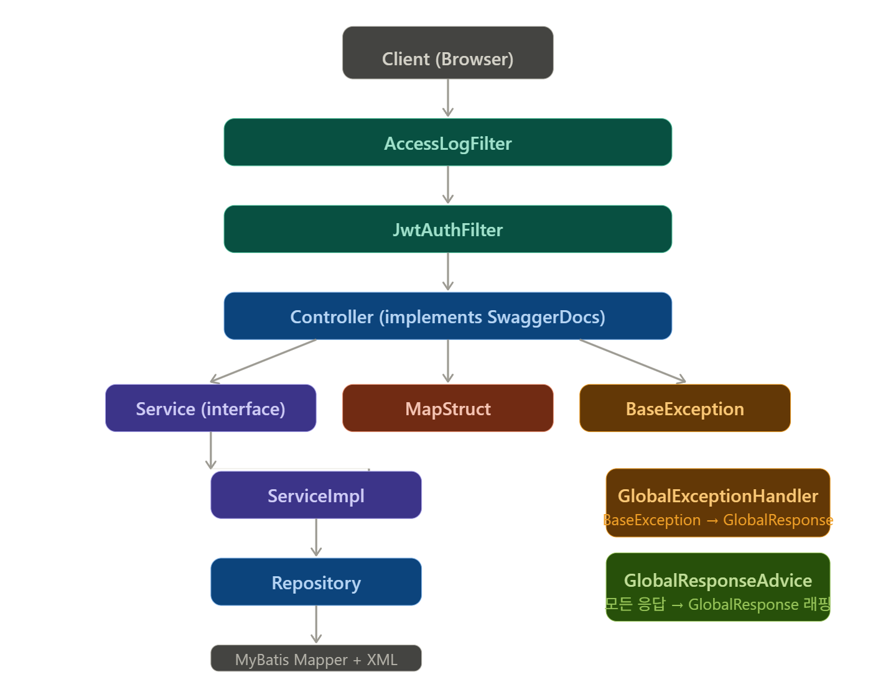

https://maketintsandshades.com/#colors=000000,532B72&hashtag=0&steps=20


# 📦 도메인 구조 설계 문서


### 백엔드 구조화 아키텍처 설계도


---

### 프론트엔드 구조화 
이 문서는 다음을 정의한다.
- 도메인 디렉토리 구조 기준
- page / components / hooks / store 역할 분리
- 조립 레이어 규칙
- 권한 기반 store 구조
- 프론트엔드 개발 규칙 적용 기준

```markdown
coupons
├── config
├── feature
│   ├── admin
│   │   ├── components
│   │   ├── hooks
│   │   └── pages
│   └── public
│       ├── components
│       ├── hooks
│       └── pages
├── store
│   ├── admin
│   └── public
└── utils
```
# 2. Page 레이어 규칙
## ✔ Page의 역할
### Page는 UI를 직접 생성 x
  - 조립 레이어 컴포넌트 import
  - layout 연결
  - 라우팅 엔트리 역할

## ✔ Page 내부 구조 규칙
```markdown
pages/
└─ CouponListPage.jsx      ← 조립 레이어만 존재
```

## ✔ Page에서 허용되는 것
- Section 조립 컴포넌트 import
- hooks 호출
- 레이아웃 연결

## ❌ Page에서 금지
- UI 마크업 작성
- 비즈니스 로직 구현
- state 로직 과도 사용
- 스타일 작성

# 3. Components 레이어 규칙
## 3.1 조립 레이어 규칙
### components 폴더 flat 위치에 존재하는 파일
```markdown
components/
├─ CouponListSection.jsx   ← 조립 레이어
└─ CouponSlideSection.jsx
```
- 폴더 안의 컴포넌트들을 조립
- hooks 연결
- layout 단위 구성

## 3.2 폴더 내부 컴포넌트 규칙
```markdown
components/
├─ card/
├─ modal/
└─ table/
```
- 조립 레이어에서만 사용됨
- 단독 페이지에서 사용되지 않음
- UI 단위 구성 요소

# 4. Hooks 규칙
### Hooks는 항상 flat 구조로 유지한다.
```markdown
hooks/
├─ useCouponList.js
├─ useCouponForm.js
└─ useCouponEdit.js
```

### ✔ Hooks 규칙
- 파일 단위 flat 구조
- UI 포함 금지
- API 호출 가능
- store 접근 가능
- 도메인 비즈니스 로직 담당

👉 Hooks는 “페이지 로직 컨트롤러” 역할

# 5. Store 구조 규칙
```markdown
store/
├─ admin/
│   ├─ api.js
│   ├─ endpoints.js
│   └─ thunks.js
│
├─ public/
│   ├─ api.js
│   ├─ endpoints.js
│   └─ thunks.js
│
└─ slices.js
```
### ✔ Store 분리 이유
👉 기능 기준이 아니라 권한 기준으로 분리
### ✔ Store 내부 규칙
api.js
- fetch 로직만 존재
- URL 호출 담당
- 비즈니스 로직 없음

endpoints.js
- URL 상수만 정의
- 문자열 하드코딩 금지

thunks.js
- createAsyncThunk만 존재
- API 호출 orchestration 담당
- UI 로직 금지

slices.js
- 상태만 정의
- reducer만 존재
- 비즈니스 로직 금지

# 6. Utils 규칙
- 순수 함수만
- store 접근 금지
- React 접근 금지
- side-effect 금지
