# ⚾ 컴프야펀 (COMPYAFUN)

모바일 게임 «컴투스프로야구» 팬을 위한 비공식 정보 사이트 — 흩어진 쿠폰·이벤트·공지를 한곳에 모으고, 공식이 정리해 주지 않는 게임 데이터를 검색·비교할 수 있게 만든다.

[](https://compyafun.com)
[](docs/roadmap.md)
[](docs/overview/ai-workflow.md)

<p align="center">
  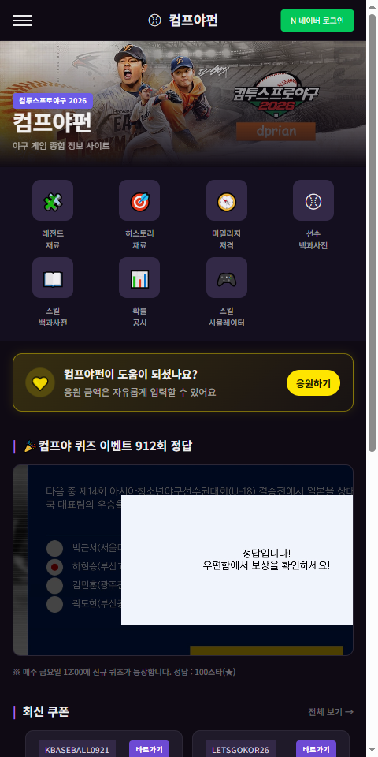
</p>

## 목차

- [프로젝트 소개](#프로젝트-소개)
- [혼자 맡은 역할](#혼자-맡은-역할)
- [기술 스택](#기술-스택)
- [주요 기능](#주요-기능)
- [아키텍처](#아키텍처)
- [프로젝트 구조](#프로젝트-구조)
- [개발 방식](#개발-방식)
- [운영 이력](#운영-이력)
- [운영하며 배운 것](#운영하며-배운-것)
- [로드맵·문서](#로드맵문서)

## 프로젝트 소개

«컴투스프로야구»는 정보가 공식 카페·공지에 흩어져 있고, 스킬 조합·구종 등급·레전드 재료 같은 게임 내부 데이터는 검색도 비교도 안 되는 형태로만 공개된다. 컴프야펀은 이 둘을 한 사이트로 모은다 — 쿠폰·이벤트·공지는 한곳에서 확인하고, 게임 데이터는 검색·비교 가능한 형태로 찾아본다. 성공 기준은 "게임 밖에서 이 게임 정보를 찾을 때 여기부터 연다"는 상태다.

| 이용자 상황 | 무엇을 하러 오나 | 체류 |
|---|---|---|
| 게임 중 잠깐 | 쓸 만한 쿠폰 코드가 있나 확인하고 곧바로 게임으로 돌아간다 | 가장 짧음 |
| 패치·이벤트 직후 | 무엇이 새로 생겼고 무엇이 끝났는지 확인한다 | 방문이 몰리는 시점 |
| 공략을 파고들 때 | 스킬 조합·선수 카드·레전드 재료를 검색·비교하며 오래 뒤진다 | 가장 김 |
| 습관적으로 둘러볼 때 | 특별한 목적 없이 새 소식이 있나 훑어본다 | 짧음 |

첫 도메인 코드는 2026-01-29에 시작됐고, 2026-09-28 현재 18개 기능이 운영 중이다. 자세한 이용자 상황·제약은 [PRODUCT.md](PRODUCT.md) 참고.

## 혼자 맡은 역할

기획·디자인·개발·인프라·운영·마케팅을 혼자 맡아 실제 서비스를 운영한다.

| 영역 | 한 일 | 근거 |
|---|---|---|
| 기획 | 이용자 4상황·기능 우선순위 정의, 기능별 스펙 작성 | [PRODUCT.md](PRODUCT.md), [docs/features](docs/features) |
| 디자인 | Figma 디자인 시스템 구축·전면 감사, 토큰·컴포넌트 정리 | [docs/decisions/0006](docs/decisions/0006-design-system-overhaul.md) |
| 프런트엔드 | React 19 SPA, 18개 도메인 화면·상태관리 구현 | `web/src/domains` |
| 백엔드 | Spring Boot API, 인증·캐시·예외 처리 등 공통 장치 구현 | [docs/overview/architecture.md](docs/overview/architecture.md) |
| 인프라 | AWS S3+CloudFront+EC2 배포 파이프라인, GitHub Actions 자동화 | [docs/overview/architecture.md § 5](docs/overview/architecture.md) |
| 운영 | 쿠폰·이벤트·공지 수동 등록, 캐시 수동 재적용까지 폰·PC로 관리 | [PRODUCT.md](PRODUCT.md) |
| 마케팅 | 애드센스 심사 대응 콘텐츠 보강, 가이드 12편 작성 | [docs/decisions/0003](docs/decisions/0003-adsense-manual-slots.md) |

## 기술 스택

**프런트엔드**


**백엔드**


**DB·인프라**


**도구·AI**


## 주요 기능

공개 기능 17개와 관리자 도구 1개. 전부 모바일 한 손 조작을 기준으로 만들었다(폭 480 캡처).

### 운영 소식 — 흩어진 정보를 한곳에

<table><tr>
<td align="center">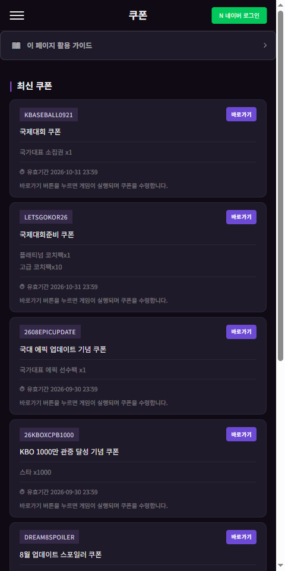<br><b>쿠폰</b></td>
<td align="center"><br><b>이벤트</b></td>
<td align="center"><br><b>공지</b></td>
</tr></table>

- **쿠폰** — 유효한 코드를 목록으로 모으고, "바로가기"가 게임 앱 딥링크로 이어져 자동 수령된다
- **이벤트** — 공식 카페 이벤트를 진행 중·종료로 나눠 보여주고 원문으로 연결한다
- **공지** — 제목 기반 주소의 상세 화면, 이미지 크게 보기. 운영자가 폰에서 바로 등록한다

### 게임 데이터 — 공식이 정리해 주지 않는 것을 검색·비교 가능하게

<table><tr>
<td align="center">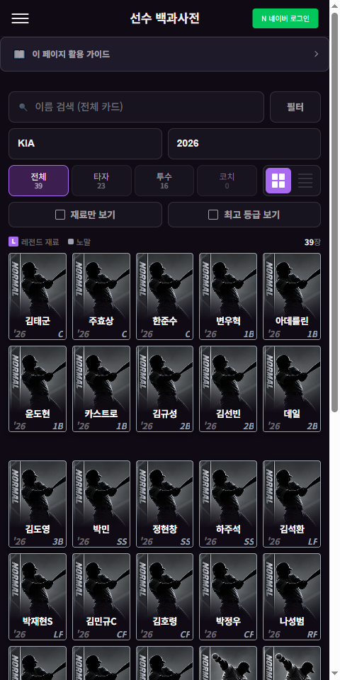<br><b>선수 백과사전</b></td>
<td align="center">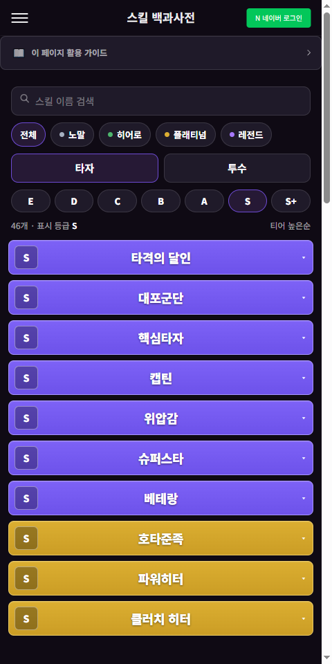<br><b>스킬 백과사전</b></td>
<td align="center">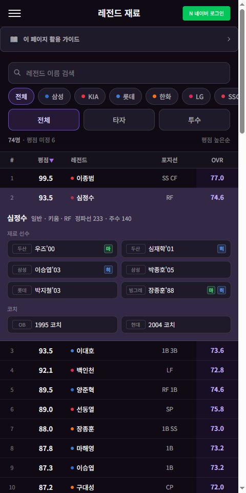<br><b>레전드 평점표</b></td>
<td align="center">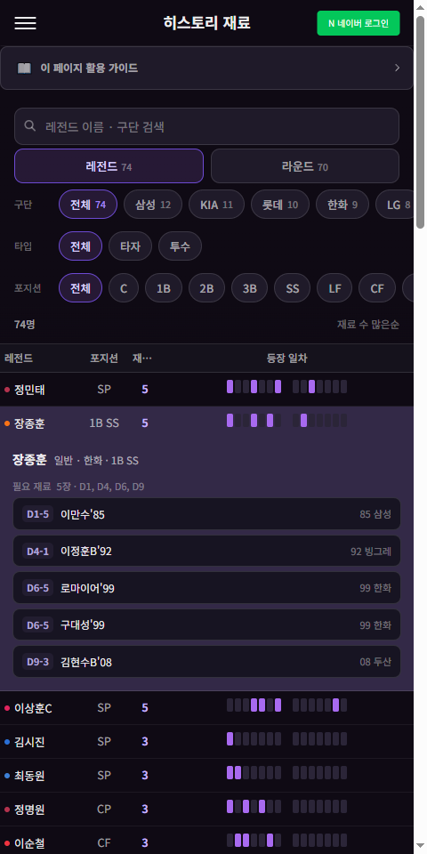<br><b>히스토리 재료 탐색기</b></td>
</tr></table>

- **선수 백과사전** — 카드 스탯을 구단·연도·포지션으로 걸러 리스트로 비교한다. 엑셀로 정리한 원천을 DB 로 옮겨 실데이터로 제공
- **스킬 백과사전** — 스킬 카탈로그와 등급별 수치, 조합 시뮬레이션
- **레전드 평점표** — 레전드 선수의 평점·구종을 한 표로 본다
- **히스토리 재료 탐색기** — "이 레전드를 얻으려면 어느 스테이지를 돌아야 하나"를 역참조로 찾는다. 데이터가 앱에 내장돼 서버 없이 즉시 반응

### 도구·안내

<table><tr>
<td align="center">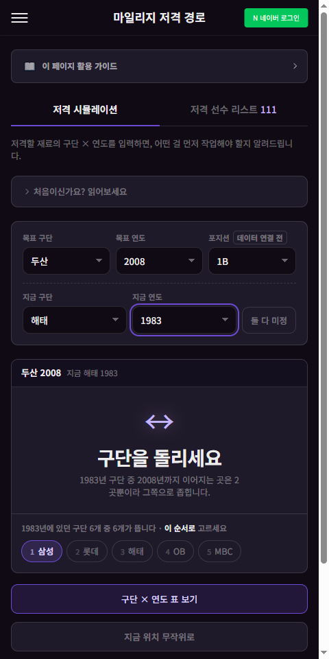<br><b>마일리지 저격</b></td>
<td align="center">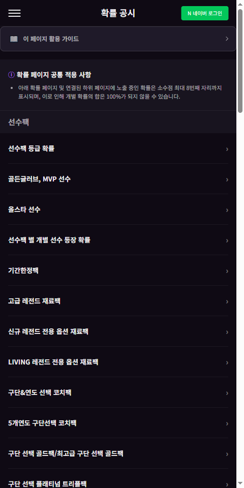<br><b>확률 공시</b></td>
<td align="center">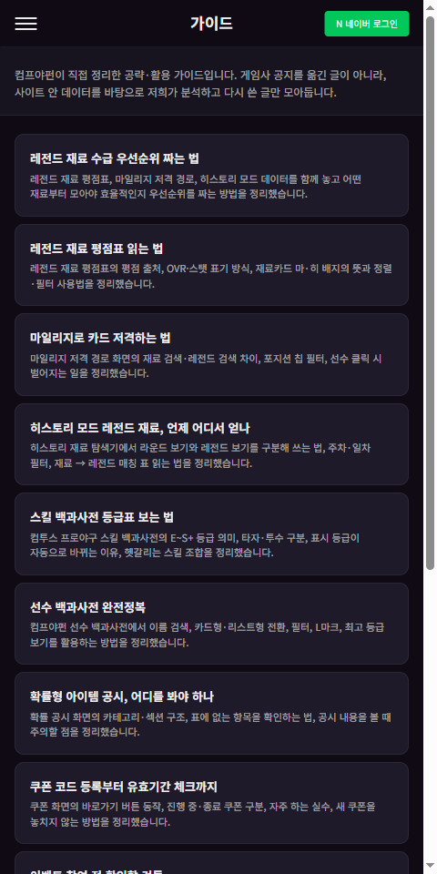<br><b>이용 가이드</b></td>
</tr></table>

- **마일리지 저격** — 목표 구단·연도 카드까지의 적립 경로를 계산한다(계산기 탭은 베타)
- **확률 공시** — 확률형 아이템 확률을 법정 의무 공시 형태로 정리한 정적 페이지
- **이용 가이드** — 애드센스 심사 대응으로 직접 쓴 오리지널 가이드 12편

### 관리자

운영자 1명이 쿠폰·이벤트·공지·퀴즈·회원을 등록·수정·노출 전환하는 화면. 단일 셸(`/admin/:tab`)에 상단 탭 7개, 폰·PC 양쪽에서 쓴다. 조회 전용 데이터 캐시도 여기서 버튼으로 재적용한다.

## 아키텍처

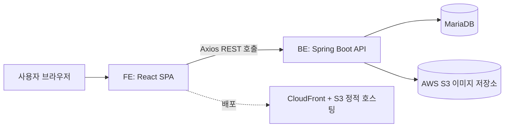
```mermaid
flowchart LR
  U[사용자 브라우저] --> FE[FE: React SPA]
  FE -->|Axios REST 호출| BE[BE: Spring Boot API]
  BE --> DB[(MariaDB)]
  BE --> S3[(AWS S3 이미지 저장소)]
  FE -. 배포 .-> CDN[CloudFront + S3 정적 호스팅]
```

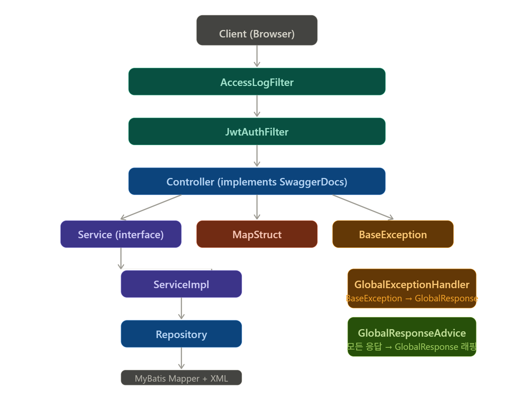

배포는 FE·BE가 분리돼 있다 — FE는 master push 시 GitHub Actions가 빌드·프리렌더·S3 동기화·CloudFront 무효화까지 자동으로 처리하고, BE는 Actions 탭에서 수동으로 실행해 EC2에 배포한다. 상세 구성·인증 흐름·알려진 구조적 제약은 [docs/overview/architecture.md](docs/overview/architecture.md) 참고.

## 프로젝트 구조

<details>
<summary>폴더 트리 펼치기</summary>

```
web/src/
├── domains/        # 기능 18개 — coupons, events, notices, players, ...
├── app/             # provider, router, store, wrapper
├── infra/           # ads, analytics, api, http, seo
└── global/          # 공용 스타일·컴포넌트

src/main/java/com/dawne/com2usbaseball/
├── domain/          # coupon, event, notice, admin, community, quiz, home, oauth, analytics, statistics, fun
├── common/          # 응답 봉투, 전역 예외 처리
├── config/
└── security/        # JwtAuthFilter 등

sql/                 # V2, V2_insert, V3, V3_insert

docs/
├── features/<f>/    # spec.md · design.md · history.md
├── overview/        # architecture, domain, ai-workflow, traceability
└── decisions/       # ADR

.claude/             # 에이전트 정의, 규칙, 컨벤션, 워크플로
```

</details>

## 개발 방식

이 프로젝트는 규칙 문서로 AI 에이전트를 운용해 **분석 → 수정 → 실측 검증**을 반복하는 방식으로 개발한다. 요청이 들어오면 트랙(개발/기획/디자인/운영)을 나누고, 트랙별 에이전트를 동시에 띄워 같은 파일을 두 에이전트가 건드리지 않게 범위를 분리한다. 각 에이전트는 분석 문서를 먼저 쓰고, 코드를 고친 뒤, 브라우저 조작과 DB 조회로 실측 검증까지 마치고 보고한다. 자세한 흐름은 [docs/overview/ai-workflow.md](docs/overview/ai-workflow.md) 참고.

브랜치는 `feat/` `fix/` `refactor/` `docs/` `ops/`로 분리해 PR로 머지하며, master 직접 커밋은 하지 않는다. 커밋마다 이용자 체감 변화(기능 버전)와 개발 구조 변화(플랫폼 버전)를 `버전 영향:` 줄로 따로 표기한다.

| 문서 | 내용 |
|---|---|
| [docs/features/\<f\>/spec.md](docs/features) | 기능별 기획·요구사항 |
| [docs/features/\<f\>/design.md](docs/features) | 화면 설계 |
| [docs/features/\<f\>/history.md](docs/features) | 변경 이력 |
| [docs/decisions/](docs/decisions) | 여러 기능에 걸친 결정 기록(ADR) |
| [docs/overview/traceability.md](docs/overview/traceability.md) | 요구사항 → 화면 → API → 테이블 추적표 |

## 운영 이력

| 구간 | 기능 버전 | 플랫폼 버전 | 내용 |
|---|---|---|---|
| 기준선 | `v2.0.0` | `platform-2.0` | v1(PC) → v2(모바일 리뉴얼) 전환 완료 상태로 선언 |
| 2026-09 하이라이트 | (기준선 포함) | — | 마일리지 저격·스킬 백과사전·선수 백과사전(실데이터) 신규 오픈, 어드민 셸+탭 전면 재설계, 가이드 12편 신설 |
| 진행 중 | `v2.0.1` 후보 | `platform-2.0` 유지 | 코드 리뷰 수정 다수 + 디자인 시스템 정리 |

네이버 로그인은 2026-01-23 최초 도입됐다. 광고는 2026-08-22 최초 애드센스 신청 이후 "콘텐츠 없는 화면 광고" 사유로 반복 반려돼, 자동광고 대신 화면마다 수동 슬롯을 심는 방식으로 전환했다([ADR 0003](docs/decisions/0003-adsense-manual-slots.md)). 배포 파이프라인에는 정적 프리렌더 빌드·검증 단계가 포함돼 있다. 전체 릴리스 노트는 [CHANGELOG.md](CHANGELOG.md) 참고.

## 운영하며 배운 것

- **Redis는 도입 당일 롤백했다** — 2026-02-17 VM 부하로 즉시 되돌렸다. 재도입은 필요성이 확실할 때만 검토한다.
- **버전을 두 축으로 나눴다** — 이용자가 체감하는 변화(기능)와 개발자만 체감하는 변화(플랫폼)를 한 숫자로 섞으면 구분이 안 된다. [ADR 0002](docs/decisions/0002-versioning-two-axes.md)
- **코드보다 기준 문서를 먼저 고쳤다** — 디자인 시스템 감사에서 기준 문서 자체가 코드와 어긋나 있어, 교정 전에 기준부터 정정했다. [ADR 0006](docs/decisions/0006-design-system-overhaul.md)
- **타임존을 어디에도 명시하지 않았더니 자정~오전 9시에 날짜가 하루 밀렸다** — 서버가 우연히 한국 시간대 OS 위에서 돌던 것뿐이었다. [ADR 0007](docs/decisions/0007-kst-timezone.md)
- **예외 처리의 마지막 그물이 표준 예외 7종을 전부 500으로 삼키고 있었다** — 안내 문구는 준비돼 있었지만 실행 흐름이 거기 닿지 못했다. [ADR 0008](docs/decisions/0008-exception-status-mapping.md)
- **문서보다 코드가 항상 먼저였다** — 기획서를 앞서 쓰는 대신 코드에서 거꾸로 역산하는 방식(as-built)이 이 프로젝트의 기본 문서화 방법이다.

## 로드맵·문서

- [docs/roadmap.md](docs/roadmap.md) — 완료·진행 중·계획 중인 기능, 아직 못 정한 것
- [docs/README.md](docs/README.md) — 기능 18개 전체 목록과 문서 안내

---

컴프야펀은 «컴투스프로야구»의 비공식 팬 사이트입니다. 게임 이미지·데이터의 권리는 컴투스에 있습니다. 문의는 사이트 내 [/contact](https://compyafun.com/contact)로 남겨 주세요.
