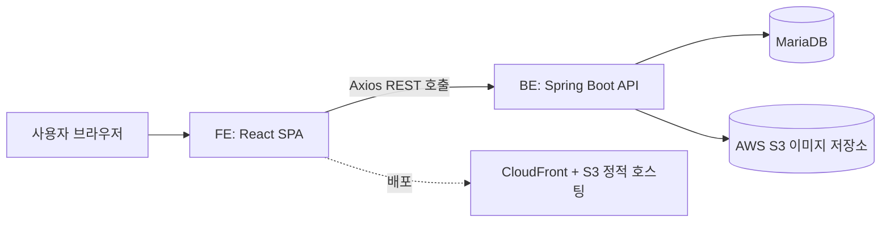

# com2usbaseball

## 1. 프로젝트 소개

**컴프야펀(COMPYAFUN)**은 모바일 게임 «컴투스프로야구»를 즐기는 팬을 위한 비공식 정보 사이트다. 공식 카페·공지에 흩어진 쿠폰·이벤트·공지를 한곳에 모으고, 공식이 정리해 주지 않는 게임 내부 데이터(스킬 조합·선수 카드·레전드 재료)를 검색·비교할 수 있는 형태로 제공한다. **성공 기준**은 "게임 밖에서 이 게임 정보를 찾을 때 여기부터 연다"는 상태가 되는 것이다.

| 이용자 상황 | 무엇을 하러 오나 | 체류 |
|---|---|---|
| 게임 중 잠깐 | 쓸 만한 쿠폰 코드가 있나 확인하고 곧바로 게임으로 돌아간다 | 가장 짧음 |
| 패치·이벤트 직후 | 무엇이 새로 생겼고 무엇이 끝났는지 확인한다 | 방문이 몰리는 시점 |
| 공략을 파고들 때 | 스킬 조합·선수 카드·레전드 재료를 검색·비교하며 오래 뒤진다 | 가장 김 |
| 습관적으로 둘러볼 때 | 특별한 목적 없이 새 소식이 있나 훑어본다 | 짧음 |
| 운영자(1명) | 공식 카페 글을 보고 손으로 쿠폰·이벤트·공지를 등록한다. 폰·PC를 오가며 관리 | — |

**범위** — 공개 기능(쿠폰·이벤트·공지·백과사전·히스토리 재료 탐색기·홈·네이버 로그인), 관리 기능(등록/수정/삭제/노출 전환). 권한은 관리자·일반 2단계뿐이고 로그인 수단은 네이버 하나다.

**아직 비어 있는 부분** — 커뮤니티 쓰기(동결 상태), 백과사전 "게임정보" 두 칸(내용 0건), 수익화(광고·후원·결제) 여부 미확정. 상세는 [roadmap.md](roadmap.md) 참고.

---

## 2. 시스템 구성

| 영역 | 구성 |
|---|---|
| 프런트엔드 | React 19 + Redux Toolkit + React Router + Vite + SCSS(Sass) |
| 백엔드 | Spring Boot 3.3(Java 21) + MyBatis + Spring Security + JWT |
| 데이터베이스 | MariaDB |
| 배포 | GitHub Actions — 프런트엔드는 push 시 AWS S3 + CloudFront 자동 배포, 백엔드는 EC2 수동 배포 |

*(출처: `web/package.json`, `build.gradle`, `.github/workflows/*.yml`)* — 상세 시스템 구성도는 [overview/architecture.md](overview/architecture.md) 참고.

---

## 3. 기능 목록

<!-- readme-table:start -->
| 기능 | 설명 | 상태 | 시작일 | 버전 | 문서 |
|---|---|---|---|---|---|
| admin | 운영자용 관리 도구(쿠폰·이벤트·공지·회원 관리) | 운영 | 2026-01-29 | 1.3.0 | [spec](features/admin/spec.md) · [design](features/admin/design.md) · [history](features/admin/history.md) |
| coupons | 게임 쿠폰 목록·등록·조회 | 운영 | 2026-01-29 | 1.0.4 | [spec](features/coupons/spec.md) · [design](features/coupons/design.md) · [history](features/coupons/history.md) |
| events | 이벤트 공지 목록 | 운영 | 2026-01-29 | 1.0.4 | [spec](features/events/spec.md) · [design](features/events/design.md) · [history](features/events/history.md) |
| notices | 공지사항 목록·상세 | 운영 | 2026-01-29 | 1.0.5 | [spec](features/notices/spec.md) · [design](features/notices/design.md) · [history](features/notices/history.md) |
| community | 커뮤니티 게시판(쓰기 기능 동결) | 동결 | 2026-02-02 | 1.0.1 | [spec](features/community/spec.md) · [design](features/community/design.md) · [history](features/community/history.md) |
| quiz | 퀴즈 이벤트(홈 섹션+운영자 화면 위주) | 운영 | 2026-03-29 | 1.0.3 | [spec](features/quiz/spec.md) · [design](features/quiz/design.md) · [history](features/quiz/history.md) |
| home | 첫 화면 — 최신 소식·후원 섹션 모아보기 | 운영 | 2026-04-14 | 1.0.4 | [spec](features/home/spec.md) · [design](features/home/design.md) · [history](features/home/history.md) |
| authentication | 로그인/회원가입, 네이버 소셜 로그인(OAuth) | 운영 | 2026-04-17 | 1.0.8 | [spec](features/authentication/spec.md) · [design](features/authentication/design.md) · [history](features/authentication/history.md) |
| users | 마이페이지 — 내 정보·활동 조회 | 운영 | 2026-05-31 | 1.0.1 | [spec](features/users/spec.md) · [design](features/users/design.md) · [history](features/users/history.md) |
| odds | 확률형 아이템 확률 공시(법정 의무, 정적) | 운영 | 2026-08-22 | 1.0.1 | [spec](features/odds/spec.md) · [design](features/odds/design.md) · [history](features/odds/history.md) |
| players | 선수 백과사전(카드 스탯 조회, 리스트형) | 운영 | 2026-08-22 | 1.0.1 | [spec](features/players/spec.md) · [design](features/players/design.md) · [history](features/players/history.md) |
| error | 라우트 매칭 실패·렌더 오류를 잡는 공용 에러 화면 | 운영 | 2026-08-31 | 1.0.1 | [spec](features/error/spec.md) · [design](features/error/design.md) · [history](features/error/history.md) |
| policy | 약관·개인정보 처리방침 | 운영 | 2026-08-31 | 1.0.0 | [spec](features/policy/spec.md) · [design](features/policy/design.md) · [history](features/policy/history.md) |
| historyLegend | 레전드 카드 히스토리 재료 탐색기 | 운영 | 2026-09-02 | 1.0.3 | [spec](features/historyLegend/spec.md) · [design](features/historyLegend/design.md) · [history](features/historyLegend/history.md) |
| legendStats | 레전드 선수 평점표 조회 | 운영 | 2026-09-02 | 1.0.1 | [spec](features/legendStats/spec.md) · [design](features/legendStats/design.md) · [history](features/legendStats/history.md) |
| mileage | 마일리지 적립·저격 경로 계산 | 개발중 | 2026-09-05 | 1.0.1 | [spec](features/mileage/spec.md) · [design](features/mileage/design.md) · [history](features/mileage/history.md) |
| playerSkills | 선수 스킬 백과사전 | 운영 | 2026-09-09 | 1.0.0 | [spec](features/playerSkills/spec.md) · [design](features/playerSkills/design.md) · [history](features/playerSkills/history.md) |
| guides | 게임 이용 가이드(12편) | 운영 | 2026-09-13 | 1.0.2 | [spec](features/guides/spec.md) · [design](features/guides/design.md) · [history](features/guides/history.md) |
<!-- readme-table:end -->

시작일은 각 FE 도메인 폴더의 최초 커밋일이다. 상태·버전 등 현황 갱신은 [roadmap.md](roadmap.md)에서 다룬다. 아직 코드가 없는 계획 중 기능(account·analytics·gamification)은 이 표에 없다 — [roadmap.md § 5](roadmap.md) 참고.

---

## 4. 문서 안내

각 산출물 종류가 이 저장소에서 어디로 갔는지 보여준다.

| 산출물 | 위치 |
|---|---|
| 프로젝트 개요서 | `README.md` § 1 |
| 요구사항 정의서(REQ-xxx) | `features/<f>/spec.md` § 3 |
| 기능 정의서 | `README.md` § 3 + `overview/domain.md` § 1 |
| 정보구조도(IA)·화면 목록(SC-xx-xx) | `overview/domain.md` § 2~3 |
| 유저 플로우·시퀀스 | `features/<f>/design.md` § 3, 인증은 `overview/architecture.md` § 4 |
| 화면 설계서 | `features/<f>/design.md` § 1~2·§ 6(Figma) |
| 정책서 | `features/<f>/spec.md` § 3 + `decisions/` |
| 로드맵·릴리스 계획 | `roadmap.md` |
| 디자인 시스템 | `decisions/0006`(결정) · 토큰 원천은 코드(`web/src/global/styles`) |
| 컴포넌트 명세 | `features/admin/design.md` |
| 시스템 아키텍처·배포 | `overview/architecture.md` |
| 기술 결정 기록(ADR) | `decisions/` |
| ERD·테이블 정의 | `overview/domain.md` § 4~5 |
| API 명세 | `features/<f>/spec.md` § 4 · `design.md` § 5 |
| 테스트·실측 기록 | `features/<f>/history.md` |
| 릴리스 노트 | 루트 [`CHANGELOG.md`](../CHANGELOG.md) |
| 요구사항 추적표(RTM) | [`overview/traceability.md`](overview/traceability.md) — REQ → 화면 → API → 테이블 → 이력 |
| 회고·개선 이력 | `roadmap.md` § 7 배운 것 · `overview/ai-workflow.md` |

지금 없는 문서는 이 표에 없다. 리뷰·감사·todo 같은 작업 기록은 브랜치별 `.claude/.progress/` 에만 두고 머지 때 지운다 — 원본은 git 태그 `docs-archive-2026-09` 에 남아 있다.

---

## 5. 개발 방식

이 프로젝트는 규칙 문서로 AI 에이전트를 운용해 분석 → 수정 → 실측 검증을 반복하는 방식으로 개발한다. 자유 형식으로 맡기는 대신 판단 기준을 문서로 고정해, 작업이 몇 번 반복되어도 산출물 형식과 품질이 흔들리지 않게 만들었다.

자세한 흐름은 [overview/ai-workflow.md](overview/ai-workflow.md) 참고.
