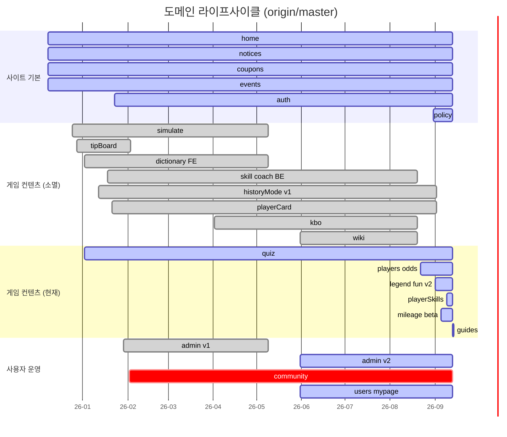

# 컴프야펀 변천사 통합본 (2025-12-08 ~ 2026-09-13)

> 기준 ref: `origin/master` HEAD `566cf3bd` (커밋 1,116개, 작성자 1인). 근거: git log/show/ls-tree 만 사용 (기존 md 서술 불신).
> 기간 파일 4개를 통합·교차검증한 요약본. 세부 커밋은 기간 파일에 있음.

## § 0 읽는 법

| 파일 | 기간 | 커밋 | 성격 |
|---|---|---|---|
| [p1-2025-12_2026-01.md](p1-2025-12_2026-01.md) | 2025-12-08 ~ 2026-01-31 | 424 | 정적 팬사이트 → BE 투입 → domain 구조 |
| [p2-2026-02_2026-03.md](p2-2026-02_2026-03.md) | 2026-02-02 ~ 2026-03-29 | 258 | 커뮤니티·백과사전 확장, v2.0.0 FE 구조화 |
| [p3-2026-04_2026-07.md](p3-2026-04_2026-07.md) | 2026-04-02 ~ 2026-05-31 (6~7월 0건) | 275 | DB V2, 모바일 전환(1차 리뉴얼), AI 워크플로우 |
| [p4-2026-08_now.md](p4-2026-08_now.md) | 2026-08-20 ~ 2026-09-13 | 159 | 2차 리뉴얼, fun 재건, 애드센스 대응 |

- 날짜는 author date(KST). 커밋 hash는 8자리.
- 참고용 진단: [../status-overview.md](../status-overview.md)
- 이 문서의 § 6(소급 버전)은 **제안**이며 태그는 아직 만들지 않았음.
- 기간 파일 § 7 에 `✅ 해소` / `⚠` 표시를 달았다. 결과 모음은 이 문서 § 7.

## § 1 전체 연표 요약 (국면별)

활동 분포: 12월 88 · 1월 336 · 2월 232 · 3월 26 · 4월 107 · 5월 168 · (6·7월 0) · 8월 26 · 9월 133.
공백: **03-05~03-27** (23일), **06-01~08-19** (80일).

| 국면 | 기간 | 성격 | 대표 사건 | 대표 커밋 |
|---|---|---|---|---|
| A. 정적 팬사이트 | 12-08 ~ 01-14 | FE 단독(React+Vite, mock data) | 사이트 개시, 스킬변경 시뮬(12-25), 팁게시판(12-28), 백과사전(01-02), 히스토리모드(01-12), GTM | `499902e9` `9e02aa32` `150e90f9` |
| B. BE 투입 | 01-16 ~ 01-28 | Spring Boot + MariaDB/MyBatis + 네이버 OAuth/JWT | jar 배포·api 서브도메인, 스킬/선수 API, USER 테이블, 마이페이지 | `e1b0245c` `0815c4dd` `2e3a236a` |
| C. domain 구조·admin | 01-29 ~ 02-17 | FE `domains/`·BE `domain/` 전환, DB CRUD | admin 신설, 쿠폰/이벤트 DB화, 커뮤니티(02-02), 코치 스킬(02-05), GENERIC 응답, Redis 도입→즉시 롤백 | `7a3716af` `363857e0` `e377e848` `61252cf2` |
| D. v2.0.0 구조화 | 02-18 ~ 03-29 | 작성자 명명 "v2.0.0" FE 아키텍처·토큰 재정립 | 전역 토큰/브레이크포인트/4px 그리드, admin·public 분리, S3 업로드, 선수카드(02-28), 퀴즈 CRUD(03-29) | `dc2f7a07` `f6cdcb81` `02dff89a` `158e3bb7` |
| E. DB V2·BE 재구축 | 04-02 ~ 04-04 | `sql/V2` (site_/fun_) + BE v2.x 라벨 재작성 | kbo 크롤러, site_coupons, fun 엔티티, Swagger, notice/event/auth/community/quiz BE | `4435959d` `1d9d1190` `509b194c` |
| F. 1차 리뉴얼(모바일) | 04-10 ~ 05-07 | PC→모바일 전용 재구현 | 모바일 scss 분기(04-10)→PC 주석(04-14), `[리뉴얼]` 라벨(04-17~), 쿠폰/이벤트/공지/히스토리 모바일화 | `80889396` `c0728ffe` `012db128` `133598bb` |
| G. legacy 폐기·AI 체계 | 05-09 ~ 05-31 | 도메인 대량 폐기 + `.claude` 워크플로우 + BE 보안 | kbo·dictionary·profile·simulate·playerCard FE 폐기, CLAUDE.md(05-10), refresh token, mobile-first 선언, wiki·users 신설 | `823c6ac4` `04a095ca` `96624eb1` `763c0d16` |
| H. 2차 리뉴얼(정리·재건) | 08-20 ~ 09-02 | 죽은 도메인 제거, v1→v2 데이터 이관, fun 재건 | wiki/skill/coach/kbo 삭제, docs 113→25, 선수백과·확률공시, 애드센스 1·2차 준비, 레전드 재료/스탯/히스토리 v2 | `47a5c2d3` `cd660ff1` `1248ce58` `1396b3c0` `d8585158` |
| I. 수익화·운영 정비 | 09-04 ~ 09-13 | admin 재디자인, 유저 개편, 콘텐츠·광고 | admin 단일셸, 선수스킬/마일리지, 행동통계, 네이버정보 분리, 가이드 12편, 광고 슬롯, 후원, GH Actions | `1918860b` `9ac6898a` `6d931045` `11957331` `566cf3bd` |

## § 2 도메인 라이프사이클

FE 폴더명 기준(BE 패키지는 괄호). "현재" = HEAD 존재 여부.

| 도메인 | 등장 | 주요 개편 | 소멸 | 현재 |
|---|---|---|---|---|
| home | 12-08 `499902e9` | 02-19 모바일 재구성, 04-14 섹션 조립(`domains/home`), 09-13 후원 섹션 | — | 운영 |
| notices | 12-08 (BE 02-25 `001968e8`) | 05-06 모바일, 09-05 slug·발행일, 09-10 배너형 | — | 운영 |
| coupons | 12-08 | 01-30 DB화, 02-19 admin/public 분리, 04-03 site_coupons, 04-17 모바일 | — | 운영 |
| events | 12-08 (BE 01-29) | 02-25 eventType, 04-17 모바일 | — | 운영 |
| simulate(스킬변경) | 12-25 `9e02aa32` | 01-13 v2, 03-28 카드 개편 | 05-09 `bc147f90` | 없음 |
| tipBoard | 12-28 | — | 02-03 `fd021ba8` | 없음 |
| dictionary(FE 백과사전) | 01-02 `99e9e9ec` | 02-04 Meta Registry, 02-08 TAB | 05-09 `823c6ac4` | 없음 |
| skill/coach(BE) | 01-18 `0815c4dd` | 01-30 `domain/skill`, 02-05 coach | 08-20 `47a5c2d3` | 없음 |
| historyMode v1 | data 12-08, page 01-12 `150e90f9` | 03-28 개편, 05-07 모바일 | 09-02 `d8585158` | 폐기 |
| historyLegend(v2) | 09-02 `2b3b95e6` (BE `fun/historyMode`) | 09-10 로스터 | — | 운영 |
| quiz | 01-02 홈 섹션 `d4afc632` | 03-29 BE/admin, 04-04 BE v2, 04-14 홈 섹션, 09-04 admin | — | 홈 섹션+admin만 |
| auth/authentication | 01-23 | 04-04 재구현, 04-17 모바일, 05-11 refresh token, 09-11 네이버정보 분리 | — | 운영 |
| profile→mypage | 01-28 `2e3a236a` | — | 05-09 `346a1d5d` → 08-31 마이페이지 재신설 | 운영 |
| admin v1 | 01-29 `7a3716af` | 02-19 레이아웃 | 05-09 `2e277b76` | 폐기 |
| admin v2 | 05-31 `16631379` | 09-04 단일셸+탭, 09-05 확정디자인 | — | 운영 |
| community | 02-02 `e377e848` | 04-04 BE 확장, 05-07 모바일 데모, 08-31 인증 수정 | — | **동결**(읽기전용·noindex) |
| player(BE v1) | 01-21 (`domain/player` 01-30) | — | 09-02 `f6bbcc98` | 폐기 |
| playerCard(FE) | 02-28 `767c1320` | 03-28 리팩터 | 05-09 `bc147f90` | 폐기 |
| fun/playerCard(BE) | 04-03 `1d9d1190` (v2, 미적재) | 09-02 삭제 → 09-10 재작성 `f91d64ba` | — | 운영 |
| kbo | 04-02 `f8c806b2` | — | FE/BE 05-09, 크롤러·sql 08-20 | 없음 |
| wiki | 05-31 `4cf8a60f` | — | 08-20 `47a5c2d3` | 없음 |
| users(admin) | 05-31 `16631379` | 09-11 유저 개편 | — | 운영 |
| players(선수백과) | 08-22 `1248ce58` | 09-10 서버데이터, 09-13 리스트형 | — | 운영 |
| odds(확률공시) | 08-22 `1248ce58` | — | — | 운영 |
| policy | 08-31 `1396b3c0` | 09-10 쿠키조항 | — | 운영 |
| legendMaterials/Stats | 09-01 / 09-02 | 09-02 재료 v2 전환 | — | 운영 |
| playerSkills | 09-09 `6ee9d198` | — | — | 운영(삭제된 skill 과 무관) |
| mileage | 09-05 `022f2c4e` | 09-10 API | — | beta |
| guides | 09-13 `6d931045` | — | — | 운영 |

(`crit` = 동결, `done` = 소멸, `active` = 운영)

## § 3 디자인 변천

| 시점 | 스타일 체계 | PC→모바일 | 토큰 | 근거 |
|---|---|---|---|---|
| 12-08 | SCSS + CSS Modules, `styles/{base,mixins,variables}` | PC 중심, `$mobile:480/$tablet:768/$desktop:1200` mixin | `_colors.scss` named 변수(`$primary0~9` 등) | `499902e9` |
| 12-25 ~ 01-09 | 동일 | 모바일 nav 분리, 반응형 사후 패치 | 추가 위주 | `e34f90ae` `ad44408b` |
| 01-12 ~ 01-13 | `common`→`shared`, 시맨틱 태그 컴포넌트 | — | — | P1 § 4 |
| 01-30 | `web/src/global/styles/*` 로 이동 | — | 불변 | `363857e0` 전후 |
| **02-19 (v2.0.0)** | `variables/{_font,_radius,_semantic,_spacing,_breakpoints,_colors,_zindex}` | Home 모바일 재구성, admin table 모바일 분기 | **시맨틱 토큰 + 4px 그리드** 첫 도입 | `f6cdcb81` `02dff89a` `7b0dd7ad` |
| 02-25 | 전역 color 규칙 변경 | — | 색 규칙 갱신 | P2 § 2 |
| **04-10** | PC/모바일 이중 scss + 모바일 router 분기 | 1단계: 병행 | — | `80889396` |
| **04-14** | PC scss 주석 처리, 모바일 Layout/Drawer/TopBar | 2단계: 모바일 기본 | — | `c0728ffe` |
| 04-17 ~ 05-07 | 도메인별 PC 파일 삭제 | 3단계: 쿠폰→이벤트→공지→히스토리→커뮤니티 모바일 전용 | 도메인 `*.tokens.scss` 첫 등장(05-07) | `012db128` `73cbb7be` |
| **05-31** | `styles/functions`(rem), mixins 정리 | 4단계: **mobile-first 공식 선언**(pc-first deprecate) | color/radius/spacing 토큰 갱신, 6개 도메인 일괄 적용 | `763c0d16` `2bb54c0b` |
| 08-21 | `docs/convention/design.md` 일원화 | — | — | `39ff3a99` |
| 09-04 ~ 09-05 | `global/ui/admin/` + `admin.tokens.scss` | admin 도 모바일 룩(가로스크롤 제거) | admin 토큰 | `b44879a2` `6e72570e` |
| 09-13 | 표 스타일 공용화, 가이드 렌더러 `global/ui` 승격, `:where()` 특이도 복구 | — | 도메인 로컬 토큰 6종 | `c453625d` `5ff82133` |

요약: **PC 설계 → 사후 반응형(12~1월) → 토큰화(02-19) → 모바일 전용 재구현(04-10~05-07) → mobile-first 선언(05-31) → 도메인 로컬 토큰(8~9월)**. 모바일 퍼스트 "재수립"은 이 위에서 시작한다.

## § 4 수익화 변천 (애드센스·광고·SEO·후원)

| 일자 | 구분 | 내용 | 커밋 |
|---|---|---|---|
| 12-19 | SEO | SEO 메타, sitemap·robots 최초 | `e5d5efad` |
| 12-25 | SEO | 네이버 서치어드바이저 인증 | P1 |
| 12-29 | 분석 | GTM 연동, 쿠폰 버튼 클릭 트래킹, 개인정보처리방침 | `b882a92c` `fab9ce9a` |
| 02-08 / 02-19 | 분석 | GA4 연결(`gtag`) / 페이지 타이틀 GA 반영 | `9b3c3447` `4dd6975e` |
| 04-17 | 분석 | 모바일 인증·이벤트 GA 이벤트 | P3 § 2 |
| — | 공백 | 12월~8월 중순까지 광고 코드 0건 | — |
| **08-22** | AdSense | `google-adsense-account` 메타 + adsbygoogle 스크립트 + `ads.txt` **최초** | `1248ce58` |
| **08-31** | AdSense/정책/SEO | "재신청 준비": `/privacy` `/terms` `/contact` `/about`, 푸터, sitemap, 빌드타임 prerender, 커뮤니티 noindex, 심사 중 광고 스크립트 비활성 | `1396b3c0` `c010c386` `d7c8ca27` |
| 09-04 | SEO | prerender 기본 빌드 편입, CloudFront index.html 리라이트 | `f3fed1fe` |
| 09-10 | 분석/정책 | 사용자 행동 통계 수집, 방문자 쿠키 조항 | `226ef8d4` |
| **09-13** | 콘텐츠 | 가이드 12편(심사용 오리지널 콘텐츠) | `6d931045` |
| **09-13** | 광고 | 광고 슬롯 홈·쿠폰·이벤트·공지·스킬·선수백과, in-feed(20행), `ADS_ENABLED=false` 승인 전 분기, `docs/convention/adsense.md` | `11957331` `2661b0a2` `886d1cd2` `566cf3bd` |
| **09-13** | 후원 | 카카오페이 후원 섹션(QR·송금링크) + 클릭 통계 API | `79924af6` |

HEAD 상태: **광고 슬롯 배치 완료 · 승인 대기(ADS_ENABLED=false)**. 결제형 수익화 코드는 없음.

## § 5 인프라 / DB / 아키텍처 변천

### 5.1 DB

| 단계 | 시점 | 내용 | 커밋 |
|---|---|---|---|
| V1 | 01-18 ~ 03-29 | `sql/CREATE_TABLE.sql` 단일 누적 파일, MariaDB+MyBatis | `0815c4dd` 전후 |
| V2 설계 | 04-03 | `sql/V2/{fun,site}` — 게임데이터 `fun_*`, 사이트 `site_*` 접두 분리 | `4435959d` `82b78d1e` |
| V3 추가 | 05-11 | `sql/V3/` 시작(refresh_tokens), 05-31 wiki·user.email | `96624eb1` |
| 데이터 이관 | 08-21 | v1→v2 이관 스크립트 4종(users/coupons/events/quiz), 08-22 적용 후 제거 | `cd660ff1` `1248ce58` |
| 정리 | 08-20 | kbo·wiki·skill 15테이블 DROP 스크립트(미실행) | `47a5c2d3` |
| 재정리 | **09-13** | `V2`/`V2_insert` = 지난 버전, `V3`/`V3_insert` = 현재. CREATE_ 를 운영 DB(09-13)와 대조해 번호순 실행 가능하게 | `1db655e1` |

주의: 폴더 "V2"는 이름과 달리 v1 테이블 정의도 포함(`CREATE_01_TABLE_V1.sql`). CLAUDE.md 가 언급하는 `sql/V2/{site,fun}` 경로는 HEAD 에 없음.

### 5.2 BE 패키지

| 시점 | 구조 | 커밋 |
|---|---|---|
| 12-08 | Spring Boot 스켈레톤만 존재(Application 클래스) | `499902e9` |
| 01-16 ~ 01-28 | `controller/`·`service/`·`repository/` 계층형 단일 패키지 | `e1b0245c` ~ |
| 01-29 ~ 01-30 | `domain/{coupon,event,oauth,player,skill}` 도메인형 전환 | `363857e0` |
| 02-08 | GENERIC Response record 통일 | `1f877420` |
| 04-03 ~ 04-04 | `domain/fun/*` 신설, mapstruct·Swagger, v2.x 라벨로 도메인 재작성 | `1d9d1190` `4826e673` |
| 05-11 / 05-31 | enum 분리·BaseException 단일화 / mapper xml 도메인별 이관 | `c4831b70` `cc8346a0` |
| 08-20 / 09-02 | skill·wiki 제거 / player·fun/playerCard 제거 | `47a5c2d3` `f6bbcc98` |
| HEAD | `domain/{admin,analytics,community,coupon,event,notice,oauth,quiz,statistics}` + `fun/{historyMode,legendCard,legendStat,mileage,playerCard,playerSkill,team}` | `566cf3bd` |

### 5.3 인증

01-23 네이버 OAuth + JWT 필터 → 01-28 쿠키·로그아웃·UserRole, 실명/번호 미수집 → 04-04 인증/인가 재구현 → 05-10 STATELESS·Authorization 헤더 차단 → 05-11 client_secret POST, refresh token(access 30분/refresh 30일, rotation) → 08-21 업로드 인증 구멍 차단 → 08-31 탈퇴 API, 권한 즉시반영 → 09-11 네이버 원본정보 분리(외부 UUID만).

### 5.4 배포·운영

| 시점 | 내용 | 커밋 |
|---|---|---|
| 01-16 | 배포용 jar(`compyafun-web.jar`), `api.compyafun.com`, AccessLogFilter(CloudFront 헤더) | `bda824ce` |
| 02-17 | Redis 캐시 도입 → VM 부하로 당일 삭제 (이후 재도입 없음) | `eaeb78e0` `61252cf2` |
| 02-18 ~ 02-25 | S3 이미지 업로드, `.env`·prod properties gitignore | `37a53d7a` `f019b4dd` |
| 05-10 | CacheConfig 제거(java in-memory), 시크릿 `.env` 분리 | `3473830c` `81cd646d` |
| 08-31 | 배포 스크립트 + FE 배포 CI(GitHub Actions 최초) | `efcaf3ed` |
| 09-04 | CloudFront index.html 리라이트 | P4 § 2 |
| 09-13 | FE·BE 모두 GitHub Actions, BE 자동배포 비활성(수동 dispatch), www→apex 301 | `95adcdd9` `9d228017` `76dd6727` |

### 5.5 FE 구조 / 개발 체계

12-08 `pages/` 산개 → 01-29~30 `domains/{도메인}/page` → 02-18 `app/router/routes/{Public,User,Admin}Routes` → 04-10 `mobile/` 분기 → 05-09 `infra/{api,http}`, legacy(`src/meta`,`src/core`) 정리 → HEAD `domains/{도메인}/{mobile,store}` + `global/{styles,ui}`.
개발 체계: 05-06 `.claude/` 최초 → 05-10 CLAUDE.md → 05-31 agent 분할·conventions → 08-21 docs 113→25.

## § 6 소급 버전 구분 제안

원칙: (1) git 이력의 **구조적 전환점**(아키텍처·DB·UI 패러다임)에서 major, 기능 묶음 전환에서 minor. (2) 작성자가 커밋에 쓴 라벨(`v2.0.0 구조화`, 04-03~04 `v2.x.x` BE 라벨)과 충돌하지 않도록 02-18 을 v2 로 맞춤. (3) 태그는 각 버전의 **마지막 커밋**에 부여(릴리즈 상태 스냅샷). 이력이 선형임을 `merge-base --is-ancestor` 로 확인. 커밋 합계 1,116 일치.

| 버전 | 기간 | 시작 커밋 | 태그 지점(마지막) | 커밋 수 | 정의 | 태그명 후보 |
|---|---|---|---|---|---|---|
| v0.1 | 12-08 ~ 01-14 | `499902e9` | `18ab46b7` | 259 | 정적 FE 팬사이트(mock data) | `retro/v0.1.0` |
| v0.2 | 01-16 ~ 01-28 | `e1b0245c` | `38866355` | 88 | BE·DB·네이버 로그인 투입 | `retro/v0.2.0` |
| v1.0 | 01-29 ~ 02-17 | `7a3716af` | `61252cf2` | 196 | domain 구조 + admin + DB CRUD, 커뮤니티·코치 | `retro/v1.0.0` |
| v2.0 | 02-18 ~ 03-29 | `4153420b` | `158e3bb7` | 139 | "v2.0.0 구조화" FE 아키텍처·토큰, 선수카드·퀴즈 BE | `retro/v2.0.0` |
| v2.1 | 04-02 ~ 04-04 | `f8c806b2` | `509b194c` | 49 | DB V2(site_/fun_) + BE v2.x 재작성 | `retro/v2.1.0` |
| v3.0 | 04-10 ~ 05-07 | `80889396` | `133598bb` | 74 | 1차 리뉴얼 — PC→모바일 전용 재구현 | `retro/v3.0.0` |
| v3.1 | 05-09 ~ 05-31 | `88242a79` | `41704084` | 152 | legacy 도메인 폐기, AI 워크플로우, BE 보안, wiki·admin v2 착수 | `retro/v3.1.0` |
| v4.0 | 08-20 ~ 09-02 | `47a5c2d3` | `d1d1a574` | 47 | 2차 리뉴얼 — 죽은 도메인 제거, v1→v2 이관, fun v2 재건, 정책·애드센스 준비 | `retro/v4.0.0` |
| v4.1 | 09-04 ~ 09-13 | `f3fed1fe` | **`566cf3bd`** | 112 | admin 재디자인, 유저 개편, 가이드·광고·후원 | `retro/v4.1.0` |

**리팩터 시작 기준선(baseline) = HEAD `566cf3bd` (2026-09-13) = v4.1.0.**
- 추가 태그 후보: `baseline/2026-09-13` (v4.1.0 과 같은 커밋). 이후 모바일 퍼스트 재수립 + 수익화 보강 결과물은 **v5.0.0** 으로 시작 제안.
- `retro/` 접두는 소급 태그임을 표시(향후 정식 semver `vX.Y.Z` 와 구분). 접두 없이 `v0.1.0` 식을 원하면 v5.0.0 부터와 충돌 없음.
- 대안(단순안): major 만 5개 — v0(정적) / v1(BE+domain) / v2(v2.0.0 구조화+DB V2) / v3(모바일 1차 리뉴얼) / v4(2차 리뉴얼·수익화).
- 태그 생성 명령은 사용자 승인 후 별도 실행 (예: `git tag -a retro/v0.1.0 18ab46b7 -m "..."`). **본 작업에서는 생성하지 않음.**

## § 7 교차검증 결과

### 7.1 해소된 항목

| 항목 | 결론 | 근거 |
|---|---|---|
| historyMode 최초 등장 | 데이터 12-08, 페이지·`/mode/history` 01-12. P2 "신규 등장"·P4 "신규"는 오류 → 수정 | `2fbe1581` `150e90f9` `d8585158` |
| community 최초 등장 | 02-02 (FE `e377e848`, BE `bc3d1cf3`) | ls-tree / log --diff-filter=A |
| quiz 페이지 존재 | **공개 독립 페이지는 전 이력에 없음**. 01-02 홈 정답 이미지 → 03-29 BE+admin 라우트 → 04-14 홈 QuizSection | `d4afc632` `158e3bb7` `cc24f52d` |
| sql/V2·V3 도입 | V2 04-03, V3 05-11, 09-13 재편(V2=지난, V3=현재). P4 § 6 의 `migration/updateData/cleanup` 은 HEAD 에 없음 → 수정 | `4435959d` `96624eb1` `1db655e1` |
| domain/skill 생성 | 01-18 `controller/skills/SkillController` → 01-30 `domain/skill`. P3 "신규(미완)" 오류 → 수정 | `0815c4dd` `363857e0` |
| player vs fun/playerCard | v1(`player_card*`) / v2(`fun_player_card*`, 미적재) 병행 레거시, 상호참조 0건. 09-02 둘 다 삭제 → 09-10 `fun/playerCard` 재작성 | `f6bbcc98` `f91d64ba` |
| simulate 등장 | 12-25. P2 "신규 등장(3/28)" 오류 → 수정 | `9e02aa32` |
| dictionary 등장/소멸 | 01-02 등장, FE 05-09 폐기, BE(skill/coach) 08-20 삭제. P2·P3 표기 보정 | `99e9e9ec` `823c6ac4` `47a5c2d3` |
| kbo 소멸 | 2단계: FE/BE 05-09, 크롤러·sql 08-20 (P3·P4 모순 해소) | `2054c373` `e41c95bd` `47a5c2d3` |
| tipBoard 소멸 | 02-03 삭제(P2 누락 → 추가) | `fd021ba8` |
| `[리뉴얼]` 라벨 시작 | 04-17 (P3 "5/6~" 보정) | `012db128` |
| 첫 AdSense 코드 | 08-22 (P4 는 08-31 부터로 기술 → 보강) | `1248ce58` |
| 03-05~03-27 공백 | 전 ref(브랜치 2·태그 0)에서 0건, 작성자 1인 → 실제 공백 | `008290ea` 메시지 "외부 작업" |
| 6~7월 공백 | 실제 공백은 06-01~08-19(80일) | `41704084` → `47a5c2d3` |
| 기간별 커밋 수 | 424/258/275/159 = 1,116 일치 | `git log --since/--until` |

### 7.2 여전히 불명 → 사용자 확인 질문

1. **공백 사유**: 03-05~03-27, 06-01~08-19 두 공백은 무엇 때문이었나? (다른 저장소·로컬 미push 작업이 있었다면 버전 경계에 영향)
2. **AdSense 신청 이력**: 08-22 코드 추가가 1차 신청이고 08-31 이 "재신청"인가? 1차 반려 사유가 있으면 § 4 에 기록할 가치 있음.
3. **`7baa0676` "V1.9.13 신규 업데이트 기능 밀기"(04-03 merge)**: V1.9.13 은 게임(컴프야) 업데이트 버전인가, 사이트 버전인가? (§ 6 소급 버전과 무관하게 처리했음)
4. **소급 태그 방식**: `retro/` 접두 사용 여부, 9단계(세분) vs 5단계(major만) 중 선택.
5. **community 동결 해제 계획**: 08-31 "쓰기는 서버 인증 정비 후 재오픈" 이후 후속 없음 — 리팩터 범위에 포함?
6. **Redis 재도입 계획**: 02-17 롤백 후 HEAD 까지 없음. 필요 여부?
7. **용어 통일**: historyMode(도메인·BE `fun/historyMode`) vs historyLegend(FE 폴더) vs `/history-mode/legend`(라우트) — 기획 정식 명칭?
8. **운영 DB 적용 순서**: `1db655e1` 은 09-13 운영 스키마와 대조했다고 하나, 실제 운영 DB 마이그레이션 이력(적용 순서·일자)은 git 으로 검증 불가.
