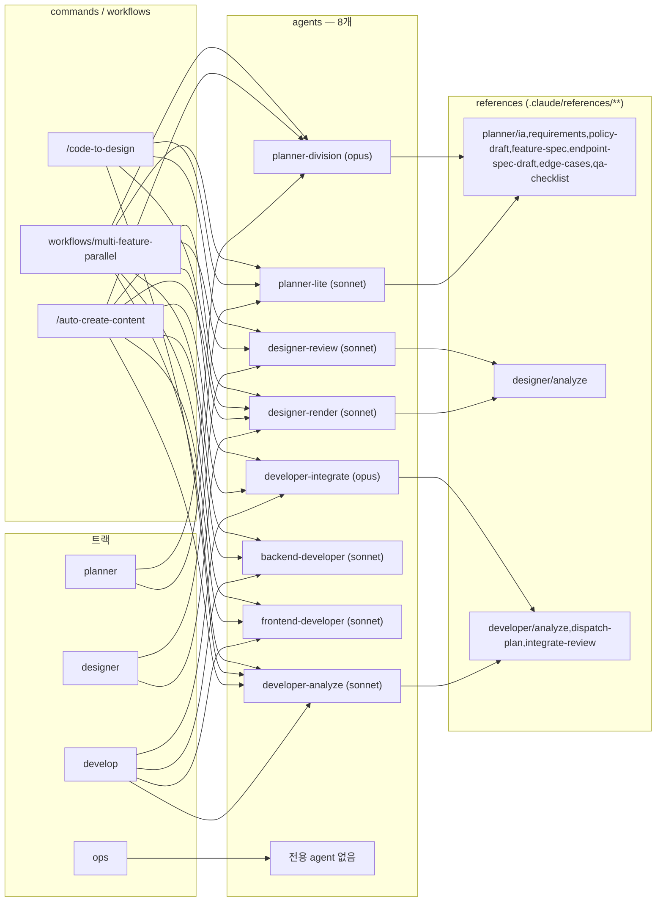
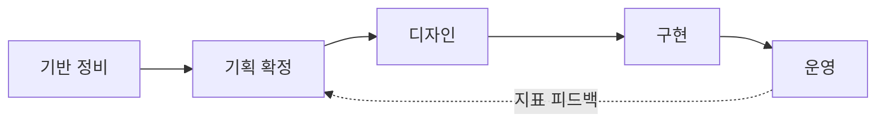

# 프로젝트 현황 진단 + 로드맵 골격 (초안)

- 기준일: 2026-09-26 (코드·문서 실측, 브랜치 `v2.0.0-refactor-mobile`)
- 목적: 일정 수립 전, **무엇이 있고 무엇이 비었는지** 한 장으로 본다. 날짜는 사용자가 정한다 — 이 문서의 날짜 칸은 전부 `TBD`.
- 참고: [v1-mobile-gap.md](./v1-mobile-gap.md) · [2026-09-release-log.md](./2026-09-release-log.md) · [decisions-2026-08-31.md](./decisions-2026-08-31.md) · [test-docs-leftover.md](./test-docs-leftover.md)
- 범례: ✅ 완료 · 🟡 부분 · ❌ 없음 · ➖ 해당 없음(정적 화면 등)

---

## 1. 도메인 식별 — 목록끼리 어긋난 곳

### 1.1 네 군데 목록 대조

| 도메인 | CLAUDE.md § 10 | `docs/domain/*` | FE `web/src/domains/*` | BE `domain/*` | DB (`sql/V2`,`sql/V3`) |
|---|---|---|---|---|---|
| home | ✅ | ❌ | `home` | ➖ (집계) | ➖ |
| coupons | ✅ | ❌ | `coupons` | `coupon` | `site_coupons` |
| events | ✅ | ❌ | `events` | `event` | `site_events` |
| notices | ✅ | ❌ | `notices` | `notice` | `site_notices` |
| users | ✅ | `account` | `users` | `oauth` | `site_users`, `site_user_oauth_accounts` |
| authentication | ✅ | ❌ | `authentication` | `oauth` | `site_refresh_tokens` |
| quiz | ✅ | ❌ | `quiz` (관리자만) | `quiz` | `fun_quiz` |
| historyMode | ✅ | ❌ | `historyLegend` | `fun/historyMode` | `data_history_*` |
| community (동결) | ✅ | `community` | `community` | `community` | `site_post` 외 8 |
| admin | ✅ | `admin` | `admin` | `admin` | ➖ |
| legendStats | **누락** | ❌ | `legendStats` | `fun/legendStat`, `fun/legendCard` | `data_player_legend*` |
| mileage | **누락** | `mileage` | `mileage` | `fun/mileage` | (data_* 재사용) |
| players (선수 백과) | **누락** | ❌ (`_roadmap` 에 조사 2건) | `players` | `fun/playerCard` | `data_player_card*` |
| playerSkills (스킬 백과) | **"삭제됨"으로 표기** | ❌ | `playerSkills` | `fun/playerSkill` | `data_player_skill*` |
| odds (확률 공시) | **누락** | `odds` | `odds` (정적 데이터) | ❌ | ❌ |
| guides | **누락** | `guides` | `guides` (정적) | ❌ | ❌ |
| policy (약관 등) | **누락** | ❌ | `policy` | ❌ | ❌ |
| analytics | **누락** | `analytics` | `infra/analytics` | `analytics` | `site_user_event*` |
| statistics (후원 클릭) | **누락** | ❌ | `home/.../SupportSection` | `statistics` | `statistic_support_click` |
| gamification | **누락** | `gamification` | ❌ | ❌ | ❌ |

### 1.2 불일치 요약

| # | 종류 | 내용 | 근거 |
|---|---|---|---|
| M1 | 목록 누락 | CLAUDE.md 의 "살아있는 도메인" 10개에 실제 운영 중인 9개가 빠짐 (legendStats·mileage·players·playerSkills·odds·guides·policy·analytics·statistics) | `web/src/app/router/routes/PublicRoutes.jsx` |
| M2 | 잘못된 삭제 표기 | CLAUDE.md 는 `skill`(스킬 백과사전) 을 삭제 도메인으로 적었으나, 2026-09 `/skills` 로 **재오픈** 됨 | `2026-09-release-log.md` § 2, `ROUTE_PATHS.player_skills` |
| M3 | 문서만 있음 | `gamification` — 기획 4건, 코드 0 | `docs/domain/gamification/prd/` |
| M4 | 코드만 있음 | home·coupons·events·notices·authentication·historyMode·legendStats·playerSkills·policy 는 기획 폴더 없음 | `docs/domain/` 목록 |
| M5 | 이름 불일치 | 같은 도메인이 층마다 다른 이름: historyMode↔historyLegend / users↔oauth↔account / players↔playerCard / legendStats↔legendStat+legendCard / 복수형(FE)↔단수형(BE) | 위 표 |
| M6 | 경로 오기 | CLAUDE.md § 4 의 `sql/V2/{site,fun}/*.sql` 은 없는 경로. 실제는 `sql/V2/CREATE_0N_*` 평면 + `sql/V3/CREATE_0N_*` | `sql/V3/README.md` |
| M7 | 오래된 문서 | `v1-mobile-gap.md` 는 "퀴즈 관리 화면 없음", "wiki/kbo 제거 조사 중" 이라 적혀 있으나 이미 반영됨 (`f4b21eb` 퀴즈 관리, wiki/kbo 삭제) | `web/src/domains/quiz/mobile/admin/AdminQuizScreen.jsx` |
| M8 | 삭제 도메인 잔재 | 코드상 잔재 없음 (`coach` 는 레전드 재료 종류 `MaterialType.COACH` 로 무관) | `grep coach\|kbo\|wiki` |

---

## 2. 도메인별 현황 매트릭스

기획 = `docs/domain/{d}/prd` 또는 `_roadmap` · 디자인 = `docs/domain/{d}/design` 또는 Figma 링크 · 테스트 = `src/test/**`(FE 테스트는 전 도메인 0건)

| 도메인 | 기획(prd) | 디자인 | FE | BE | DB schema | 테스트 |
|---|---|---|---|---|---|---|
| home | ❌ 기준선 없음 (`v1-mobile-gap.md` § 4) | 🟡 전역 `DESIGN.md` 만 | ✅ `web/src/domains/home` | ➖ | ➖ | ❌ |
| coupons | 🟡 관리자 쪽만 (`admin/prd/admin-screens.md`) | 🟡 관리자만 (`admin/design`) | ✅ `domains/coupons` | ✅ `domain/coupon` | ✅ `sql/V2/CREATE_04_TABLE_SITE.sql` | ❌ |
| events | 🟡 관리자 쪽만 | 🟡 관리자만 | ✅ `domains/events` | ✅ `domain/event` | ✅ `CREATE_04_TABLE_SITE.sql` | ❌ |
| notices | 🟡 관리자 쪽만 | 🟡 관리자만 | ✅ `domains/notices` | ✅ `domain/notice` | ✅ `CREATE_04_TABLE_SITE.sql` | ❌ |
| users (마이페이지) | ✅ `account/prd/user-features-index.md` | ❌ | ✅ `domains/users` | ✅ `oauth/UserController` | ✅ `sql/V2/MIGRATE_user_restructure.sql` | ❌ |
| authentication | ❌ | ➖ | ✅ `domains/authentication` | ✅ `oauth/AuthController` | ✅ `sql/V3/CREATE_06_site_refresh_tokens.sql` | ❌ |
| quiz | 🟡 `v1-mobile-gap.md` § 2 뿐 | ❌ | 🟡 관리자 화면 + 홈 섹션, 공개 화면 없음 | ✅ `quiz/QuizController` | ✅ `sql/V3/CREATE_05_fun.sql` | ❌ |
| historyMode | ❌ | ❌ | ✅ `domains/historyLegend` | ✅ `fun/historyMode` | ✅ `sql/V3/CREATE_01_data_history_mode.sql` | ❌ |
| legendStats | 🟡 조사만 (`_roadmap/prd/player-name-stat-sheet-crosscheck.md`) | ❌ | ✅ `domains/legendStats` | ✅ `fun/legendStat` | ✅ `sql/V3/CREATE_02_data_player_legend.sql` | ❌ |
| mileage | ✅ `mileage/prd/` (6건) | 🟡 명세만, prd 폴더 안 (`design-spec-v2.md`) | 🟡 계산기 탭 서버 미연동 | ✅ `fun/mileage` | ➖ data_* 재사용 | ✅ `MileageMapperTest` |
| players | 🟡 조사만 (`_roadmap/prd/player-card-excel-db-fullscan.md`) | ❌ | 🟡 리스트형 작업 중 (미커밋 이력) | ✅ `fun/playerCard` | ✅ `sql/V3/CREATE_03_data_player_card.sql` | ✅ `PlayerCardMapperTest` |
| playerSkills | ❌ | ❌ | ✅ `domains/playerSkills` | ✅ `fun/playerSkill` | ✅ `sql/V3/CREATE_04_data_player_skill.sql` | ✅ `PlayerSkillMapperTest` |
| odds | ✅ `odds/prd/odds-mobile-plan.md` | ❌ | ✅ 정적 (`web/src/data/odds`) | ➖ | ➖ | ❌ |
| guides | ✅ `guides/prd/guides-content-plan.md` | ❌ | ✅ `domains/guides` | ➖ | ➖ | ❌ |
| policy | 🟡 결정 기록만 (`decisions-2026-08-31.md`) | ❌ | ✅ `domains/policy` | ➖ | ➖ | ❌ |
| community | ✅ `community/prd/community-status.md` | ❌ | 🟡 읽기 전용 | ✅ 컨트롤러 14개 | ✅ `CREATE_04_TABLE_SITE.sql` | ❌ |
| admin | ✅ `admin/prd/` (12건) | ✅ `admin/design/` (6건) | ✅ `domains/admin` (셸+탭) | ✅ `domain/admin` + `Admin*Controller` | ➖ | ❌ |
| analytics | ✅ `analytics/prd/user-event-tracking.md` | ➖ | ✅ `web/src/infra/analytics` | ✅ `domain/analytics` | ✅ `sql/V3/CREATE_07_site_user_event.sql` | ✅ `AnalyticsEventGuardTest` |
| statistics | ❌ | ❌ | 🟡 홈 후원 섹션 | ✅ `domain/statistics` | ✅ `sql/V3/CREATE_08_*` | ❌ |
| gamification | ✅ `gamification/prd/` (4건) | ❌ | ❌ | ❌ | ❌ | ❌ |
| 스킬 시뮬레이터 | ❌ (보류) | ❌ | ❌ (`comingSoon`) | ❌ | ❌ | ❌ |

**숫자로 보기** (➖ 제외, 21행)

| 열 | ✅ | 🟡 | ❌ |
|---|---|---|---|
| 기획 | 8 | 7 | 6 |
| 디자인 | 1 | 5 | 13 |
| FE | 14 | 5 | 2 |
| 테스트 | 4 | 0 | 17 |

- **Figma 링크**: `docs/domain/**` 전체에 `figma.com` URL **0건**. Figma 원본 파일이 문서 어디에도 연결돼 있지 않다.

---

## 3. 프로젝트 구조 — 트랙 → agent → reference/command/workflow

- agent 는 `.claude/agents/*.md` **8개 전부** 호출 가능. `_deprecated_/` 는 `a5919bd8` 에서 **폴더째 삭제**됨 (더는 존재하지 않음).
- `planner-division.rounds.md` 는 agent 가 아니라 `planner-division` 이 라운드 진입 시점에만 Read 하는 외부 sub 문서.
- 옛 `skills` 폴더는 **없다** — `a5919bd8` 에서 전부 `.claude/references/**` 로 옮겨 "agent 가 필요 시 스스로 Read 하는 참조 문서"로 성격이 확정됐다.

| 관찰 | 근거 |
|---|---|
| ops 트랙에 agent·가이드가 하나도 없다 (변동 없음) | CLAUDE.md § 10 "⏳ ops 미작성" |
| 폐기 agent 4개 및 두 커맨드의 폐기 agent 호출은 `157e85f2`·`a5919bd8` 에서 전부 정리·교체됨 — 지금은 현행 agent만 부른다 | `.claude/commands/auto-create-content.md`, `code-to-design.md` |
| `designer-review` 는 두 커맨드 모두에서 호출된다 (figma 사용자 수정분 평가 단계) — "어디서도 호출 안 됨"은 옛 상태 | `auto-create-content.md` § 4, `code-to-design.md` § 7 |
| 도구 라우팅 정답표 `tool-routing.md` 가 신설돼 § 6 "확인 필요" 항목 다수가 해소됨 | `.claude/conventions/tool-routing.md` |
| 로드맵·일정을 다루는 agent/참조 문서는 여전히 없다 (planner 참조 7개 모두 기능 단위) | `.claude/references/planner/*` |

---

## 4. 공백 분석 — 로드맵 수립을 막는 것

| 우선 | 공백 | 왜 막는가 | 해소 산출물 | 트랙 |
|---|---|---|---|---|
| P0 | 일정·마일스톤 문서 없음 | 버전·기한·완료 기준이 어디에도 없다. `_roadmap/prd/` 는 조사·기록뿐 | `_roadmap/prd/roadmap.md` (본 문서 § 5 를 확정본으로) | planner |
| P0 | 도메인 정본 목록 불일치 (M1·M2·M5) | agent 가 CLAUDE.md 를 믿고 "스킬 백과사전은 삭제됨" 같은 틀린 전제로 일한다 | CLAUDE.md § 10 갱신 + 도메인 이름 대응표 | ops(메타) |
| P0 | 보류·미결 항목 결정 대기 | 스킬 시뮬레이터 / 커뮤니티 쓰기(동결 해제는 12월쯤 예정 — 확정 아님) / 로그인 전용 선수카드 / 업적(gamification) / 마이페이지 재기획 — 어느 것이 다음인지 정해지지 않았다 | 결정 기록 1건 | 사용자 |
| P1 | 운영 중 도메인 9개에 기획 문서 없음 (M4) | 현재 동작이 곧 사양. 개선 범위·완료 조건을 적을 기준선이 없다 | 도메인별 `prd/ia.md` (reverse 모드) | planner |
| P1 | 디자인 문서·Figma 링크 부재 | admin 외엔 디자인 산출물 0, Figma URL 0건 → designer 트랙 착수 불가 | Figma 정본 URL + 도메인별 `design/*.md` | designer |
| P1 | ops 가이드 미작성 | BE 배포가 수동(`deploy-be.yml` 은 `workflow_dispatch` 만), 운영 설정 파일(`application-prod.properties`)이 리포에 없음 — 위치 확인 필요 | `docs/convention/ops.md` | ops |
| P1 | 테스트 공백 | BE 매퍼 테스트 4건, FE 0건. 회귀 기준이 없어 구현 단계 완료 조건을 못 건다 | 도메인별 최소 테스트 기준 | develop |
| P2 | 진행 중 작업의 끝이 없음 | 선수 백과사전 리스트형 · 마일리지 계산기 서버 연동 · 퀴즈 공개 화면 · 이벤트 타입 선택 UI · 재활성화 안내 | 각 항목 완료 조건 | planner/develop |
| P2 | 오래된 문서 (M7) · 폐기 agent 호출 (§ 3) | 잘못된 현황이 다시 인용된다 | 문서 갱신, command 수정 | ops(메타) |
| P3 | 이름 체계 통일 (M5) | 검색·자동화에서 누락이 생긴다. 당장 막지는 않음 | 이름 대응표만 먼저 | develop |
| P3 | 광고(AdSense) 승인 이후 작업 | `ADS_ENABLED=false` 상태 — 08-22 신청 후 반려 반복 중, `nextjs-migration` 브랜치에서 해결 시도 중 | `docs/convention/adsense.md` 후속 | ops |

---

## 5. 로드맵 골격 (제안)

날짜 칸은 전부 `TBD` — 사용자가 채운다. 각 단계는 앞 단계의 완료 조건을 입력으로 쓴다.

### 기반 정비 단계 · 시작 `TBD` · 종료 `TBD`

| 대상 | 산출물 | 완료 조건 |
|---|---|---|
| 전역 | CLAUDE.md § 4·§ 10 갱신 (도메인 19개 정본, SQL 경로) | § 1.1 표와 CLAUDE.md 목록이 일치 |
| 전역 | 도메인 이름 대응표 (FE / BE / docs / DB) | M5 전 항목 한 줄씩 매핑 |
| `.claude` | `/code-to-design`·`/auto-create-content` 의 폐기 agent 호출 교체, `plugin-code` 정리 | `_deprecated_` agent 호출 0건 |
| `_roadmap` | `v1-mobile-gap.md` 현행화 또는 "보관" 표시 | M7 해소 |
| ops | `docs/convention/ops.md` (배포·환경·설정 위치·보안) | 수동 배포 절차를 문서만 보고 재현 가능 |

### 기획 확정 단계 · 시작 `TBD` · 종료 `TBD`

| 대상 | 산출물 | 완료 조건 |
|---|---|---|
| 기획 없는 운영 도메인 (home·coupons·events·notices·authentication·historyLegend(코드상 historyMode)·legendStats·playerSkills·policy) | `docs/domain/{d}/prd/ia.md` (reverse) | 도메인마다 화면·시나리오·우선순위 1장 |
| 진행 중 (players·mileage·quiz) | `requirements.md` + 완료 조건 | 남은 작업이 체크리스트로 닫힘 |
| 보류 후보 (시뮬레이터·커뮤니티 쓰기·로그인 전용 카드·gamification·마이페이지) | 우선순위 결정 기록 + 선택된 것만 `feature-spec.md` | 다음 구현 대상 1~2개 확정 |
| 전역 | `_roadmap/prd/roadmap.md` (버전·마일스톤) | 날짜 또는 버전 단위가 확정 |

### 디자인 단계 · 시작 `TBD` · 종료 `TBD`

| 대상 | 산출물 | 완료 조건 |
|---|---|---|
| 전역 | Figma 정본 파일 URL 기록, `DESIGN.md` 토큰 ↔ Figma 변수 대조 | 토큰 불일치 0 또는 목록화 |
| 기획 확정 단계에서 정한 도메인 | `docs/domain/{d}/design/*.md` + Figma 화면 | 기획 화면 전부에 Figma 프레임 대응 |
| 운영 중 도메인 | design-sync 보고서 (코드 ↔ Figma) | 차이 목록 + 수정 여부 결정 |

### 구현 단계 · 시작 `TBD` · 종료 `TBD`

| 대상 | 산출물 | 완료 조건 |
|---|---|---|
| 진행 중 마무리 | 선수 백과 리스트형, 마일리지 계산기 서버 연동, 퀴즈 공개 화면, 이벤트 타입 UI, 재활성화 안내 | 각 기획 확정 단계 체크리스트 전부 ✅ |
| 기획 확정 단계에서 고른 신규 기능 | BE·FE·DB 코드 (`/auto-create-content` 흐름) | developer-integrate 정합 보고 mismatch 0 |
| 테스트 | 도메인별 최소 테스트 (BE 매퍼·서비스, FE 주요 화면) | 합의한 최소 기준 충족 |

### 운영 단계 · 시작 `TBD` · 종료 `TBD`

| 대상 | 산출물 | 완료 조건 |
|---|---|---|
| 배포 | 배포 체크리스트, 롤백 절차 | 문서대로 배포·롤백 1회 성공 |
| 지표 | analytics 이벤트 기반 도메인별 사용량 보고 | 다음 기획 확정 단계 우선순위 입력으로 사용 |
| 수익·정책 | 광고 승인 후 활성화 (현재 반려 반복, `nextjs-migration` 에서 해결 시도 중), 정책 페이지 갱신일 | `ADS_ENABLED` 결정 기록 |

---

## 6. 도구 후보 매핑 (`tool-routing.md` 실측 반영)

`.claude/conventions/tool-routing.md` 가 요청별 단일 정답표다. 여기 없는 도구는 미연결로 정리했다 — 추측 안 함.

| 도구 | 종류 | 용도 | 쓰일 단계 | 트랙 | 상태 |
|---|---|---|---|---|---|
| figma | MCP | 디자인 읽기·쓰기, design-sync | 디자인, 구현 | designer | 연결됨 — 정본 파일 URL 미기록 (§ 4) |
| playwright | MCP | 반복 재현되는 화면 캡처·E2E | 구현, 운영 | develop | 연결됨 — FE 테스트 0건 공백 1순위 후보 |
| inspo | MCP | 실제 서비스 화면 레퍼런스 | 기획, 디자인 | designer, planner | 연결됨 — mobbin/refero/nicelydone 이 하려던 역할을 대신함 |
| notion | MCP | 기획 문서 저장·검색 | 기획 | planner | 연결됨 |
| impeccable | skill | 기존 화면 다듬기 (여백·정렬·접근성) | 기반 정비, 디자인 | designer | 연결됨 — `PRODUCT.md`/`DESIGN.md` 흔적 있음 |
| design-taste-frontend | skill | 신규 화면 처음부터 디자인 | 디자인 | designer | 연결됨 (옛 표기 "taste") |
| ui-ux-pro-max | skill | 색·폰트·스타일·차트 종류 고르기 | 기획, 디자인 | designer | 연결됨 |
| emil-design-eng | skill | 전환·마이크로 인터랙션 | 디자인, 구현 | designer, develop | 연결됨 (옛 표기 "emilkowalski") |
| dataviz | skill | 숫자가 주인공인 그림 | 구현 | develop | 연결됨 |
| archify | skill | 숫자 없는 구조도·흐름도 (독립 파일) | 기반 정비 | ops(메타) | 연결됨 |
| ponytail | 플러그인 | 코드 최소화·과설계 점검 | 전 단계 | develop | 연결됨 (옛 표기 "포니테일") |
| mobbin · refero · nicelydone | (검토했던 후보) | UI 레퍼런스 | — | — | 미연결 — `inspo` 로 대체 |
| layweb · inspoAI · 옴니라우트 · 그래피파이 | 확인 필요 | `tool-routing.md` 에 없음 | — | — | 미연결 |

**단계별 묶음**

| 단계 | 도구 |
|---|---|
| 기반 정비 | impeccable, archify |
| 기획 확정 | inspo, notion, ui-ux-pro-max |
| 디자인 | figma, inspo, impeccable, design-taste-frontend, ui-ux-pro-max, emil-design-eng |
| 구현 | figma(design-sync), playwright, dataviz, ponytail |
| 운영 | playwright(배포 후 스모크 테스트) |

---

## 7. 사용자 결정 필요

1. **로드맵 단위** — 날짜 마일스톤 / 버전(v2.1, v2.2 …) / 주차 중 무엇으로 끊을까?
2. **다음 구현 대상** — 스킬 시뮬레이터 · 커뮤니티 쓰기 · 로그인 전용 선수카드 · 업적(gamification) · 마이페이지 재기획 중 Phase 3 의 첫 1~2개는?
3. **도메인 정본** — CLAUDE.md § 10 을 § 1.1 의 19개로 갱신할까? 이름 기준은 FE 폴더명 / BE 패키지명 / docs 폴더명 중 어느 쪽?
4. **Figma 정본** — 기준으로 삼을 Figma 파일 URL 은? (현재 문서에 0건)
5. ~~미확인 도구~~ — 해소. `taste`→design-taste-frontend, `emilkowalski`→emil-design-eng, `포니테일`→ponytail, `archify` 모두 연결 확인 (§ 6). `layweb`·`inspoAI`·`옴니라우트`·`그래피파이` 는 `tool-routing.md` 에 없어 미연결로 정리 — 여전히 필요하면 별도 요청.
