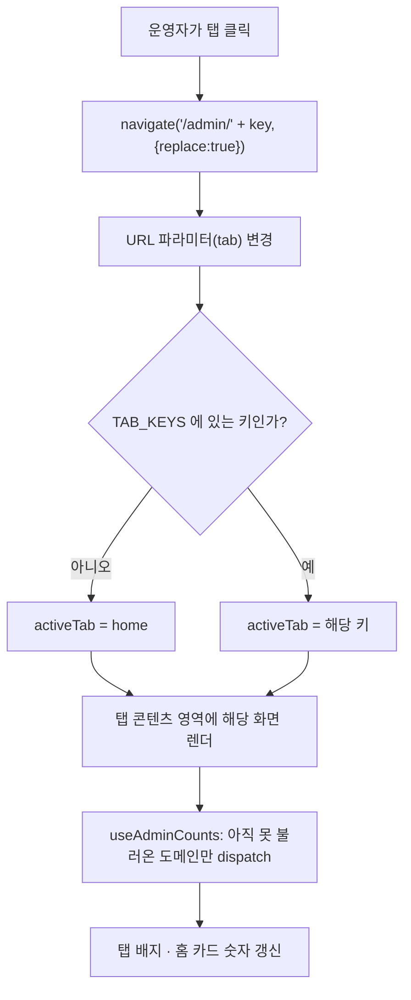

# admin — 설계

## 1. 화면 구조

| 화면 ID | 화면 | 영역 배치 |
|---|---|---|
| SC-01-01 | 어드민 셸 | 상단 탭바(가로 스크롤, 8개: 홈·퀴즈·이벤트·쿠폰·공지·유저·통계·동기화) + 탭 콘텐츠 영역(선택된 탭 1개만 렌더) |
| SC-01-01 내부 · 홈 탭 | 홈 | 제목 블록("빠른 이동") + 카드 그리드(홈 제외 7개, 탭 이동용) + "지금 홈에 노출 중" 요약 카드(퀴즈·이벤트·쿠폰·고정공지) |
| SC-01-01 내부 · 통계 탭 | 통계 | 기간 토글(오늘·7일·30일) + 요약 카드 2개(순방문자·페이지뷰) + 이벤트 종류별 건수 표 + 상위 경로 Top 10 표 + 기기 비율 막대(mobile/tablet/pc + unknown 회색) + 세션당 페이지뷰 카드 + 외부 유입 상위 표 + 재집계(날짜 선택+버튼) — 전 구간 실측(2026-09-29부터 7일·30일도 실값) |
| SC-01-01 내부 · 동기화 탭 | 동기화 | 헤더(제목+설명+전체 동기화 버튼) + 대상 목록(라벨·설명·마지막 동기화 시각·동기화 버튼) + 전체 동기화 확인창 |
| SC-01-01 내부 · 퀴즈/이벤트/쿠폰/공지/유저 탭 | 각 콘텐츠 관리 화면 | 해당 도메인이 소유한 `Admin*Screen.jsx`를 그대로 배치. 화면 구조는 각 기능 문서 소관 |
| SC-04-03 | 공지 글쓰기(셸 밖 예외) | 전체 화면, Tiptap 에디터. 화면 구조는 공지 기능 문서 소관 — 여기서는 진입점만 |

화면 ID는 프로젝트 화면 번호 목록의 `SC-NN-NN` 그대로. 어드민 셸 내부 8개 탭은 URL이 `/admin/:tab` 하나이고 탭 전환이 `AdminShellScreen.jsx` 내부 상태 전환이라 별도 화면 번호를 받지 않는다.

## 2. 상태

| 상태 | 조건 | 화면에 보이는 것 |
|---|---|---|
| 불러오는 중 | `useAdminCounts`가 6개 도메인 목록을 아직 못 받음 | 탭 배지는 count가 `null`인 동안 렌더 자체를 생략(숫자·placeholder 없음). 동기화 탭은 `StateBox status="loading"` |
| 오류 | 도메인별 fetch 실패 | 실패한 도메인만 배지 숨김, 나머지 탭은 정상 진행. 동기화 탭은 `StateBox status="error"` + 다시 시도 |
| 빈 화면 | 캐시 동기화 대상 0건 | `StateBox status="empty"` "동기화할 대상이 없습니다." |
| 상한 도달 | 회원·이벤트 목록이 전량 조회 상한(1000건)에 닿음 | 탭 배지·홈 카드 숫자 대신 "–"(틀린 숫자 대신 숨김) |
| 모르는 탭 키 | `/admin/{오타}` 등 정의되지 않은 tab 접근 | 조용히 홈 탭으로 흡수 — 빈 화면 없음 |
| 통계 불러오는 중 | `requestAdminAnalyticsSummary` pending | `StateBox status="loading"` |
| 통계 조회 오류 | 요청 실패 | `StateBox status="error"` + 다시 시도 |
| 통계 데이터 없음 | 선택 기간에 이벤트가 없음(배포 직후 등) | `StateBox status="empty"` "집계된 데이터가 없습니다." |

## 3. 흐름

동기화 탭의 개별 동작은 별도 흐름이다: 동기화 버튼 클릭 → (전체 동기화는 `AdminConfirmDialog` 확인 후) → `POST /admin/cache-sync/{id}/sync` 또는 `/sync-all` → 성공 시 해당 행에 걸린 시간, 실패 시 해당 행(또는 `allSyncError`)에 오류 메시지 표시. 서버가 부분 실패를 개별 결과로 담아 반환하므로 대상 하나가 실패해도 나머지는 계속 처리된다.

## 4. 디자인 값

- 레이아웃: `page-layout` mixin 기본값(전역 모바일 폭 단일 토큰 그대로) — 재설계 초안이 검토했던 어드민 전용 좁은 폭은 채택되지 않고 공용 폭 그대로 확정됐다
- 탭바 활성 표시: `--color-admin-accent-active-text`, `--color-admin-accent-line`
- 탭 배지 글자: `--color-text-muted`(비활성) / `--color-admin-accent`(활성)
- 표 행/헤더 높이: `--admin-row-h`, `--admin-head-h` (레전드 재료 화면과 같은 높이로 통일)
- 표 헤더 배경: `--color-table-head-bg`(공용 승격, admin 로컬 정의 없음), hover 는 `--color-admin-table-row-hover`(`--color-table-row-hover` 참조)
- 토글 on/off: `--color-admin-on`, `--color-admin-toggle-off`
- 체크박스·선택 행: `--color-admin-checkbox-off`, `--color-admin-row-selected-bg`
- 태그/배지 5색(퀴즈 노출중·이벤트 공식·쿠폰 만료 강조·공지 사이트/공식·유저 상태): `--color-admin-tag-purple-*`, `-green-*`, `-amber-*`, `-rose-*`, `-neutral-*`
- 위 토큰은 전부 `web/src/global/ui/admin/admin.tokens.scss`(도메인 로컬 토큰, side-effect import) 소유이며 전역 `_colors.scss`/`semantic/_color.scss` 값을 그대로 변경하지 않는다
- 기기 비율 막대: 신규 토큰 없이 재사용 — mobile `--color-admin-tag-purple-500`, tablet `-green-500`, pc `-amber-500`, unknown `-neutral-500`

## 5. 서버와 주고받는 것

| 요청 | 응답 | 실패하면 |
|---|---|---|
| `GET /api/admin/cache-sync/targets` | `List<CacheSyncTargetResponse>` | 동기화 탭 `StateBox status="error"` + 다시 시도 버튼 |
| `POST /api/admin/cache-sync/{targetId}/sync` | `CacheSyncResultResponse` | 해당 대상 행에만 실패 메시지 표시, 다른 대상은 영향 없음 |
| `POST /api/admin/cache-sync/sync-all` | `List<CacheSyncResultResponse>`(부분 실패 개별 결과 포함) | 대상별 결과에 실패가 섞여 와도 성공한 대상은 정상 표시, 요청 자체 실패는 `allSyncError` 문구 |
| (셸 마운트 1회) 퀴즈·이벤트·쿠폰·공지·유저 목록 조회 | 각 도메인 리스트 | 실패한 도메인만 탭 배지·홈 카드가 "–"로 남고 나머지는 정상 |
| `GET /api/admin/analytics/summary?range=TODAY\|WEEK\|MONTH` | `AdminAnalyticsSummaryResponse`(+ pageViewsPerSession, deviceRatio·topReferrers·sessionCount 이제 전 구간 실값) | `StateBox status="error"` + 다시 시도 버튼 |
| `POST /api/admin/analytics/aggregate?date=YYYY-MM-DD` | 성공 시 알림 모달("YYYY-MM-DD 재집계했습니다") + 현재 보던 range 재조회 | 버튼 옆 인라인 에러 텍스트 |

## 6. Figma

| 화면 | node-id |
|---|---|
| SC-01-01 어드민 셸(전체) | 미확인 — 과거 `figma-plugin` 코드 렌더 방식(`domains/admin-screens-v2.ts` 등)으로 생성된 node(`16:xxx` 계열)가 있으나, 이 방식은 2026-08-20 폐기되어 현재 Figma MCP(`use_figma`)로 재확인된 적이 없다. 신뢰할 수 있는 현재 node-id 없음 |
