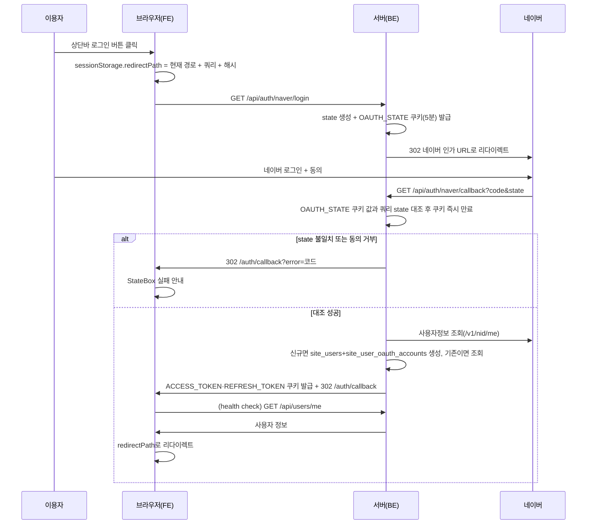

# authentication — 설계

## 1. 화면 구조

| 화면 ID | 화면 | 영역 배치 |
|---|---|---|
| SC-08-01 | 로그인 콜백 처리 | `<MobileLayout>` 본문 중앙에 스피너 + 안내문(성공 시 즉시 리다이렉트라 실제로는 실패했을 때만 보인다) |
| 미부여 | 로그인 안내 모달(공용) | 제목 "로그인이 필요해요" · 보조 "로그인하면 지금 보던 화면으로 돌아와요." · 본문은 진입 지점별 문구 3종 · 버튼 `닫기` / `로그인`. 서랍·홈 바로가기·화면 안 편집 버튼이 같은 부품을 쓴다(REQ-AUTH-13) |

도메인 자체 헤더 없음 — 전역 `MobileLayout`(상단바+서랍) 위에 본문만 얹는다. 이 화면은 AdSense 반려 재발 방지를 위해 광고 슬롯을 배치하지 않는다(`fe-ads.md` § 2 배치 금지 화면).

## 2. 상태

| 상태 | 조건 | 화면에 보이는 것 |
|---|---|---|
| 처리 중 | 콜백 도착 직후, `requestUserHealthCheck` 응답 대기 | 스피너 + "로그인 처리 중입니다…" |
| 성공 | health check 성공 | 화면이 보이지 않음 — 로그인 전 머물던 주소(`sessionStorage.redirectPath` — 경로 + 쿼리 + 해시. 없거나 `/` 로 시작하지 않거나 `//` 로 시작하는 외부 주소면 `/`)로 즉시 리다이렉트 |
| 실패 | 쿼리에 `?error=코드`가 있거나 health check 실패 | `StateBox status="error"`로 안내문 표시. `AUTH_USER_BLOCKED`만 전용 문구, 나머지는 공통 재시도 안내 |

빈 화면 상태는 없다 — 이 화면은 처리 중이거나 실패 안내뿐이고, 성공 시 화면이 그려지기 전에 다른 주소로 넘어간다.

## 3. 흐름

로그아웃: `logout()` 호출 → GA4 로그아웃 이벤트 기록 → `POST /api/auth/logout`(쿠키·refresh 토큰 삭제) → Redux 상태·세션 마커 초기화 → `/`로 이동.

앱 진입 시 인증 상태 복구: 최초 마운트에서 `GET /api/users/me`(health check) 1회 호출 → 성공하면 `user`·`userRole` 저장, 401이면 `user = null`로 비로그인 처리(§5 참조). 이후 별도 재확인 주기 없음(§ 스펙 § 5 "하지 않는 것").

## 4. 디자인 값

색은 상태 3축(`fe-design.md` § 4) 중 상태 축(오류=위험 색)만 쓴다. 스피너·안내 문구는 `global/ui/mobile/stateBox/StateBox` 토큰을 그대로 따른다. 이 화면 전용 색·간격 토큰 없음.

## 5. 서버와 주고받는 것

| 요청 | 응답 | 실패하면 |
|---|---|---|
| `GET /api/auth/naver/login` | 302 (네이버 인가 URL) | `naver.redirect-uri` 환경변수 누락 시 서버 기동 자체가 실패(배포 단계에서 걸러짐) |
| `GET /api/auth/naver/callback?code&state` | 302 `/auth/callback`(성공: 쿠키 발급 / 실패: `?error=코드`) | 응답 본문을 화면에 노출하지 않는다 — 항상 리다이렉트 |
| `GET /api/users/me`(health check) | 사용자 정보(userRole 포함) | 401/403 → `StateBox` 실패 안내, 세션 마커 정리(`resetAuthSession`) |
| `POST /api/auth/refresh` | 새 access 토큰 쿠키 | 실패 시 로그아웃 처리 |
| `POST /api/auth/logout` | 204 | 없음 — 실패해도 FE는 세션을 정리한다 |

## 6. Figma

| 화면 | node-id |
|---|---|
| 로그인 안내 모달 (보유 현황 위) · 안내 화면 | 536:1876 · 536:2120 · 536:2163 |
| 사용자 흐름도 (`14`) | 540:2143 |
| 로그인 콜백 처리 | 미확인 — Figma 정본 파일 없음(`screen-id.md` § 4) |
| (옛 시안) 로그인 안내 모달 (문구 3종, `legendContentFlow / 06`) | 511:1329 |
| (옛 시안) 모달 부품 `C/LCF/LoginRequiredModal` | 511:1320 |
| (옛 시안) 사용자 흐름도 | 514:1350 |
