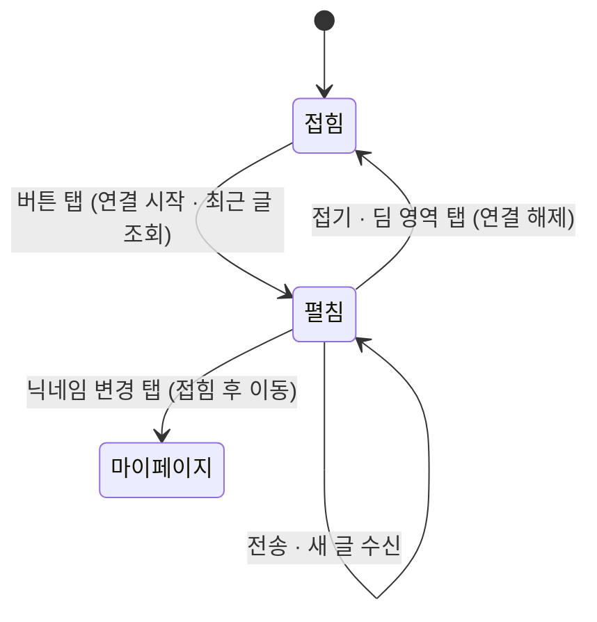

# chats (펀톡 — 플로팅 채팅 위젯) — 설계

## 1. 화면 구조

화면 ID(`SC-NN-NN`)는 구현 단계에서 `overview/domain.md` 에 채번한다. 아래 `CH-N` 은 Figma 프레임 이름용 임시 번호다. ❓

| 임시 ID | 화면 | 영역 배치 |
|---|---|---|
| CH-1 | 접힘 — 플로팅 버튼 | 우측 하단 52 원형 · 아이콘만 · 본문 위에 얹힘 |
| CH-2 | 펼침 — 로그인 사용자 | 뒤 화면 딤 + 우측 하단 플로팅 카드(400 × 560, 우·하 여백 16). 헤더(제목 · 접기) → 보관 고지 → 메시지 목록 → 입력 영역 |
| CH-3 | 펼침 — 비로그인 | 입력 영역 자리에 "로그인하고 대화에 참여하기" + 로그인 버튼 |
| CH-4 | 펼침 — 마스킹 닉네임 | 입력 영역 자리에 "닉네임을 바꾸면 채팅할 수 있어요" + 닉네임 변경 버튼(마이페이지로 이동) |
| CH-5 | 펼침 — 연결 끊김/재연결 | 헤더 아래 경고 띠, 입력창·전송 잠금, 받은 글은 그대로 |
| CH-6 | 펼침 — 빈 상태 | 목록 가운데 아이콘 + "아직 대화가 없어요 / 첫 인사를 남겨보세요" |
| CH-7 | 펼침 — 오류 토스트 | 입력 영역 바로 위 붉은 띠 "잠시 후 다시 보내주세요", 입력 내용 유지 |

- 접힘 ↔ 펼침: 버튼 탭 → 펼침, 접기 버튼 또는 딤 영역 탭 → 접힘 (Figma 에 화살표 주석)
- 상단바는 전역 `MobileLayout` 이 소유한다. 위젯은 자체 헤더를 두지 않는다 (패널 헤더는 패널 제목줄일 뿐)
- 메시지 3종(부품 `C/Chat/Message`): 남의 글(좌측 · 닉네임+시간 · 어두운 말풍선), 내 글(우측 · 시간 · 브랜드색 말풍선), 봇 글(좌측 · `봇` 표식 · 보라 옅은 면 + 왼쪽 선)

## 2. 상태

| 상태 | 조건 | 화면에 보이는 것 |
|---|---|---|
| 접힘 | 기본 | 플로팅 버튼만. 안 읽은 표시 없음 (닫히면 연결을 끊으므로 알 수 없다) |
| 불러오는 중 | 펼친 직후 최근 글 조회 중 | 목록 자리 "불러오는 중입니다" (`StateBox` loading 재사용, 이번 Figma 에는 미작도) |
| 정상 | 연결됨 · 로그인 | CH-2 |
| 비로그인 | 읽기 전용 | CH-3 |
| 마스킹 닉네임 | `***` 로 끝나는 닉네임 (REQ-CHAT-18) | CH-4 |
| 연결 끊김 | 소켓 끊김 · 재접속 시도 중 (REQ-CHAT-14) | CH-5. 복구되면 띠 사라지고 빠진 글 보충 |
| 빈 상태 | 보관 글 0개 | CH-6 |
| 오류 | 3초 전송 제한(REQ-CHAT-11) 등 전송 거절 | CH-7. 3초 뒤 자동으로 사라짐 |
| 조회 실패 | 최근 글 조회 오류 | 목록 자리 오류 문구 (`StateBox` error, 이번 Figma 에는 미작도) |

## 3. 흐름

## 4. 디자인 값

토큰 이름만 적는다. 원천은 `.claude/rules/fe/fe-design.md`.

| 대상 | 토큰 |
|---|---|
| 패널 | 폭 `min(화면 − 32, 400)` = 480 기준 400 · 높이 560 · 우측·하단 16 에 떠 있는 카드(전폭 바텀시트 아님, 딤은 유지) · 면 `bg/card` · 테두리 `border/strong` · 네 모서리 `radius/2xl` · 그림자(판이라 허용, 색 `overlay/scrim`) |
| 딤 | `overlay/scrim` |
| 플로팅 버튼 | 면 `brand/dark` · 아이콘 `chat/on-brand`(흰색 고정) · 모서리 `radius/full` · 크기 `control/height-lg` · 그림자 없음(판 아님) |
| 입력창 | 면 `bg/deep` · 테두리 `border/strong` · 높이 `control/height-md` · 모서리 `radius/md` |
| 말풍선 | 남 `bg/elevated` · 내 `brand/dark` · 봇 `brand/alpha-15` + 왼쪽 선 `brand/default` · 모서리 `radius/lg` |
| 경고 띠 / 오류 띠 | `status/warning-dim`+`status/warning` / `status/danger-dim`+`status/danger` |
| 글자 | 제목 `font/size/15` · 본문 13 · 닉네임·띠 12 · 고지 11 · 시간·카운터 10 · 봇 표식 9 |
| 브랜드 면 대비 | 흰 글자·아이콘(`chat/on-brand`)이 올라가는 면(내 말풍선 · 전송/로그인/닉네임 변경 버튼 채움 · 플로팅 버튼)은 `brand/dark`. 흰색 대비 다크 `#6d4ad3` 5.88:1 · 라이트 `#5b21b6` 8.98:1 (본문 기준 4.5:1 통과, 옛 `brand/default` 는 다크 3.51:1 미달) |
| 간격 | `spacing/1~4` (패널 안쪽 16, 메시지 사이 12, 헤더 52) |

모션(글로만): 펼침은 카드가 버튼 자리(우측 하단)에서 커지며 나타나고 딤이 함께 나타난다(약 200ms). 접힘은 역방향. `prefers-reduced-motion` 이면 즉시 전환. 새 글 도착 시 맨 아래로 스크롤(위로 올려 읽는 중이면 유지).

코드 반영 시 바꿀 점: ① 텍스트 "채팅" 원형 → 아이콘 52 원 ② 패널 뒤 딤 + 딤 탭으로 접기 ③ 내 글 구분(우측 · 브랜드 말풍선) ④ 접기 버튼에 아이콘 추가 ⑤ 오류는 입력 영역 위 띠, 페이지 끝 하단 여백 68(52+16)을 확보해 버튼이 마지막 콘텐츠를 가리지 않게 한다.

## 5. 서버와 주고받는 것

`spec.md` § 4 와 같다 (이 문서는 화면만 다룬다). 화면 표시 문구와 매핑되는 실패: 3초 제한 → CH-7 띠, `CHAT_NICKNAME_REQUIRED` → CH-4, 소켓 끊김 → CH-5.

## 6. Figma

파일 `VCVQzOpSIpwpZw11gxG7N1` · 페이지 `0:1` · 섹션 "펀톡 위젯"(`612:3346`) — 프레임 480 × 860 (본문은 자리표시).

| 화면 | node-id |
|---|---|
| 섹션 | 612:3346 |
| CH-1 접힘 | 614:3346 |
| CH-2 펼침 · 로그인 | 614:3389 |
| CH-3 비로그인 | 614:3474 |
| CH-4 마스킹 닉네임 | 614:3559 |
| CH-5 연결 끊김 | 614:3644 |
| CH-6 빈 상태 | 614:3731 |
| CH-7 오류 토스트 | 614:3795 |
| CH-1L 접힘 · 라이트 | 617:3457 |
| CH-2L 펼침·로그인 · 라이트 | 617:3500 |
| CH-3L 비로그인 · 라이트 | 617:3563 |
| 부품 `C/Chat/Message` | 612:3369 |

라이트 프레임은 CH-1·2·3 을 복제하고 `Color` 컬렉션 mode 만 Light 로 지정했다(바인딩 동일, 색만 바뀜).

## 7. 사용자 확인 필요

| 마커 | 항목 | 가정값 |
|---|---|---|
| 결정됨 | 채팅 아이콘(말풍선)·접기 화살표는 임시 벡터 그대로 사용(2026-10-08). SVG 원본은 `.claude/.progress/feat-chat/icons.md`, 정식 아이콘 세트는 추후 | 확정 |
| 결정됨 | `Color/chat/on-brand` 추가 승인·적용(2026-10-08): Dark·Light 모두 `grade/on-strong` 과 같은 원색 alias, code syntax `var(--color-chat-on-brand)`. 내 말풍선 글자·플로팅 버튼 아이콘에 사용. `chat/mine-bubble` 은 만들지 않음 | 확정 |
| 🟨 | 라이트에서 `C/Button` 부품 자체 값은 그대로 두고, 챗 프레임 안 인스턴스 채움만 `brand/dark` 로 덮어씀(2026-10-08) — 말풍선·버튼·플로팅 버튼 면이 한 색. 코드도 `--color-brand-dark` 로 통일 | 유지 |
| 🟨 | 패널 높이 560, 플로팅 버튼 52 | 현 값 |
| 결정됨 | 200자 도달 시 카운터 숫자를 위험색 `status/danger`(`var(--color-danger)`)로 바꾼다(2026-10-08). Figma 변형: 섹션 안 `CH-2 · 카운터 200/200 (입력부)` (620:3525) | 확정 |
| ❓ | 화면 ID 채번 (`CH-N` → `SC-NN-NN`) | 구현 단계에서 |
