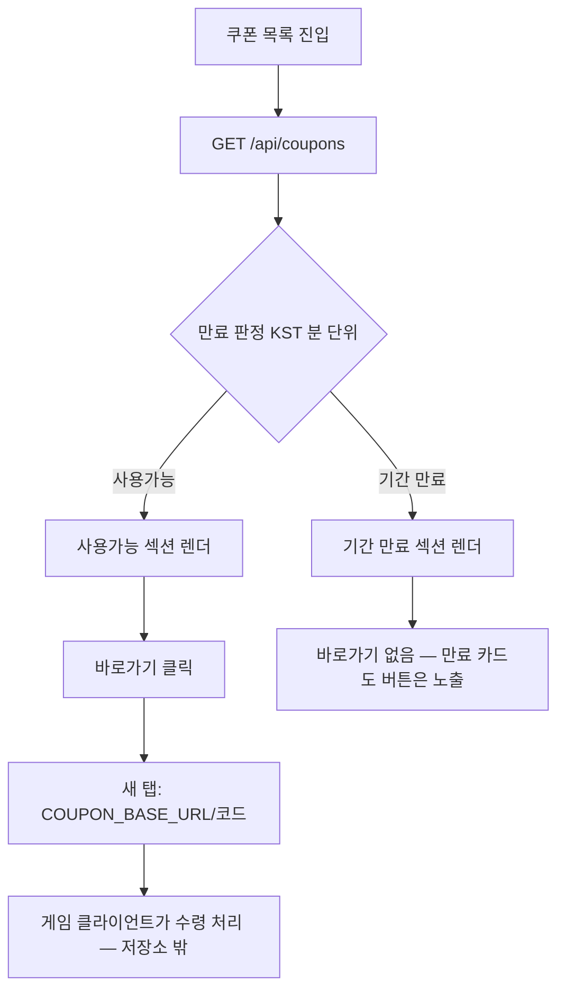

# coupons — 설계

## 1. 화면 구조

| 화면 ID | 화면 | 영역 배치 |
|---|---|---|
| SC-02-01 | 쿠폰 목록(`/coupons`) | 상단바 → "사용가능" 섹션(카드 목록) → "기간 만료" 섹션(카드 목록) → 광고 슬롯(1건 이상 렌더 시에만) |
| SC-01-01 내부 | 관리자 쿠폰 관리(`/admin/coupon`) | 관리자 셸 탭 안 — 목록 표 + 등록/수정 폼 + 일괄 선택 툴바 |

카드 1개 구성: 코드·제목·만료일·(있으면) 설명 펼침 + "바로가기" 버튼. 상태는 뱃지가 아니라 "사용가능"/"기간 만료" 섹션 구분 자체로 표현한다(코드에 `StatusBadge`/`PinnedBadge` 사용 없음). 홈 미리보기 카드는 `showDetail=false`(설명 펼침 없이 간략), 쿠폰 페이지 카드는 `showDetail=true`(설명 펼침 가능한 상세) — 같은 `CouponCard`를 prop으로만 분기한다.

## 2. 상태

| 상태 | 조건 | 화면에 보이는 것 |
|---|---|---|
| 불러오는 중 | 목록 요청 진행 중 | 섹션별 로딩 표시 |
| 사용가능 | `expireAt >= now`(KST 분 단위) | 해당 카드가 "사용가능" 섹션에 |
| 기간 만료 | `expireAt < now` | 해당 카드가 "기간 만료" 섹션에 |
| 빈 화면 | 두 섹션 다 0건 | 섹션별 빈 상태 문구, 광고 슬롯 미노출 |
| 오류 | 목록 요청 실패 | 섹션별 오류 안내 + 재시도(홈 미리보기는 이 구분이 없어 실패도 "쿠폰 없음"처럼 보임 — `docs/features/home/spec.md` 참조) |
| 관리자 — 일괄 처리 부분 실패 | 선택한 항목 중 일부만 서버가 처리 못함 | 성공분만 목록 반영 + "N건 처리 실패" 배너 |

## 3. 흐름

관리자 등록/수정 흐름: 폼 저장 → `POST/PATCH /api/admin/coupons` → 서버가 만료 시각을 보정(비어 있으면 그날 23:59:59) → 응답 그대로 목록에 반영(요청값 재사용 안 함).

## 4. 디자인 값

- 카드 폭·좌우 여백: 기본 모바일 토큰(`fe-design.md` § 1) 그대로, 도메인 전용 값 없음.
- 상태 구분은 색이 아니라 섹션 제목으로 표현 — 뱃지·색 토큰 신규 정의 없음.
- 상단바·하단 여백: `MobileLayout` 공용 값.

## 5. 서버와 주고받는 것

| 요청 | 응답 | 실패하면 |
|---|---|---|
| `GET /api/coupons` | 노출 중인 쿠폰 배열 | 오류 섹션 표시, 재시도 가능 |
| `POST /api/admin/coupons` | 등록된 쿠폰(서버 보정값 포함) | 코드 중복 시 409 안내 |
| `PATCH /api/admin/coupons/{id}` | 수정된 쿠폰 | 코드 중복 시 409 안내 |
| `PATCH /api/admin/coupons/{id}/visible`, `bulk/visible` | 처리 결과 | 일부 실패 시 `failedIds` 기준 배너 |
| `DELETE /api/admin/coupons/{id}`, `bulk` | 처리 결과 | 일부 실패 시 배너, 같은 코드 재등록은 409 |
| `POST /api/admin/coupons/refresh` | 최신 목록 | 실패 시 기존 화면 유지 |

## 6. Figma

| 화면 | node-id |
|---|---|
| 쿠폰 목록 | 미확인 — Figma 정본 파일 없음 |
| 관리자 쿠폰 관리 | 미확인 — 동일 |
