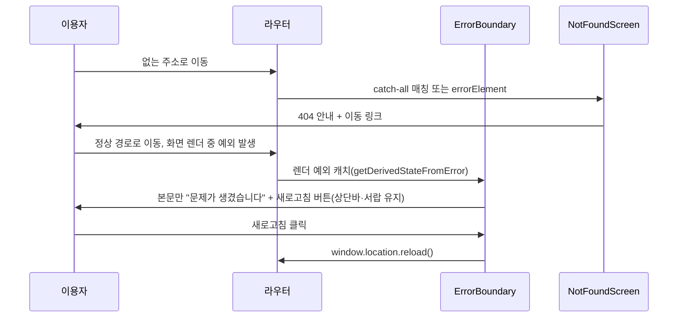

# error — 설계

## 1. 화면 구조

| 화면 ID | 화면 | 영역 배치 |
|---|---|---|
| SC-12-01 | 404 / 공용 에러 화면 | 전역 레이아웃 바깥일 수 있음(라우터 자체 실패 대비) — 코드(`404`) + 제목 + 안내문 + 이동 링크 3개(홈/공지/이벤트), 세로 중앙 배치 |

`ErrorBoundary`가 잡는 렌더 예외는 별도 화면이 아니라 `MobileLayout` 본문 자리에 "문제가 생겼습니다" + 새로고침 버튼으로 대체된다(상단바·서랍은 유지).

## 2. 상태

| 상태 | 조건 | 화면에 보이는 것 |
|---|---|---|
| 404 | 등록 안 된 경로(catch-all) | 코드 "404" + "요청하신 페이지를 찾을 수 없습니다" + 이동 링크 3개 |
| 라우터 오류 | 라우터 `errorElement`로 진입(경로 매칭 실패 등) | 위와 같은 `NotFoundScreen` — `useTopBar()`가 null이어도 방어되어 죽지 않는다 |
| 렌더 예외 | 화면 렌더 중 JS 예외 | `ErrorBoundary`가 본문만 "문제가 생겼습니다" + 새로고침 버튼으로 대체, 상단바·서랍 유지 |

빈 화면·불러오는 중 상태는 없다 — 이 도메인은 서버 요청이 없는 순수 정적 안내 화면이다.

## 3. 흐름

## 4. 디자인 값

상태 표시 색은 상태 축(§ 4)의 위험/중립 색만 쓴다. 별도 도메인 전용 토큰 없음 — `NotFoundScreen.module.scss`·`ErrorBoundary.module.scss` 모두 전역 토큰만 참조한다.

## 5. 서버와 주고받는 것

| 요청 | 응답 | 실패하면 |
|---|---|---|
| (없음 — 화면 자체는 서버 요청 없음) | — | — |
| 참고: 없는 API 주소 호출 | 404 `NOT_FOUND`(전역 공통 코드) | 해당 없음 — 이 화면이 직접 호출하지 않는다 |

## 6. Figma

| 화면 | node-id |
|---|---|
| 404 / 공용 에러 화면 | 미확인 — Figma 정본 파일 없음(`screen-id.md` § 4) |
