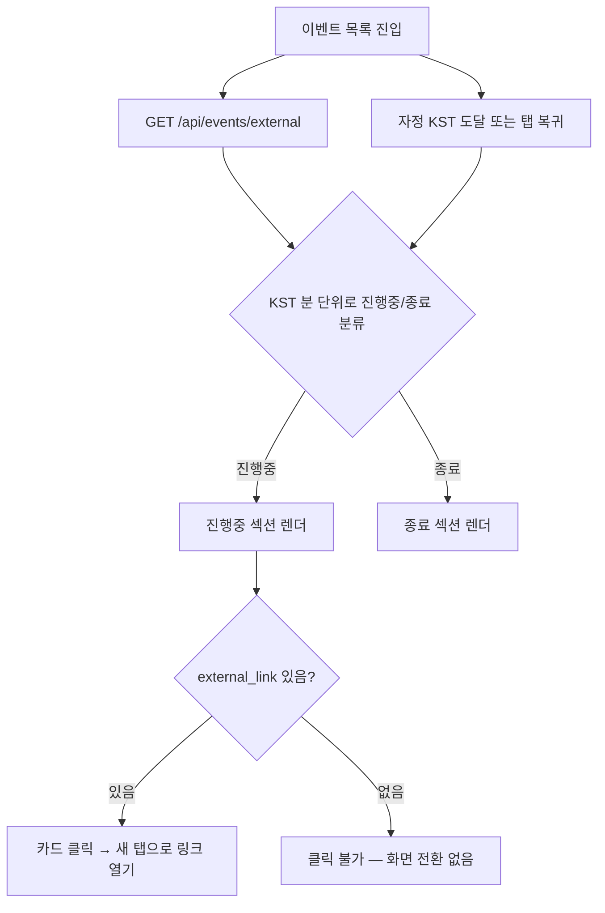

# events — 설계

## 1. 화면 구조

| 화면 ID | 화면 | 영역 배치 |
|---|---|---|
| SC-03-01 | 이벤트 목록(`/events`) | 상단바 → "진행중" 섹션(카드 목록) → "종료" 섹션(카드 목록) → 광고 슬롯(1건 이상 렌더 시에만) |
| SC-01-01 내부 | 관리자 이벤트 관리(`/admin/event`) | 관리자 셸 탭 안 — 목록 표(페이지네이션) + 등록/수정 폼 + 일괄 선택 툴바 |

카드 1개 구성: 이미지·제목·기간 + 상태 뱃지(`StatusBadge` `active`="진행중" / `expired`="종료") + (외부 링크 있으면) 클릭 가능 표시.

## 2. 상태

| 상태 | 조건 | 화면에 보이는 것 |
|---|---|---|
| 불러오는 중 | 목록 요청 진행 중 | 섹션별 로딩 표시 |
| 진행중 | `expireAt >= now`(KST 분 단위) | `StatusBadge variant="active"` |
| 종료 | `expireAt < now` | `StatusBadge variant="expired"` |
| 빈 화면 | 두 섹션 다 0건 | 섹션별 빈 상태 문구, 광고 슬롯 미노출 |
| 오류 | 목록 요청 실패 | 섹션별 오류 안내 + 재시도(홈 미리보기는 이 구분이 없음) |
| 관리자 — 상한 도달 | 전체 이벤트가 1000건 초과 | 경고 배너("더 있을 수 있음") |
| 관리자 — 일괄 처리 부분 실패 | 선택 항목 중 일부만 처리됨 | 성공분만 반영 + "N건 처리 실패" 배너 |

## 3. 흐름

관리자 등록/수정 흐름: 폼 저장 → `POST/PATCH /api/admin/events` → 시각 입력을 비웠으면 서버가 기본값(12:00/23:59:59) 채움, 채웠으면 그 값 유지 → 캐시 커밋 전 비움(§ 스펙 REQ-EVT-11).

## 4. 디자인 값

- 상태 뱃지: `PinnedBadge` 아님 — `StatusBadge`의 `active`/`expired` variant, 상태 축 팔레트(`fe-design.md` § 4) 그대로.
- 카드 폭·간격: 기본 모바일 토큰, 도메인 전용 색·여백 토큰 없음. 단 카드 썸네일 높이·제목 글자 크기·정보 영역 padding은 CSS 변수(`--thumb-height` `--title-font-size` `--event-card-info-padding`)로 `EventCard` 기본값을 두고, `EventListHorizontal`/`EventListVertical` 컨테이너가 배치 맥락에 맞춰 오버라이드한다(가로 스크롤 쪽이 더 작은 값).

## 5. 서버와 주고받는 것

| 요청 | 응답 | 실패하면 |
|---|---|---|
| `GET /api/events/external` | 노출 중인 이벤트 배열(OFFICIAL만) | 오류 섹션 표시, 재시도 가능 |
| `POST /api/admin/events` | 등록된 이벤트 | 필수값 비어도 서버 검증이 약해 500이 날 수 있음(§ 스펙 참조) |
| `PATCH /api/admin/events/{id}` | 수정된 이벤트(전체 필드) | 동일 |
| `PATCH .../visible`, `bulk/visible` | 처리 결과 | 일부 실패 시 `failedIds` 기준 배너 |
| `DELETE /api/admin/events/{id}`, `bulk` | 처리 결과 | 일부 실패 시 배너 |
| `GET /api/admin/events` | 페이지네이션된 전체 목록 | 1000건 초과 시 경고 배너 |

## 6. Figma

| 화면 | node-id |
|---|---|
| 이벤트 목록 | 미확인 — Figma 정본 파일 없음 |
| 관리자 이벤트 관리 | 미확인 — 동일 |
