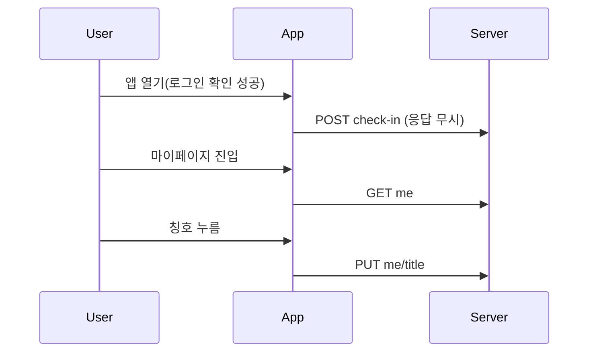

# 등급·포인트·칭호 — 설계

## 1. 화면 구조

| 화면 ID | 화면 | 영역 배치 |
|---|---|---|
| SC-09-01 | 마이페이지 `/mypage` | 기존 상단바 → 프로필 카드(닉네임 옆 등급 칩 + 대표 칭호) → 요약 카드(Lv.·등급명, XP 진행바, 보유 포인트) → **이동 행 3개**(각 탭 영역 기준 이상, 오른쪽 ›, 행 제목은 행동 문구: 등급표 보기 · 대표 칭호 바꾸기(칭호 없으면 칭호 등록하기) · XP·포인트 내역. 카드와 같은 등급명·칭호명은 보조 문구에서 반복하지 않는다). 티어 카드는 정보 전용이라 누를 수 없다 → 내 선호 레전드 → 회원 탈퇴. "?" 아이콘과 인라인 탭 구역은 없다 |
| SC-09-02 | 등급 모달 / 칭호 등록 모달 (마이페이지 위, 가운데 카드) | 등급: 위에 내 누적 XP, 아래 10단계 목록(내 위치 강조, 열 때 내 위치로 자동 스크롤) 맨 끝에 "XP 얻는 법" 3줄·"전체 안내 보기 ›"·포인트 상점 준비 중 안내를 같이 스크롤, 푸터는 [닫기]만. 칭호 등록: 처음엔 현재 대표 칭호가 선택돼 있고 [등록]은 비활성, 다른 칭호를 고르면 활성. 잠긴 칭호는 흐리지 않고 제목 본문색 + 조건 보조색 + 자물쇠 아이콘. 등록 실패 시 버튼 위 안내 문구 |
| SC-09-04 | 활동 내역 `/mypage/history` | 뒤로가기형 상단바("활동 내역") + 탭 2개 [XP · 포인트] + 내역 목록(XP 탭 +XP, 포인트 탭 +/−P). 불러오는 중·오류·빈 상태는 목록 자리에 표시 |
| SC-09-03 | 출석 토스트 | 하루 첫 방문 "+10 XP · +100P", 레벨업이면 "Lv.N 등급명로 올랐어요" 변형 |
| 부품 | 닉네임 옆 표시 | 서랍 메뉴 프로필, 마이페이지 프로필 카드에서 같은 부품을 쓴다 |

## 2. 상태

| 상태 | 조건 | 화면에 보이는 것 |
|---|---|---|
| 불러오는 중 | 조회 진행 | 불러오기 안내 |
| 오류 | 조회 실패 | 오류 안내 + 다시 시도 |
| 빈 화면 | XP·포인트·칭호·내역 모두 0 | "아직 활동 기록이 없어요" |
| 정상 | 위 외 | 위 구성 |
| 장착 실패 | 칭호 변경 실패 | 칭호 등록 모달 버튼 위 안내 문구 |
| 등록 비활성 | 선택한 칭호 == 현재 대표 | [등록] 비활성(disabled) |

불러오는 중·오류·빈 상태는 활동 내역 페이지의 목록 자리에만 나온다. 마이페이지와 두 모달은 `GET me` 응답을 그대로 쓴다.

## 3. 흐름

## 4. 디자인 값

등급 색은 `--color-tier-*` 토큰(Figma `tier/*` 변수와 같은 값). 5단계 T1~T5 = Lv.1–2 · 3–4 · 5–6 · 7–8 · 9–10. 야구공은 직접 그린 SVG(작은 크기는 단색, 큰 크기는 효과, 움직임 줄이기 설정에서는 애니메이션 끔). 고정색 티어 카드 위 글자는 티어 글자 토큰, 모드 따라가는 면 위는 기존 글자 토큰. 간격·글자 단계·탭 영역은 기존 토큰. 외부 이미지·아이콘 라이브러리 없음.

## 5. 서버와 주고받는 것

| 요청 | 응답 | 실패하면 |
|---|---|---|
| POST check-in | 지급 결과 `{xp,point,level,levelName,leveledUp}` | 무시 |
| GET me | xp · level · levelName · nextLevelXp · point · titles[code,name,equipped] · equippedCode · recent[reason,xpDelta,pointDelta,rewardDate] | 오류 상태 |
| PUT me/title {code} | 갱신된 내 정보 전체 | 칩 아래 안내 |
| GET titles | `[code,name,category,condition,bonusPoint,owned,equipped]` | 모달 안 오류 안내 |
| GET levels | `[level,name,requiredXp,bonusPoint]` | 모달 안 오류 안내 |
| GET me/history?type&page | `{type,page,size,hasNext,items[sourceType,xpDelta,pointDelta,reason,rewardDate]}` | 목록 자리 오류 + 다시 시도 |

## 6. Figma

파일 `VCVQzOpSIpwpZw11gxG7N1`, 모두 480 폭. 부품 `C/GM/*` 는 부품 시트에 있다. 밝은 프레임은 y=2800, 어두운 프레임(Color 모드 Dark 고정, 이름 끝 ` · Dark`)은 같은 x 에서 y=4853.

| 화면 | 밝음 | 어두움 |
|---|---|---|
| 02 마이페이지 (T1 연습생 · 10/50 XP · 100P · 칭호 없음) | 598:2938 | 606:5890 |
| 02h 마이페이지 (T3 주전 · 칭호 장착) | 604:5498 | 606:5933 |
| 12 등급 모달 (Lv.5 · 내 위치로 스크롤됨 · XP 안내는 목록 끝) | 606:2238 | 606:5976 |
| 13 칭호 등록 모달 (대표 선택됨 · 등록 비활성) / 13a 장착 실패 | 606:5146 / 606:5259 | 606:6045 / 606:6116 |
| 13b 칭호 등록 모달 (다른 칭호 선택 · 등록 활성), y=3700 / 5753 | 609:5925 | 609:6108 |
| 14 활동 내역 XP 탭 / 14a 포인트 탭 | 606:5446 / 606:5540 | 606:6188 / 606:6203 |
| 14b 활동 내역 상태 3종 (불러오는 중 · 오류 · 빈 상태) | 606:5642 | 606:6218 |
| 01 서랍 닉네임 옆 표시 (칭호 장착) / 01a (미장착) | 550:1352 / 550:1381 | 563:4935 / 563:4975 |
| 08 출석 토스트 | 551:1944 | 563:5519 |
| 11 가이드 상세 `/guides/gamification` | 593:2828 | 593:5805 |
| 서랍 적용 예 T1 / T3 / T5 (확정 B) | — | 563:5549 / 563:5589 / 563:5629 |

| 부품·시트 | node-id |
|---|---|
| 부품 시트 `gamification / Components` | 549:1350 |
| 티어 시각 전체 (B 확정 · A 미채택) · 부품 시트 BallIcon 30종 / DrawerProfile 10종 | 555:1598 · 555:1599 (세트 555:1768 / 556:1805) |
| 요약 카드 `C/GM/SummaryCard` (티어 5 × 칭호 on/off, "자세히 보기" 줄 없음) | 571:2864 |
| 알약형 탭 `C/GM/Tab` (선택 = 흰 판 + 브랜드 테두리, 기본 = 투명, 높이 44 `control/height-md`, 탭 바 54) | 549:4083 |
| `C/GM/XpGuideBlock` | 589:2697 |
| `C/GM/NavRow` (이동 행) · `C/GM/TitleOption` (칭호 라디오 행) | 604:5475 · 606:5144 |

**티어 색**: 5단계(루키·브론즈·실버·골드·레전드, 두 등급씩)는 B안(브랜드 톤 메탈) 확정. Color 컬렉션 `tier/*` 변수, 다크 값은 라이트와 동일. 등급 탭 로드맵 공은 Lv.1~2=T1, 3~4=T2, 5~6=T3, 7~8=T4, 9~10=T5.

**어두운 모드 글자색 규칙** — 카드 색은 두 모드가 같아서(T3·T4·T5) 카드 위 글자도 티어 전용 색을 쓴다: T3 `tier/t3-text`(대비 11.8:1)·`t3-text-sub`(대비 6.0:1), T4 `t4-text`·`t4-text-sub`, T5 `t5-text`·`t5-sub`. T1·T2 카드는 `bg/deep`(모드 추종)이라 `text/*` 그대로. 그 면 위 내역 XP·토스트 제목은 `brand/default`. T3 카드의 XP 바·라벨은 `tier/t3-xp-track`·`t3-xp-fill`·`t3-xp-label` (값은 밝음/어두움 각각 Figma 변수) — 어두움 바 채움÷트랙 7.2:1, 라벨 7.7~16:1.

**서랍 폭 250 기준** — 서랍 프레임 10장은 폭 250(실제 앱: 화면 75%, 최대 250), `C/GM/DrawerProfile` 은 카드 폭 226 · 바깥 여백 12 · 안쪽 padding 12 · 아바타 48, 닉네임은 말줄임.

**안내** — "?" 아이콘은 없다. "XP 얻는 법"과 포인트 사용처(상점 준비 중)는 등급 모달 목록 맨 끝에 있고, "전체 안내 보기 ›"가 가이드 페이지로 연결된다. 가이드 페이지는 목록에는 숨기고 링크로만 들어온다.

**구조 변경 (2026-10-08, 2차 덜어내기)** — 마이페이지 안 "내 활동" 인라인 구역을 없애고 등급·칭호는 모달, 활동 내역은 `/mypage/history` 페이지로 나눴다. 삭제: 02e·02f·02g, 09 안내 모달, HelpButton 부품(밝음·어두움 포함).

미해결 🟨: 등급 모달의 미래 등급 행 공(투명도 0.4)이 어두운 모드에서 탁하다. 칭호 없는 사용자(T1)용 칭호 등록 모달(보유 0)은 그리지 않았다.

구현 반영(2026-10-08): 2차 화면은 코드로 옮겼다. 보유 칭호 0개인 칭호 등록 모달은 Figma 에 없어 문구와 잠긴 목록만으로 구현했다.
