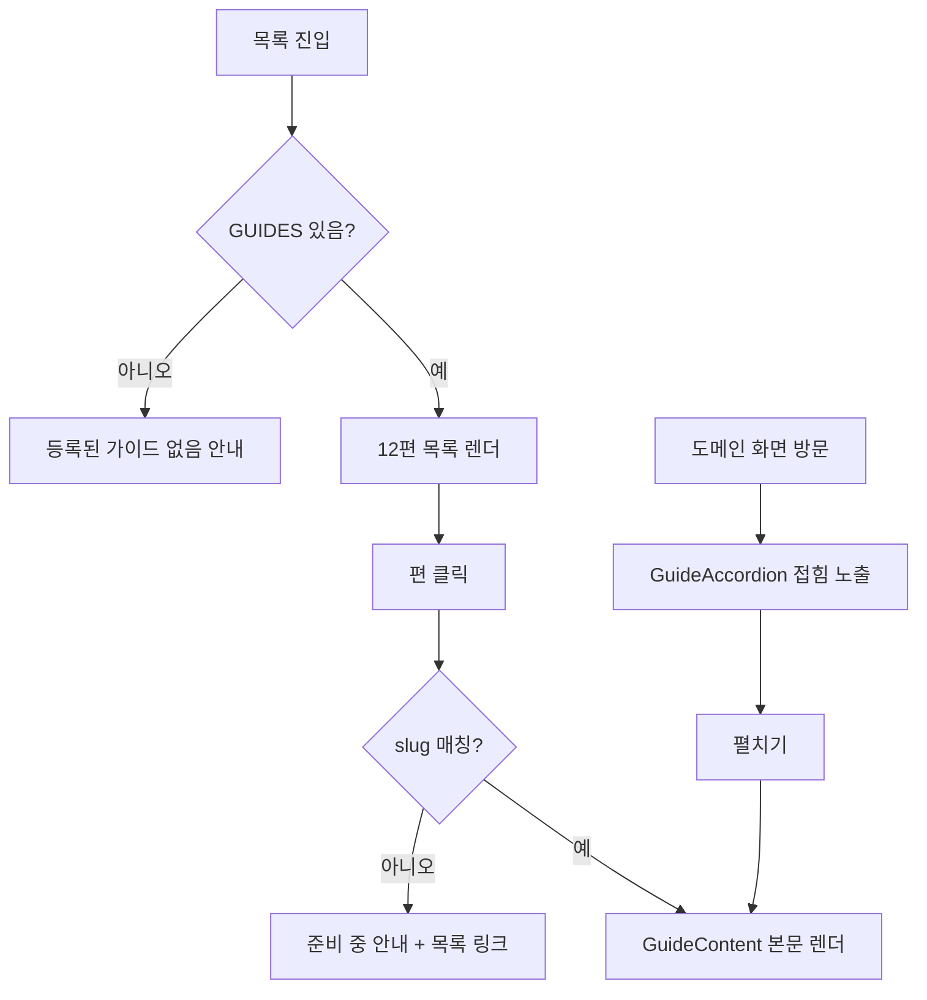

# 가이드 — 설계

## 1. 화면 구조

| 화면 ID | 화면 | 영역 배치 |
|---|---|---|
| SC-18-01 | 목록 | 소개 문구 → 12편 목록(제목 + 요약) |
| SC-18-02 | 상세(전체 화면) | 본문(`GuideContent`, 섹션별 블록 순차 렌더) → 광고 슬롯 → "다른 가이드 보러 가기" 링크 |
| SC-18-02 내부 삽입 | 접힌 가이드(`GuideAccordion`) | 도메인 화면 상단, 접힘 기본값, 펼치면 같은 `GuideContent` 렌더러로 본문 노출 |

## 2. 상태

| 상태 | 조건 | 화면에 보이는 것 |
|---|---|---|
| 빈 화면(목록) | `GUIDES` 배열이 비어 있음(작업 중 실수 방어용, 실제로는 발생하지 않음) | "등록된 가이드가 없습니다." |
| 빈 화면(상세) | slug가 없거나 미등록 | "존재하지 않거나 아직 준비 중인 가이드입니다." + 목록으로 이동 링크 |
| 정상 | 목록·slug 매칭 성공 | 목록 또는 본문 렌더 |

로딩·오류 상태 없음 — 빌드 시점에 고정된 로컬 데이터라 네트워크 요청이 없다.

## 3. 흐름

## 4. 디자인 값

전역 토큰만 사용 — 도메인 로컬 토큰 없음. 렌더러(`GuideContent.jsx`)는 목록·상세·접힌 아코디언이 동일 컴포넌트를 공유해 스타일이 한 곳에서만 정의된다.

## 5. 서버와 주고받는 것

서버 호출 없음(FE 전용, Redux store·axios 인스턴스 없음). 목록·상세 모두 `content/index.js`의 정적 배열/객체를 조회한다.

## 6. Figma

| 화면 | node-id |
|---|---|
| SC-18-01 · SC-18-02 | 미확인 — Figma 정본 파일 URL 자체가 미확정 (`roadmap.md` § 6 D-09) |
