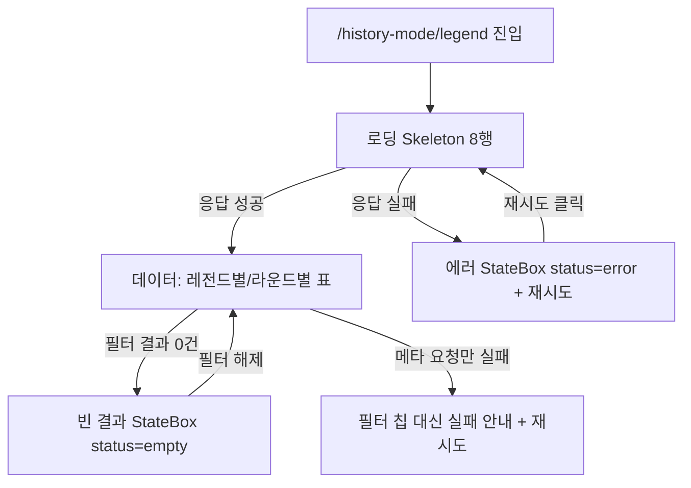

# historyLegend — 설계

## 1. 화면 구조

| 화면 ID | 화면 | 영역 배치 |
|---|---|---|
| SC-14-01 | 히스토리 재료 탐색기 | 상단바(공용) → 검색창 → 필터(주차/일차/구단/타입/포지션) + 레전드별/라운드별 뷰 전환 → 본문(표, 행 클릭으로 상세 펼침) |

단일 화면이 4가지 상태를 분기해 보여준다 — 서브 페이지 없음.

## 2. 상태

| 상태 | 조건 | 화면에 보이는 것 |
|---|---|---|
| 로딩 | `!loaded && loading` | Skeleton 8행 |
| 에러 | `!loaded && !loading && error` | `StateBox status="error"` + 재시도 버튼 |
| 데이터 | `loaded` | 레전드별 또는 라운드별 표 |
| 빈 결과(필터) | `loaded && rows.length === 0` | `StateBox status="empty"` "조건에 맞는 결과가 없습니다" |

`loading`/`error`는 라운드 요청과 레전드 메타 요청의 값을 합친 것이지만, 메타 실패는 `metaError`로 별도 노출돼 라운드가 먼저 성공해도 필터 실패 안내가 가려지지 않는다(REQ-HL-04).

## 3. 흐름

## 4. 디자인 값

- 폭 480 단일, 좌우 여백 `$layout-h-pad` 토큰(`fe-design.md` § 1)
- 간격은 `$space-1`~`$space-12` 단계 토큰만
- 정렬 화살표(▲▼)는 모든 열이 같은 기준(`sortAscending`)으로 방향을 표시 — 열마다 다른 뜻으로 쓰지 않는다
- 표 글자는 `$font-size-12` 토큰

## 5. 서버와 주고받는 것

| 요청 | 응답 | 실패하면 |
|---|---|---|
| `GET /api/history-rounds` | 라운드 70개 + 로스터 1,750행 전량, 재료 조인 포함 | `StateBox status="error"` + 재시도. 메타(레전드) 요청만 실패하면 필터 칩 대신 실패 안내 + 재시도(REQ-HL-04) |

## 6. Figma

| 화면 | node-id |
|---|---|
| SC-14-01 히스토리 재료 탐색기 | 미등록 — Figma 정본 파일 없음(`overview/domain.md` § 3) |
