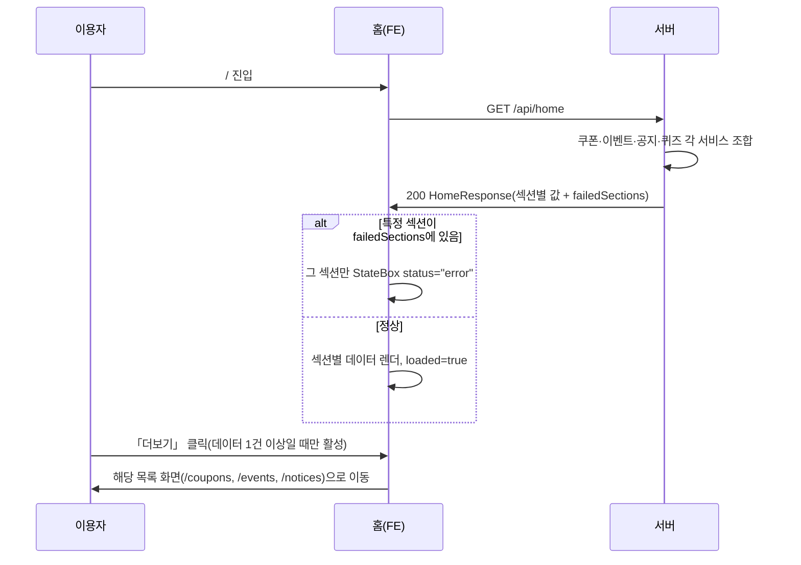

# home — 설계

## 1. 화면 구조

| 화면 ID | 화면 | 영역 배치 |
|---|---|---|
| SC-07-01 | 홈 | `<MobileLayout>` 본문 세로 스택 — 히어로 → 퀵메뉴 → 후원 → 퀴즈 → 최신 쿠폰(+광고) → 공지사항 → 진행 중인 이벤트 |

커뮤니티 인기글·자유게시판 섹션은 `community` 도메인 동결로 주석 처리돼 있다(코드에 남아 있으나 렌더 안 됨).

## 2. 상태

| 상태 | 조건 | 화면에 보이는 것 |
|---|---|---|
| 최초 로딩 | `loading && !loaded` | 섹션별 `Skeleton`(쿠폰·이벤트는 1개, 높이 96) |
| 재방문 | `loaded === true` | 스켈레톤 없이 곧바로 최신 값(성공 시) 또는 이전 값(실패 시 §오류와 동시) |
| 오류 | 각 섹션 요청 실패 | 쿠폰·이벤트: `StateBox status="error" compact` + 재시도 / 퀴즈: 값이 남아 있어도 오류 표시 |
| 빈 상태 | 쿠폰/이벤트 0건 | `StateBox status="empty" compact`("진행 중인 쿠폰/이벤트가 없습니다") + 「더보기」 링크 비활성 |
| 정상 | 데이터 1건 이상 | `CouponListHorizontal`/`EventListHorizontal`/`NoticeSection`/`QuizSection` |

## 3. 흐름

## 4. 디자인 값

섹션 간 간격은 `$space-6`(섹션 간 gap) 토큰을 따른다(`fe-design.md` § 1). 광고 슬롯은 쿠폰 섹션과 공지 섹션 사이 1곳, 배치 규칙은 `fe-ads.md` § 2·§ 3(`HOME` 슬롯) 그대로다. 빈 상태·오류 색은 상태 축(§ 4)만 쓴다.

## 5. 서버와 주고받는 것

| 요청 | 응답 | 실패하면 |
|---|---|---|
| `GET /api/home` | `{coupons, events, notices, quiz, failedSections}` | 응답 자체는 200 유지, 실패 섹션만 `failedSections`에 이름이 들어가고 그 섹션만 오류 표시 |
| `POST /statistics/support-click` | 204(봉투 없음) | 로그인 사용자만 호출, 실패해도 화면 동작에 영향 없음(fire-and-forget) |

## 6. Figma

| 화면 | node-id |
|---|---|
| 홈 | 미확인 — Figma 정본 파일 없음(`screen-id.md` § 4) |
