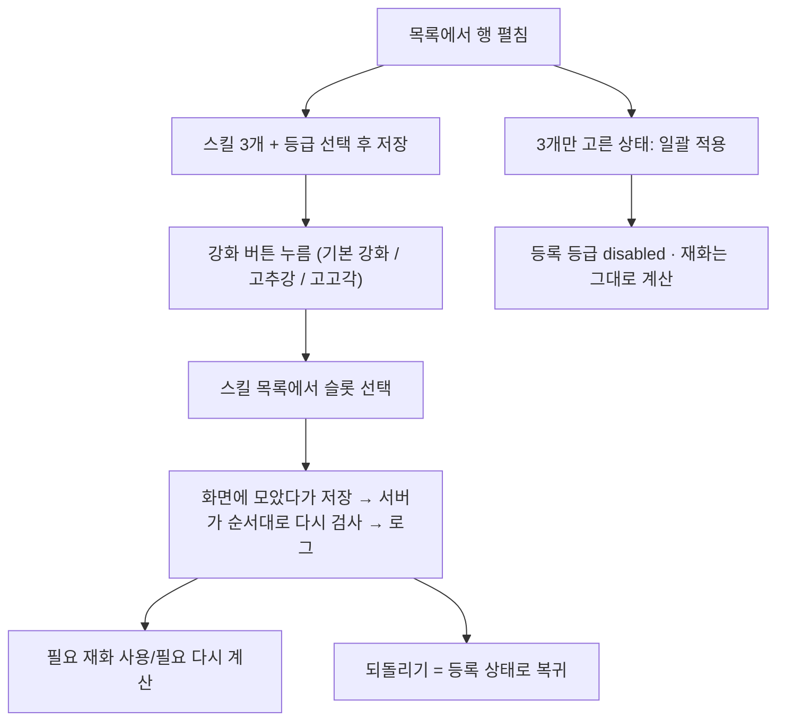

# legendCollectionSkills — 설계

## 1. 화면 구조

화면 번호는 개발 시 부여한다(spec § 2). 아래 이름은 Figma 프레임 이름이다. 비로그인 화면은 없다(REQ-LCSK-01).

공통 골격: 별도 화면 `/legend-collection-skills`. `legendCollections` 의 상단바 · 필터 · 표 틀을 빌려 쓰되 편집 모드·`편집` 버튼은 없고, 펼친 행(보유중·액자 레전드)에 스킬 패널을 둔다. 펼침 머리의 상태 토글은 `보유중` 이 켜진 상태다. 화면 제목 아래 "← 레전드 재료 보유 현황" 링크가 있고, 반대로 재료 보유 현황 화면에 "내 레전드 스킬 기록 →" 링크가 있다. 패널은 왼쪽 스킬 카드, 오른쪽 위에서 아래로: 스킬 목록(3줄) → 필요 재화 → 버튼.

| 화면 | 보이는 것 |
|---|---|
| 01 편집 (등록 직후) | 스킬 목록 = 스킬 드롭다운 + 등급 드롭다운. 카드 아래 일괄 버튼 2개(`S 일괄 적용` · `고고각 제외 적용`). 필요 재화 "고고각 0/1장 · 고추강 0/5장". 버튼 `기본 강화` 만 켜짐 |
| 02 편집 (미등록 · 빈 상태) | 카드 "스킬을 등록해 보세요", 드롭다운 미선택, 재화 칸 안내 문구. **강화 버튼 전부 숨김**, 일괄 버튼도 숨김 |
| 03 기본 강화 진행 중 | 기본 강화 3번 → 위압감 C · 배팅머신 C, 카드 배지 "강화 횟수 3/7". 고추강(기본 7회 전)과 고고각(레전드 A 없음)은 흐리게(비활성). 이유 문구는 두지 않는다 |
| 03a 강화 버튼 선택됨 | `기본 강화` 버튼이 테두리·옅은 면으로 눌린 상태. 오른쪽 패널의 슬롯 블록(스킬 드롭다운 + 등급 드롭다운을 하나로 묶음) 3개에 선택 가능 테두리, 그 안의 등급 드롭다운은 흐리게(disabled). 카드 블록 강조는 쓰지 않는다 |
| 03b 슬롯 선택 후 | 슬롯 블록 테두리 전부 해제. **오른쪽 패널의 스킬·등급 드롭다운은 계속 disabled, 등급은 등록 등급 그대로**(E·D·E). 등급 상승(위압감 E→D)과 강화 횟수 1/7 은 왼쪽 카드에만 반영. 04·05 도 같다 |
| 04 고추강 적용 후 | 위압감(레전드) A · 배팅머신(플래티넘) S · 집중력(노말) A. 강화 횟수 12/7, 고추강 5/5. 기본·고추강 비활성, 레전드가 A 이므로 `고고각` 켜짐 |
| 05 고고각 적용 | 위압감 S. 강화 횟수 **13/7**(7 초과 예시), 고고각 1/1. 기본·고추강·고고각 셋 다 비활성(모두 최대) |
| 06a S 일괄 적용 선택됨 | 카드 밑 일괄 버튼은 계속 보이며 3상태 토글(미선택 / 고고각 제외 / S 일괄). 라벨은 그대로 `S 일괄 적용`·`고고각 제외 적용` 이고 선택 상태는 채움·테두리 스타일로만 구분(선택된 쪽 브랜드 테두리 + 옅은 면). `고고각 제외 적용`은 disabled. 패널 등급 드롭다운은 disabled 로 그대로 보인다(Figma 06 은 숨긴 안 — 구현 기준으로 본다). 필요 재화·사용량은 등록 등급 기준으로 계산해 그대로 보인다("알 수 없음" 없음). 기본 강화·고추강·고고각 버튼 숨김, `되돌리기`(활성, 등록 상태로 복귀)·`스킬 초기화`만 보임 |
| 06b 고고각 제외 적용 선택됨 | 라벨 그대로, 선택은 스타일로만. `S 일괄 적용`은 눌러서 바꿀 수 있음. 레전드 A · 플래티넘 S · 히어로 A. 기본 강화·고추강 disabled, `고고각` 켜짐(레전드 A 슬롯 선택용), 되돌리기·스킬 초기화 보임 |
| 07 가이드 펼침 | 상단 `이 페이지 활용 가이드` 아코디언을 펼친 상태. 내용: 스킬 등록 방법 · 버튼별 활성 조건 · 일괄 버튼 3가지 상태 · 되돌리기 vs 스킬 초기화 · 필요 재화 읽는 법 · 스타 경험치 비용표(예전 별도 모달의 표를 가이드 안으로 옮김) |

목록 필터: 상태 칩은 `전체 / 등록 / 미등록`(스킬 등록 여부)이고, 목록에는 액자·보유중 레전드만 나온다. 요약 줄은 "액자·보유중 50명 · 등록 12 · 미등록 38" 형태.

스킬 카드(위 → 아래): 구단+선수명 판 → 우측 "강화 횟수 n/7" 배지(`16.png` 위치) → 스킬 블록 3줄(이름 + 현재 등급) → 우하단 포지션. n 은 총 강화 횟수라 7 을 넘을 수 있다. 하단 버튼: `기본 강화` · `고추강` · `고고각` / `되돌리기`(등록 상태로 복귀) · `스킬 초기화`(빈 값). 라벨에 `+1`·`남은 n/7` 을 쓰지 않는다. 누를 수 없는 버튼은 흐리게만 하고 이유 문구는 적지 않는다.

모든 화면 맨 위(상단바 바로 아래)에는 접힌 `이 페이지 활용 가이드` 줄이 있다(공용 `GuideAccordion`, `web/src/global/ui/guideAccordion/GuideAccordion.jsx`, 참고 `19.png` 접힘 · `20.png` 펼침). 버튼 아래에는 안내·비활성 이유·도움말 아이콘을 두지 않는다 — 설명은 전부 가이드에 둔다(07).

## 2. 상태

| 상태 | 조건 | 화면에 보이는 것 |
|---|---|---|
| 불러오는 중 | 스킬 기록 요청 대기 | 카드·패널 자리에 로딩 표시 (펼침 영역 기존 방식) |
| 빈 상태 | 등록 안 됨 | 02. 강화 버튼 숨김 |
| 강화 버튼 대기 | 등록됨 | 01·03·03b. 활성 규칙대로 켜짐/흐림 |
| 스킬 고르는 중 | 강화 버튼을 누름 | 03a. 눌린 버튼 + 스킬 목록 선택 가능 테두리, 드롭다운 disabled |
| 활성 규칙 | — | 기본 강화: 기본 7회가 남아 있고 올릴 스킬이 있을 때. 고추강: 기본 7회를 다 쓴 뒤 올릴 스킬이 있을 때. 고고각: 레전드 스킬이 A 일 때. 셋 다 올릴 게 없으면 모두 흐림 |
| 일괄 적용 후 | 일괄 버튼 사용 | 06. 등록 등급 드롭다운은 disabled 로 남고 필요 재화는 그대로 계산 |
| 저장 실패 | 로그인 만료·서버 오류 | 화면 그대로 두고 재시도 안내. 서버가 409 로 답하면 충돌 문구를 보이나 서버는 아직 409 를 내지 않는다 |
| 오류 | 조회 실패 | 패널 자리에 불러오기 실패 안내 |
| 초기화 확인 | `스킬 초기화` | 공통 확인 팝업(`web/src/global/ui/confirmModal/ConfirmModal.jsx`, `legendCollections` 에서 옮김) 후 빈 값 |

보기 모드에서 미보유 레전드 행에는 스킬 영역이 없다.

## 3. 흐름

## 4. 디자인 값

토큰 이름만 적는다.

- 폭 480 단일. 좌우 여백 `layout/h-pad`. 간격 `spacing/1`~`spacing/12`. 모서리 카드·가이드 줄 `radius/lg`·판·배지 `radius/sm`·필드·버튼 `radius/md`
- 면 `bg/deepest` · `bg/card`(필드·재화 칸·버튼) · `bg/overlay`(읽기 전용 등급 칸) · `brand/tint`(펼침 영역, 눌린 버튼 면) · `overlay/scrim`(카드 위 배지)
- 강조: 눌린 버튼 `brand/tint` 면 + `brand/default` 굵은 테두리. 선택 가능한 슬롯 블록(스킬 + 등급 드롭다운 묶음) `brand/default` 굵은 테두리. 흐린 버튼은 투명도
- **스킬 등급 색(신규, 추가만) — 카드 스킬 블록에만 쓴다**. 게임 화면(`17.png`·`18.png`) 톤의 위→아래 그라데이션 + 흰 굵은 글자 + 얇은 밝은 테두리(`text/secondary`), 불투명. 시작색 Color `grade/legend`(보라) · `grade/platinum`(금) · `grade/hero`(초록) · `grade/normal`(회청) + 끝색 `grade/*-end`, 글자 `grade/on-strong`(흰색). 원색은 Primitives 에 같은 이름으로 추가, Color 는 Dark·Light 둘 다 그 원색을 가리킨다. 오른쪽 패널 드롭다운에는 색을 넣지 않는다. 기존 변수 값은 바꾸지 않았다
- `grade/on-bright`(어두운 글자)는 지금 미사용 — 삭제 여부는 정리 때 결정. 이 4색을 `fe-design.md` § 4 의 등급 축("값 미정")에 편입할지는 사용자 결정 ❓
- 글자: `text/body-bold`(카드 이름·스킬·라벨·버튼) · `text/body` · `text/caption`(배지) · `text/badge`(포지션) · `text/section-title`(가이드 소제목)
- 필드·버튼 최소 높이 `control/height-md`(44). 표 줄 `control/height-sm`
- 카드 글자: 가장 긴 스킬명 "컨트롤 아티스트 D" 가 카드 폭 180 에서 한 줄에 들어감을 확인. 말줄임 없음. 좁은 화면은 카드 폭에 비례해 글자도 줄인다 ❓
- 카드 안은 항상 Dark 모드 값으로 그린다. 카드 배경: 타자 `web/public/cards/hitter_legend.webp`, 투수 `web/public/cards/pitcher_legend.webp` — 둘 다 Figma 이미지 fill 로 반영

## 5. 서버와 주고받는 것

| 요청 | 응답 | 실패하면 |
|---|---|---|
| `GET /api/legend-collection-skills` | 레전드별 스킬 3칸(스킬 id · 등록 등급 · 현재 등급) · 총 강화 횟수 · 사용/필요 재화 | 패널에 불러오기 실패 안내 |
| `PUT /api/legend-collection-skills/{legendId}` | 등록 저장 결과 | 재시도 안내 |
| `POST /api/legend-collection-skills/{legendId}/events` | 일괄·되돌리기·초기화 결과(갱신된 3슬롯·횟수) | 실패 안내, 화면 값 유지 |
| `POST /api/legend-collection-skills/{legendId}/events/batch` | 강화 묶음(1~50개) 저장 결과, 전부 성공 또는 전부 취소 | 실패 안내, 모아 둔 강화 유지 |
| `GET /api/player-skills/{hitters\|pitchers}` | 스킬 목록 · `skillGrade`(색 · 재화 계산 · 활성 판단) | 드롭다운 비활성 + 안내 |

스킬 카드 부품은 위 요청을 모르고, 이름·포지션·스킬 3개(이름·현재 등급·등급 종류)·강화 횟수·선택 번호·타자/투수만 받아 그린다.

## 6. Figma

파일 `VCVQzOpSIpwpZw11gxG7N1` 페이지 `0:1`. 색은 `Color`, 간격·모서리는 `Spacing`·`Radius`, 글자는 기존 텍스트 스타일에 바인딩.

| 화면 | node-id |
|---|---|
| 부품 모음 `legendCollectionSkills / Components` (등급 색 범례 포함) | 467:315 |
| 부품 `C/LCSK/SkillCard` (kind × state, 변형 4개, 강화 횟수 배지·등급 그라데이션 블록. 선택 강조 변형은 제거) | 467:373 |
| 부품 `C/LCSK/Select` · `C/LCSK/ActionButton` | 467:324 · 467:316 |
| 부품 `C/Guide/AccordionSummary` (접힘·펼침, 파일에 기존 부품이 없어 새로 그림) | 483:684 |
| 01 편집 (등록 직후) | 484:315 |
| 02 편집 (미등록 · 빈 상태) | 484:476 |
| 03 기본 강화 진행 중 | 484:614 |
| 03a 강화 버튼 선택됨 | 484:771 |
| 03b 슬롯 선택 후 | 484:928 |
| 04 고추강 적용 후 | 484:1085 |
| 05 고고각 적용 | 484:1242 |
| 06a S 일괄 적용 선택됨 | 484:1399 |
| 06b 고고각 제외 적용 선택됨 | 484:1553 |
| 07 가이드 펼침 (활용 가이드) | 484:1714 |
| 08 확인 모달 (스킬 초기화 · 일괄 적용 · 되돌리기 · 저장 안 된 강화 버리기) | 502:993 · 502:1122 · 502:1251 |
| 내 덱 샘플 (이미지 저장용 시안, 이번 범위 아님) | 491:643 |

## 7. 확인 필요

🔴 위험 — 없음. 변수는 추가만 했고 기존 값·부품 구조 변경, 외부 자산 도입이 없다.

❓ 미정
- ❓ 스킬 등급 색 4종(그라데이션 8값)을 `fe-design.md` § 4 등급 축(값 미정)에 정식 편입할지. 값은 `17.png`·`18.png` 눈대중 — 정확한 색 코드를 주면 교체
- ❓ 흰 글자 대비: 금색(플래티넘)·회청(노말) 블록 위 흰 글자는 3:1 근처로 낮을 수 있다(굵은 글자 기준). 개발 때 대비 계산
- ❓ 01 은 "등록 직후"라 드롭다운이 남아 있다. 저장 뒤에도 드롭다운·일괄 버튼을 남길지(03 이후는 읽기 전용으로 그림)
- ❓ 320 폭 카드 글자 크기 — 카드 폭 비례 + 최소 크기, 개발 때 실측
- ❓ 일괄 적용 결과의 "강화 횟수 —/7" 표기(사용량을 모름)

🟨 가정
- 🟨 강화 버튼을 먼저 누르고 슬롯 블록을 고르는 순서(03a → 03b).
- 🟨 "되돌리기"는 등록 상태로 복귀. 강화 전(01)에는 비활성, 일괄 적용 뒤(06a·06b)에는 활성
- 🟨 스킬 예시는 위압감(레전드) E · 배팅머신(플래티넘) D · 집중력(노말) E → 고고각 1 · 고추강 5. 히어로 색은 06 의 훈련중독 A 와 부품 모음 범례에서 확인
