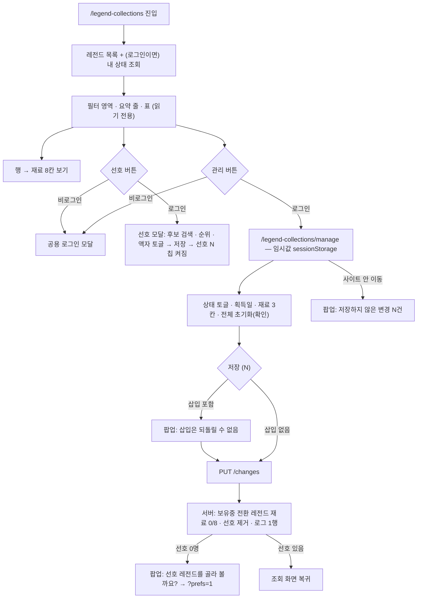

# legendCollections — 설계

## 1. 화면 구조

| 화면 ID | 화면 | 영역 배치 |
|---|---|---|
| 미부여 (개발 시 부여) | 내 재료 보유 현황 — 조회 `/legend-collections` (읽기 전용) | 상단바 "레전드 재료" → 공용 탭 3개("내 보유 현황" 켜짐) → "이 페이지 활용 가이드" 아코디언 → 필터 영역(검색 줄 `[검색][선호][관리]` + 구단 칩 · 전체/타자/투수 · 상태 칩 `전체 \| 액자 O \| 액자 X \| 선호 N`, 항상 펼침) → 요약 줄(왼쪽 "N명 · 액자 n · 재료 보유 n · 삽입 n" · 오른쪽 정렬 기준) → 표(`#`·레전드·선호·상태·획득일·보유, 레전드 열 1.6 비율·나머지 1:1, 레전드만 왼쪽 정렬) → 행을 누르면 재료 2열 카드 6 + 코치 2 + 획득일 글자(보기만). `선호 N` 칩을 켜면 선호 레전드만 순위대로 |
| 미부여 | 보유 현황 관리 `/legend-collections/manage` (편집) | 조회 화면과 같은 머리, 검색 줄만 `[검색][취소][저장 (N)]`(선호 칩 없음). 펼침 머리에 `액자`·`보유중` 토글·획득일 입력(보유중은 둘 다, 액자는 액자만)·변경일, 카드 안 `없음·보유·삽입` 3칸, "재료 전체 초기화" 버튼 |
| 미부여 | 선호 설정 모달 (조회 화면 위, 주소 없음) | 머리 "선호 레전드 n / 10" · 내 순위 목록(줄 전체를 끌거나 ↑↓ 키, 액자 토글, 빼기) · 후보 검색(공용 `SearchInput`) · `전체/타자/투수` 칩(후보만) · 후보 목록(미보유, "n/8") · `닫기` / `저장`. 검색 줄 `선호` 또는 `?prefs=1` 로 열린다 |
| 미부여 | 비로그인 `/manage` 안내 | 공용 탭 + 가이드 → 제목 "내 기록 관리는 로그인하면 쓸 수 있어요" · 본문 · `로그인하고 시작하기`(공용 로그인 모달) · "로그인하면 이 화면으로 바로 돌아와요." |
| 미부여 | 확인 팝업 5종 | 삽입 포함 저장 · 재료 전체 초기화 · 저장 안 하고 나가기(나가기 / 저장하고 나가기) · 첫 저장 뒤 "선호 레전드를 골라 볼까요?"(나중에 / 고르러 가기) · 저장 실패(재시도 · 충돌 해결 · 재로그인) |
| 미부여 | 홈 카드 2종 | "오늘 히스토리 모드" 카드(REQ-LCOL-20) · "이번 주기 일정" 섹션(`home` REQ-HM-16, 같은 `ScheduleCard` 부품). 위치·숨김은 `home` design |

레전드 펼침은 머리(이름·구분·상태) → 8칸 막대 → 재료 선수 2열 → 코치 2칸 → (관리) 재료 전체 초기화 순이다. 보유중 레전드는 0/8 로 보이고 재료 버튼이 잠긴다.

## 2. 상태

| 상태 | 조건 | 화면에 보이는 것 |
|---|---|---|
| 불러오는 중 | 레전드 목록·내 상태 요청 대기 | 표 자리에 스켈레톤 8줄, 펼침 영역에 로딩 표시 |
| 비로그인 열람 | 로그인 안 함 | 모든 칸 미보유, 현황 0, `선호 N` 칩 없음. `선호`·`관리` 를 누르면 공용 로그인 모달(REQ-LCOL-01). `/manage` 직접 진입은 안내 화면(REQ-LCOL-31) |
| 로그인 열람 | 로그인 + 내 상태 응답 | 표·펼침에 저장된 상태·획득일. 내 기록 요청 실패는 표 위 오류 상자 + 재시도(목록은 유지) |
| 빈 결과(필터) | 필터 결과 0건 | 안내 문구. `선호 N` 칩 + 선호 0명이면 "선호 레전드가 없어요 … `선호` 버튼에서 골라 주세요" |
| 편집 중 | 관리 화면 | 편집형 펼침 + `저장 (N)`. 임시값은 sessionStorage(REQ-LCOL-08·13) |
| 재료 칸 | 미보유 / 보유 / 삽입(저장 전) / 삽입(저장됨·잠김) | 점선 칸 / 브랜드 테두리 / 브랜드 채움 / 채움 + 자물쇠 "삽입됨"(REQ-LCOL-03·10) |
| 충돌(409) | 다른 기기에서 먼저 저장 | 저장 실패 팝업에서 내 값 유지 또는 서버 값 채택 |
| 오류 | 조회·저장 실패 | 조회 실패 안내 + 재시도. 저장 실패는 임시값 보존 + 재시도, 로그인 만료면 재로그인(REQ-LCOL-14) |

## 3. 흐름

## 4. 디자인 값

- 폭 480 단일, 좌우 여백 `layout/h-pad`, 상단바 `layout/topbar-height`
- 간격 `spacing/1`~`spacing/12`, 모서리 카드 `radius/lg`·칩 `radius/full`
- 면 `bg/deepest`(화면) · `bg/card`(카드·재료 줄) · `bg/modal`(팝업) · `overlay/scrim`(팝업 뒤)
- 선택·보유·삽입 강조는 브랜드 축(`brand/default` · `brand/alpha-15` · `brand/tint`). 상태색(성공·위험·주의)은 쓰지 않는다 — 단, 삽입 확정·전체 초기화 팝업의 확인 버튼만 `status/danger`
- 글자는 텍스트 스타일 `text/topbar` · `text/section-title` · `text/body-bold` · `text/body` · `text/caption` · `text/badge`
- 뱃지 "액자"·"보유중" 은 분류 축 뱃지(`fe-badges.md` PinnedBadge 계열), 등급 색 아님. 꺼진 토글은 `--color-lc-toggle-off-*`(전역 중립 회색)

## 5. 서버와 주고받는 것

| 요청 | 응답 | 실패하면 |
|---|---|---|
| `GET /api/legend-stats` | 레전드 목록(구단·타입·포지션) | 조회 실패 안내 |
| `GET /api/legends/{id}` | 재료 8행(선수 6 + 코치 2) | 펼침 영역에 불러오기 실패 |
| `GET /api/legend-collections` | 내 레전드 상태 + 재료 상태 + 선호 순위 + 획득일 2종 + version | 비로그인은 호출 안 함. 실패 시 빈 상태 + 오류 상자 |
| `PUT /api/legend-collections/changes` | 편집 변경분(재료 + 레전드 상태·`acquiredOn` + 초기화할 레전드 목록) 저장 결과, 새 version | 전환 규칙 위반 거절 · 로그인 만료 시 임시값 보존 · 409 동시 수정 |
| `PUT /api/legend-collections/{legendId}/acquired-at` | 보유·액자 획득일 저장(REQ-LCOL-21) | 미보유·미래 날짜 거절 |
| `PUT /api/legend-collections/preferences` | 선호 순위 + 액자 토글 저장 결과 | 10명 초과 · 보유중 레전드 포함 시 거절, 모달 안 안내 |
| `GET /api/legend-collections/schedule` | 오늘 일차 + 14일 재료 목록(일차·라운드·레전드·재료·액자) | 홈 카드·홈 일정 섹션 숨김 |

## 6. Figma

| 화면 | node-id |
|---|---|
| (옛 시안) 부품 모음 `legendCollections / Components` · C/LC/Icon/Lock · MaterialSlot · MaterialRow · LegendCard · MatCard | 411:100 · 411:101 · 411:120 · 411:160 · 411:215 · 418:387 |
| (옛 시안) `legendCollections v2 / 01 열람` · `02 편집` · `02b 레전드 상태 토글` · `03 팝업 모음` | 419:340 · 429:312 · 434:264 · 420:2549 |
| (옛 시안) `legendCollections v2 / 05 선호 고르기` · `06 홈 오늘 히스토리` | 424:247 · 425:247 |
| (옛 시안) `legendCollections v2 / 04 내 목표` · `04b 주기 일정 상태` (옛 시안 — 보유 현황의 일정 카드는 폐기, 04b 의 카드는 홈 일정 섹션으로 이동) | 423:247 · 440:409 |
| (옛 시안) 로그인 안내 모달 · 흐름도 (`legendContentFlow / 06 · 10`) | 511:1329 · 514:1350 |
| `02 내 보유 현황 보기` · `03 선호 칩 선택` | 530:1392 · 530:1627 |
| `04 내 기록 관리` (`/manage`) | 530:1822 |
| `05 선호 설정 모달` | 532:1567 |
| `09a 보유 현황 (비로그인) + 로그인 안내 모달` · `09c 기록 관리 안내 화면` | 536:1876 · 536:2163 |
| `14 사용자 흐름도` | 540:2143 |
| 부품 `Components (C/Legend/*)` | 526:1351 |
