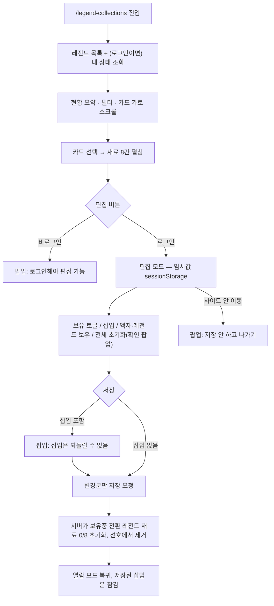

# legendCollections — 설계

## 1. 화면 구조

| 화면 ID | 화면 | 영역 배치 |
|---|---|---|
| 미부여 (개발 시 부여) | 레전드 재료 보유 현황 — 열람 | 상단바 → 가이드 → 검색 · 구단 칩 · 전체/타자/투수 · 포지션 칩 → 현황 요약(N명·액자·재료 보유·삽입) + 액자 필터(전체·액자 O·액자 X) → 순위 표(`#`·레전드·상태·획득일·보유) → 행을 누르면 재료 2열 카드 6 + 코치 2. 내 목표: 접힌 주기 일정(상단 고정) → 필터(전체·액자 보유·미보유) → 순위순 진행률 카드. 선호 고르기: 가운데 모달. 홈: 오늘 히스토리 모드 카드 |
| 미부여 | 레전드 재료 보유 현황 — 편집 | 열람과 같은 골격, `편집` 자리에 "저장 안 한 변경 N · 취소 · 저장", 펼침 머리에 `액자`·`보유중` 토글, 카드 안 `없음·보유·삽입` 3칸, "이 레전드 재료 전체 초기화" 버튼(하단 고정 바 없음) |
| 미부여 | 확인 팝업 4종 | 삽입 포함 저장 확인 · 전체 초기화 확인 · 저장 안 하고 나가기 안내 · 비로그인 편집 안내 |

레전드 카드는 한 장에 구단·타입·포지션, 이름, 액자 뱃지, 8칸 진행 점, "보유 n · 삽입 n / 8" 을 담는다(REQ-LCOL-12). 레전드 보유 카드는 "이미 보유중" 뱃지를 더 붙인다(REQ-LCOL-06).

## 2. 상태

| 상태 | 조건 | 화면에 보이는 것 |
|---|---|---|
| 불러오는 중 | 레전드 목록·내 상태 요청 대기 | 카드 줄·펼침 영역 자리에 로딩 표시 |
| 비로그인 열람 | 로그인 안 함 | 모든 칸 미보유, 현황 0. 편집 버튼 누르면 로그인 안내 팝업 (REQ-LCOL-01) |
| 로그인 열람 | 로그인 + 내 상태 응답 | 카드 진행률·펼침 영역에 저장된 상태 |
| 빈 결과(필터) | 필터 결과 0건 | 카드 줄 대신 안내 문구 |
| 편집 중 | 편집 버튼 누름 | 편집형 펼침 + 상단 "저장 안 한 변경 N · 취소 · 저장". 임시값은 sessionStorage, "탭을 닫으면 임시값이 사라져요" 안내 (REQ-LCOL-08·13) |
| 재료 칸 | 미보유 / 보유 / 삽입(저장 전) / 삽입(저장됨·잠김) | 점선 칸 / 브랜드 테두리 / 브랜드 채움 / 채움 + 자물쇠 "되돌릴 수 없음" (REQ-LCOL-03·10) |
| 충돌(409) | 다른 기기에서 먼저 저장 | 경고 팝업, 내 값 유지 또는 서버 값 채택 |
| 오류 | 조회·저장 실패 | 조회 실패 안내 문구. 저장 실패는 임시값 보존 + 재시도 안내, 로그인 만료면 재로그인 뒤 복구 (REQ-LCOL-14) |

## 3. 흐름

## 4. 디자인 값

- 폭 480 단일, 좌우 여백 `layout/h-pad`, 상단바 `layout/topbar-height`
- 간격 `spacing/1`~`spacing/12`, 모서리 카드 `radius/lg`·칩 `radius/full`
- 면 `bg/deepest`(화면) · `bg/card`(카드·재료 줄) · `bg/modal`(팝업) · `overlay/scrim`(팝업 뒤)
- 선택·보유·삽입 강조는 브랜드 축(`brand/default` · `brand/alpha-15` · `brand/tint`). 상태색(성공·위험·주의)은 쓰지 않는다 — 단, 삽입 확정·전체 초기화 팝업의 확인 버튼만 `status/danger`
- 글자는 텍스트 스타일 `text/topbar` · `text/section-title` · `text/body-bold` · `text/body` · `text/caption` · `text/badge`
- 뱃지 "액자"·"이미 보유중" 은 분류 축 뱃지(`fe-badges.md` PinnedBadge 계열), 등급 색 아님

## 5. 서버와 주고받는 것

| 요청 | 응답 | 실패하면 |
|---|---|---|
| `GET /api/legend-stats` | 레전드 목록(구단·타입·포지션) | 조회 실패 안내 |
| `GET /api/legends/{id}` | 재료 8행(선수 6 + 코치 2) | 펼침 영역에 불러오기 실패 |
| `GET /api/legend-collections` 🟨 | 내 레전드 상태(미보유·액자·보유중) + 재료 상태 + 선호 순위 | 비로그인은 호출 안 함. 실패 시 빈 상태 + 안내 |
| `PUT /api/legend-collections/changes` 🟨 | 편집 변경분(재료 + 레전드 상태) 저장 결과, 초기화할 레전드 목록 처리, 서버 수정 시각 | 전환 규칙 위반 거절 · 로그인 만료 시 임시값 보존 · 동시 수정 경고 |
| `PUT /api/legend-collections/{legendId}/acquired-at` | 보유·액자 획득일 저장 (REQ-LCOL-21) | 미보유·미래 날짜 거절 |
| `PUT /api/legend-collections/preferences` 🟨 | 선호 순위 + 액자 토글 저장 결과 | 10명 초과 · 보유중 레전드 포함 · 보유중 레전드 액자 토글 시 거절 |
| `GET /api/legend-collections/schedule` 🟨 | 오늘 일차 + 14일 재료 목록(일차·라운드·레전드·재료·액자) | 홈 카드 숨김, 내 목표 일정 영역에 오류 문구 |

## 6. Figma

| 화면 | node-id |
|---|---|
| 부품 모음 `legendCollections / Components` | 411:100 |
| 부품 C/LC/Icon/Lock · MaterialSlot · MaterialRow · LegendCard | 411:101 · 411:120 · 411:160 · 411:215 |
| `legendCollections v2 / 01 열람` (480 폭, Light 모드 · legendStats 표+펼침 구조) | 419:340 |
| `legendCollections v2 / 02 편집` (재료 + 레전드 상태 편집 · 상단에 저장 안 한 변경/취소/저장 · 펼침 머리 액자·보유중 토글 · 2열 카드 안 없음/보유/삽입 3칸) | 429:312 |
| `legendCollections v2 / 03 팝업 모음` (삽입 저장 · 초기화 · 이탈 · 비로그인) | 420:2549 |
| `legendCollections v2 / 04 내 목표` (접힌 주기 일정 상단 고정 · 전체/액자 보유/미보유 필터 · 순위순 목록 · 남은 재료 2열 카드) | 423:247 |
| `legendCollections v2 / 04b 주기 일정 상태` (접힘·오늘 있음 / 접힘·오늘 없음 문구 / 펼침 전체 일정 · 줄 = 레전드 · 재료 카드 두 칸) | 440:409 |
| `legendCollections v2 / 05 선호 고르기` (가운데 모달 · 미보유 레전드만 · 최대 10 · 순위 끌기 · 액자 토글) | 424:247 |
| `legendCollections v2 / 06 홈 오늘 히스토리` (홈 카드 · 숨김 조건 메모) | 425:247 |
| `legendCollections v2 / 02b 레전드 상태 토글` (미보유·액자·보유중 3가지 · 보유중이면 액자 비활성) | 434:264 |
| 재료 카드 C/LC/MatCard [view: 미보유·보유·삽입 / edit: 미보유·보유·저장 전 삽입·저장된 삽입] · grid(2열 편집): 미보유·보유·저장 전 삽입·저장된 삽입 · 미보유 칸 불리언 속성 `마일리지`·`히스토리` | 418:387 |

## 7. 획득일 · 필터 (1.1.0)

- 표에 `획득일` 열이 있고 머리를 눌러 정렬한다. 날짜 없는 행은 항상 뒤(REQ-LCOL-23).
- 편집으로 상태를 바꾸면 변경일 입력칸(기본 오늘)이 뜬다(REQ-LCOL-22). 펼침 머리에서 보유·액자 획득일을 고친다(REQ-LCOL-21).
- 필터 묶음은 공용 접이식 구역을 쓴다(REQ-LCOL-25).
