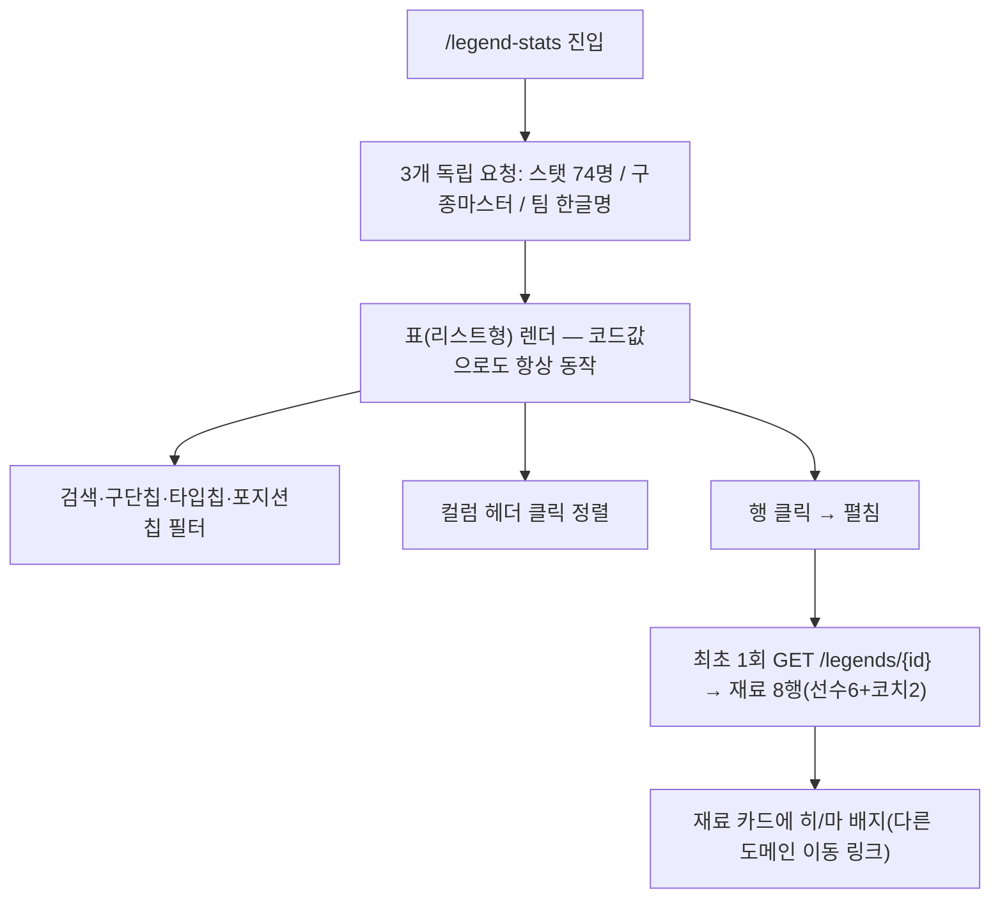

# legendStats — 설계

## 1. 화면 구조

| 화면 ID | 화면 | 영역 배치 |
|---|---|---|
| SC-15-01 | 레전드 재료 평점표 | 상단바(공용) → 검색창 → 구단 칩/타입 칩/포지션 칩 → 본문(표, 행 클릭으로 재료 펼침) |

카드형/리스트형 전환이 없다 — 애초에 표(리스트형) 단일 구조.

## 2. 상태

| 상태 | 조건 | 화면에 보이는 것 |
|---|---|---|
| 로딩 | 3개 독립 요청(스탯/구종마스터/팀명) 대기 중 | 전용 마크업(코드값으로도 표는 계속 살아 있음) |
| 데이터 | 스탯 요청 성공 | 표(리스트형) |
| 빈 결과(필터) | 검색·필터 결과 0건 | 안내 문구(전용 마크업) |
| 오류(재료) | 재료 요청 실패(펼친 행) | "재료 정보를 불러오지 못했습니다" — 재료 0건(정상)과 구분해 `hasMaterialsResponse`로 3단 분기(로딩중/재료없음/불러오기실패) |

## 3. 흐름

## 4. 디자인 값

- 폭 480 단일, 좌우 여백 `$layout-h-pad` 토큰(`fe-design.md` § 1)
- 표 글자는 `$font-size-12` 토큰
- 간격은 `$space-1`~`$space-12` 단계 토큰만
- 평점 미정 행의 강조 색은 상태 축이 아니라 중립(muted) 토큰 — 상태색(성공/위험/주의) 오용 금지
- 표 10행·40행 뒤 `colSpan` 광고 슬롯(`LEGEND_STATS_LIST`, in-feed) — `fe-ads.md` § 3

## 5. 서버와 주고받는 것

| 요청 | 응답 | 실패하면 |
|---|---|---|
| `GET /api/legend-stats` | 레전드 74명 태생 스탯 전량 | 전용 오류 마크업(구체 동작 코드로 미확인 — ❓) |
| `GET /api/legend-stats/pitch-types` | 구종 마스터 10종 | 실패해도 코드값으로 표 유지(§3) |
| `GET /api/teams` | 구단 한글명 | 실패해도 코드값(구단 코드)으로 표 유지 |
| `GET /api/legends/{id}` | 재료 8행(선수6+코치2) | 로딩중/재료없음/불러오기실패 3단 분기 |

## 6. Figma

| 화면 | node-id |
|---|---|
| SC-15-01 레전드 재료 평점표 | 미등록 — 메모리에 "308:103 아래 18프레임" 기록이 있으나 이번 조사로 코드·문서에서 확인되지 않아 "미등록"으로 남긴다 |
