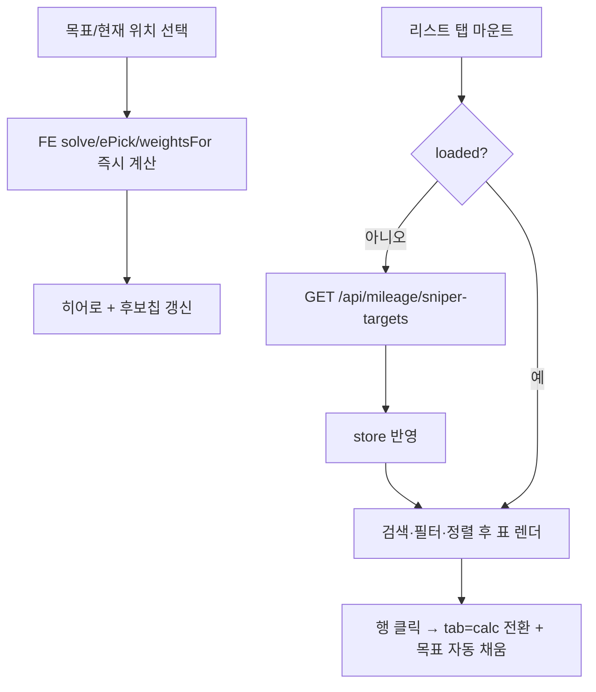

# 마일리지 — 설계

## 1. 화면 구조

| 화면 ID | 화면 | 영역 배치 |
|---|---|---|
| SC-16-01 | 시뮬레이션 탭 (`?tab=calc`) | 안내 배너(리스트에서 왔을 때만) → 목표/현재 위치 셀렉트(구단·연도 각 2개) → 히어로(다음 한 수 안내 + 발광 글리프) → 추천 후보칩 → "구단×연도 표 보기" 버튼 → 도움말 |
| SC-16-01 | 저격 선수 리스트 탭 (`?tab=list`) | 검색행(모드 토글 + 검색창) → 포지션 칩 12개 → 카운터행(정렬 라벨 포함) → 표(레전드·재료 카드·구단·연도·포지션) |
| SC-16-01 내부 서브뷰 | 구단×연도 표 | 전체화면. 칸을 누르면 그 자리를 "지금 위치"로 놓고 재계산 |

`<MobileLayout>` 공용 상단바 + 서랍을 그대로 쓰고 도메인 자체 헤더는 없다(`useDomainTopBar` 텍스트 지정만).

## 2. 상태

| 상태 | 조건 | 화면에 보이는 것 |
|---|---|---|
| 정상(시뮬레이션) | 항상 — FE 순수 함수 즉시 계산 | 히어로 + 후보칩 + 표. 로딩/에러 없음(서버 호출 없음) |
| 로딩(리스트) | 저격 대상 목록 조회 중(`loading && !loaded`) | 표 헤더는 그대로, `<tbody>` 각 행에 `Skeleton` |
| 에러(리스트) | 조회 실패(`error && !loaded && !loading`) | "불러오지 못했습니다." + 재시도 버튼 |
| 빈 화면(리스트) | 필터링 결과 0건 | "조건에 맞는 선수가 없습니다." |
| 정상(리스트) | 데이터 있음 | 표 행 렌더, 선택된 행은 하이라이트 배경 |

## 3. 흐름

## 4. 디자인 값

- 전역 토큰(브랜드 보라 `--color-brand-dark`/`-300`, 청록 `--color-mint`, 경고 `--color-warning`) 우선 사용
- 도메인 로컬 토큰(`mileage.tokens.scss`, 전역으로 대체 불가한 값만): `--color-mileage-accent-text` · `--color-mileage-accent-bg` · `--color-mileage-goal`(목표 셀) · `--color-mileage-current`(현재 위치) · `--color-mileage-heat-rgb`(표 히트맵 알파용 RGB 성분) · `--color-mileage-glow`/`-glow-done`(다음 수 발광) · `--color-mileage-list-row-hover` · `--color-mileage-list-disabled`
- 다크 기본(`:root`) + 밝은톤(`:root[data-theme="light"]`) 별도 조정값 존재 — 목표색·히트맵 알파 계수가 테마별로 다르게 보정됨
- 표는 시맨틱 `<table>` 유지, 히트맵은 인라인 `rgba()` 조합(알파 범위는 `config/mileage.js` 계산 모듈이 결정)

## 5. 서버와 주고받는 것

| 요청 | 응답 | 실패하면 |
|---|---|---|
| `GET /api/mileage/sniper-targets` (파라미터 없음, 인증 불필요) | `{cardId, teamCode, seasonYear, positionCode, subPositionCode, mainUnique, subUnique, playerName, legendName}[]` | 리스트 탭에 "불러오지 못했습니다." + 재시도 버튼. 시뮬레이션 탭은 이 API를 쓰지 않아 영향 없음 |

## 6. Figma

| 화면 | node-id |
|---|---|
| SC-16-01 | 미확인 — Figma 정본 파일 URL 자체가 미확정 (`roadmap.md` § 6 D-09) |
