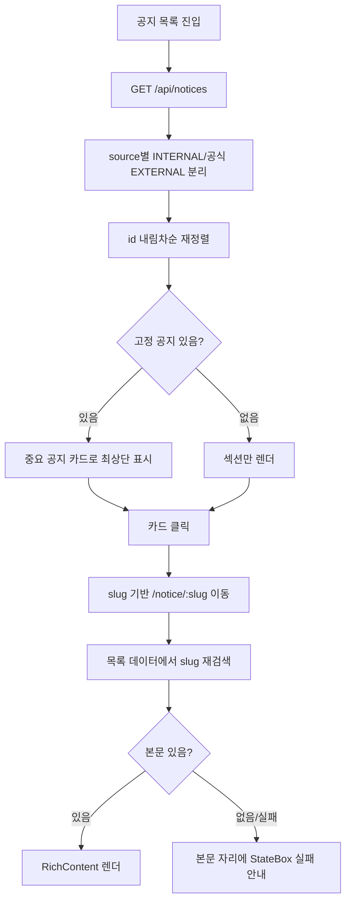

# notices — 설계

## 1. 화면 구조

| 화면 ID | 화면 | 영역 배치 |
|---|---|---|
| SC-04-01 | 공지 목록(`/notices`) | 상단바 → 중요 공지 카드(있으면) → "사이트 공지" 섹션 → "공식 공지" 섹션 → 더보기(3건씩) → 광고 슬롯 |
| SC-04-02 | 공지 상세(`/notice/:slug`) | 상단바 → 제목·날짜 → 본문(`RichContent`, 실패 시 `StateBox`) |
| SC-01-01 내부 | 관리자 공지 관리(`/admin/notice`) | 관리자 셸 탭 안 — 목록 표 + 글쓰기/수정 버튼 + 일괄 선택 툴바 |
| SC-04-03 | 공지 글쓰기(`/admin/notice/write[/:id]`) | 전체 페이지(셸 밖 유일한 예외) — 제목·구분(INTERNAL/EXTERNAL)·이미지·본문(Tiptap 에디터) 입력 |

카드 표시: INTERNAL → "사이트 공지" 섹션(고정 공지는 `PinnedBadge variant="mark"`), EXTERNAL → "공식 공지" 섹션(`PinnedBadge variant="cafe"`), 클릭 가능한 `<a>` 로 렌더.

## 2. 상태

| 상태 | 조건 | 화면에 보이는 것 |
|---|---|---|
| 불러오는 중 | 목록 요청 진행 중 | 두 섹션이 같은 요청을 공유해 동시에 로딩 표시 |
| 정상 | 목록 응답 있음 | 중요 공지 카드 + 두 섹션 |
| 빈 화면 | 섹션 0건 | 섹션별로 따로 판단해 빈 상태 문구 |
| 오류 | 목록 요청 실패 | 두 섹션 동시에 오류 안내 + 재시도 |
| 상세 — 본문만 실패 | 목록 진입은 됐으나 본문 요청 실패 | 제목·날짜 정상 표시, 본문 자리에만 `StateBox`(compact) |
| 관리자 — 일괄 처리 부분 실패 | 선택 항목 중 일부만 처리됨 | 성공분만 반영 + "N건 처리 실패" 배너 |

## 3. 흐름

관리자 글쓰기 흐름: Tiptap 작성 → 저장 → 서버가 살균(Jsoup) 후 검증 → 성공 시 서버 응답(등록/수정일 포함) 그대로 반영 → 공지 탭으로 복귀.

## 4. 디자인 값

- 고정 공지: `PinnedBadge` `mark`(사이트 공지)/`cafe`(공식 공지) variant — 분류 축 팔레트(`fe-design.md` § 4).
- 본문 렌더: `RichContent` 공용 컴포넌트, 링크는 항상 새 탭 강제 속성.
- 그 외 카드·목록 레이아웃은 기본 모바일 토큰.

## 5. 서버와 주고받는 것

| 요청 | 응답 | 실패하면 |
|---|---|---|
| `GET /api/notices` | 노출 중인 공지 배열(INTERNAL+EXTERNAL) | 오류 섹션 표시, 재시도 가능 |
| `GET /api/notices/{id}` | 공지 상세 | 상세 본문 자리에 `StateBox` 실패 안내(REQ-NTC-08) |
| `POST /api/admin/notices` | 등록된 공지(본문 살균 후) | 살균 후 빈 문자열이면 400 |
| `PUT /api/admin/notices/{id}` | 수정된 공지 | 동일 |
| `PATCH .../visible`, `bulk/visible` | 처리 결과 | 일부 실패 시 배너 |
| `DELETE /api/admin/notices/{id}`, `bulk` | 처리 결과 | 일부 실패 시 배너 |
| `POST /api/admin/notices/refresh` | 최신 목록 | 실패 시 기존 화면 유지 |

## 6. Figma

| 화면 | node-id |
|---|---|
| 공지 목록 | 미확인 — Figma 정본 파일 없음 |
| 공지 상세 | 미확인 — 동일 |
| 관리자 공지 관리 · 글쓰기 | 미확인 — 동일 |
