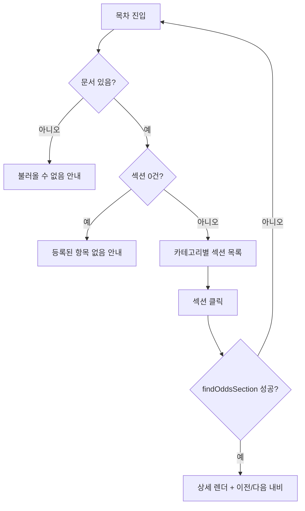

# 확률 공시 — 설계

## 1. 화면 구조

| 화면 ID | 화면 | 영역 배치 |
|---|---|---|
| SC-10-01 | 목차 | 가이드 아코디언(접힘) → 안내(intro) → 카테고리별 섹션 행 목록(제목 + `›`) |
| SC-10-02 | 상세 | 섹션 제목 + 카테고리 라벨 → 블록(표/노트/텍스트/링크) 순차 렌더 → 하단 이전/다음 섹션 내비 |

## 2. 상태

| 상태 | 조건 | 화면에 보이는 것 |
|---|---|---|
| 빈 화면(문서 없음) | `DEFAULT_ODDS_DOC`가 없음 | "공시 문서를 불러올 수 없습니다." |
| 빈 화면(섹션 0건) | `doc.sections.length === 0` | "등록된 확률 공시 항목이 없습니다." |
| 잘못된 섹션 | `sectionId`가 목록에 없음 | 목차(`/probability`)로 즉시 리다이렉트 |
| 정상 | 문서·섹션 있음 | 목차 또는 상세 렌더. 로딩/오류 상태 없음 — 정적 데이터라 네트워크 요청이 없다 |

## 3. 흐름

## 4. 디자인 값

전역 토큰만 사용 — 도메인 로컬 토큰 없음. 표 셀 병합(`computeGridColumns`)은 HTML 표의 rowSpan/colSpan 규칙을 그대로 옮긴 계산으로, 5열 이상 넓은 표에서 단순화하면 깨진다(리팩터 금지).

## 5. 서버와 주고받는 것

서버 호출 없음(FE 전용). 목차·상세 모두 정적 import(`@/data/odds`)로 데이터를 읽는다.

## 6. Figma

| 화면 | node-id |
|---|---|
| SC-10-01 · SC-10-02 | 미확인 — Figma 정본 파일 URL 자체가 미확정 (`roadmap.md` § 6 D-09) |
