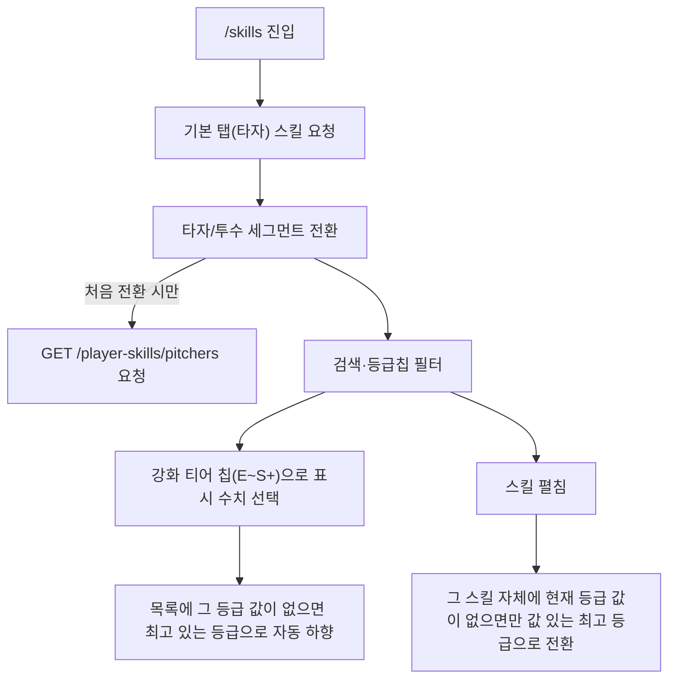

# playerSkills — 설계

## 1. 화면 구조

| 화면 ID | 화면 | 영역 배치 |
|---|---|---|
| SC-17-01 | 스킬 백과사전 | 상단바(공용) → 검색창 → 타자/투수 세그먼트 → 등급 칩 + 강화 티어 칩 → 본문(스킬 목록, 펼침형) |

## 2. 상태

| 상태 | 조건 | 화면에 보이는 것 |
|---|---|---|
| 로딩 | 해당 role(타자/투수) 최초 요청 중 | 공용 `StateBox`(2026-09-28 이후 전용 마크업에서 교체) |
| 데이터 | 응답 성공 | 스킬 목록(카드/아코디언형 `SkillItem`) |
| 빈 결과(필터) | `.empty` — 검색·등급 필터 결과 0건 | "조건에 맞는 스킬이 없습니다" 안내(공용 `StateBox`와 다른 전용 스타일, 검색결과 없음 의도적으로 구분) |
| 오류 | 요청 실패 | 공용 `StateBox`(오류 문구 + 재시도) |

## 3. 흐름

리스트형(표) 전환 개념이 없다 — 단일 목록 구조.

## 4. 디자인 값

- 폭 480 단일, 좌우 여백 `$layout-h-pad` 토큰(`fe-design.md` § 1)
- 간격은 `$space-1`~`$space-12` 단계 토큰만
- 글자는 rem 아홉 값 토큰, 굵기 400/500/600/700만
- 등급 칩(노말/히어로/플래티넘/레전드) 색은 등급 축 토큰 — 값 미정(`fe-design.md` § 4, 게임 본편 등급 체계 확보 후)
- 스킬 리스트 10번째 항목 뒤 광고 슬롯(`SKILLS_LIST`, in-feed) — `fe-ads.md` § 3

## 5. 서버와 주고받는 것

| 요청 | 응답 | 실패하면 |
|---|---|---|
| `GET /api/player-skills/hitters` | 타자 스킬 46건(티어별 수치 포함) | 공용 `StateBox` 오류 + 재시도 |
| `GET /api/player-skills/pitchers` | 투수 스킬 46건, 투수 탭 최초 전환 시에만 요청 | 공용 `StateBox` 오류 + 재시도 |

## 6. Figma

| 화면 | node-id |
|---|---|
| SC-17-01 스킬 백과사전 | 미등록 — Figma 정본 파일 없음(`overview/domain.md` § 3) |
