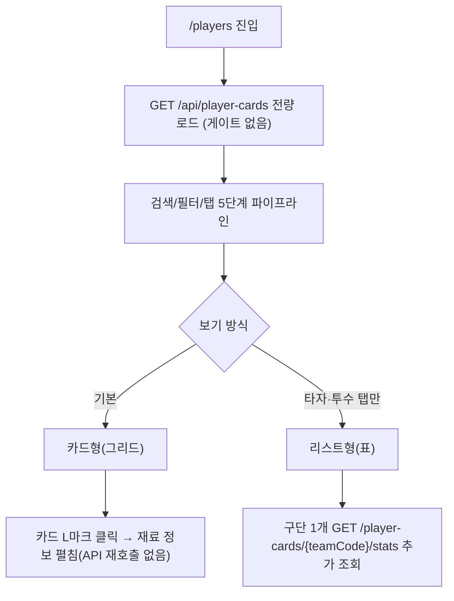

# players — 설계

## 1. 화면 구조

| 화면 ID | 화면 | 영역 배치 |
|---|---|---|
| SC-11-01 | 선수 백과사전 | 상단바(공용) → 검색창 → 필터/탭(전체·타자·투수·코치, "재료만 보기" 토글) → 본문(카드형 그리드 또는 리스트형 표, 스크롤) |

## 2. 상태

| 상태 | 조건 | 화면에 보이는 것 |
|---|---|---|
| 로딩 | 최초 진입, 응답 대기 | 스켈레톤 카드 격자(전용 마크업, `StateBox` 미사용) |
| 데이터 | 응답 성공 | 카드형 그리드 또는 리스트형(표) |
| 빈 결과(필터) | 필터·검색 결과 0건 | 안내 문구 + "필터 초기화" 버튼(전용 마크업) |
| 오류 | 목록 요청 실패 | 빈 결과와 같은 마크업을 재사용 — 문구만 다르고 글자색은 danger가 아니라 muted(전용 마크업) |

## 3. 흐름

## 4. 디자인 값

- 폭 480 단일, 좌우 여백 `$layout-h-pad`, 카드 폭 `$layout-card-width` 토큰(`fe-design.md` § 1)
- 간격은 `$space-1`~`$space-12` 단계 토큰만
- 글자는 rem 아홉 값 토큰(`--font-size-*`), 굵기는 400/500/600/700만
- 카드 등급 색(등급 축)은 값 미정(`fe-design.md` § 4 등급 팔레트 미확정) — 등급 표시는 텍스트/아이콘으로 임시 처리
- 뱃지("L"/"LN")는 분류 축(`--color-cat-*`) 재사용 여부 미확인 — 코드 확인 필요

## 5. 서버와 주고받는 것

| 요청 | 응답 | 실패하면 |
|---|---|---|
| `GET /api/player-cards` | 카드 11,668건(L/LN 배지 포함), ETag/Cache-Control | 오류 상태(§2) — 안내 + 필터 초기화 버튼 재사용 |
| `GET /api/player-cards/{teamCode}/stats` | 구단 1개(전 연도) 태생 5스탯 + 투수 보유 구종 | 리스트형 전환 시 실패 동작은 코드로 미확인 — ❓ |

## 6. Figma

| 화면 | node-id |
|---|---|
| SC-11-01 선수 백과사전 | 미등록 — Figma 정본 파일 없음(`overview/domain.md` § 3) |
