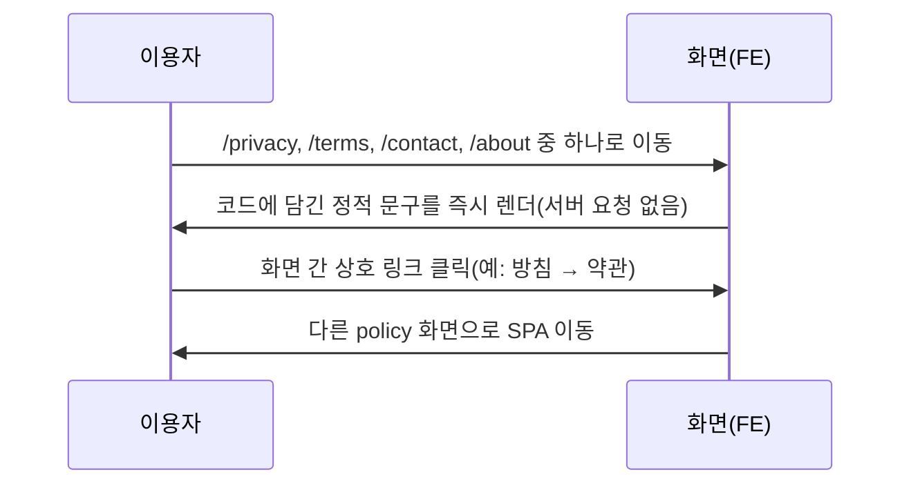

# policy — 설계

## 1. 화면 구조

| 화면 ID | 화면 | 영역 배치 |
|---|---|---|
| SC-13-01 | 개인정보처리방침 | `<MobileLayout>` 본문 — 조 단위 `SECTIONS` 배열을 세로로 나열 |
| SC-13-02 | 이용약관 | 동일 구조, `SECTIONS` 배열 |
| SC-13-03 | 문의하기 | 소개 문구 + `SectionBlock` 2개(오픈채팅 / 이메일) |
| SC-13-04 | 사이트 소개 | 운영자 소개 + `FEATURES` 목록(현재 7항목) |

4화면 모두 `useDomainTopBar(제목)`으로 상단바 제목만 바꾸고 도메인 자체 헤더는 만들지 않는다.

## 2. 상태

| 상태 | 조건 | 화면에 보이는 것 |
|---|---|---|
| 정상(유일한 상태) | 항상 | 정적 텍스트 전체가 즉시 렌더된다 |

서버 요청이 없어 불러오는 중·오류·빈 화면 상태가 존재하지 않는다.

## 3. 흐름

## 4. 디자인 값

본문 글자는 rem 아홉 값 중 본문 급을 쓴다(`fe-design.md` § 1). 조 제목은 섹션 제목 급. 색은 상태 3축 중 어디에도 해당하지 않는 순수 텍스트라 배경/글자 의미 색만 쓴다. 이 도메인 전용 토큰 없음.

## 5. 서버와 주고받는 것

이 도메인은 서버와 통신하지 않는다. 전 화면이 코드 내 정적 데이터만 렌더한다.

## 6. Figma

| 화면 | node-id |
|---|---|
| 개인정보처리방침·이용약관·문의하기·소개 | 미확인 — Figma 정본 파일 없음(`screen-id.md` § 4) |
