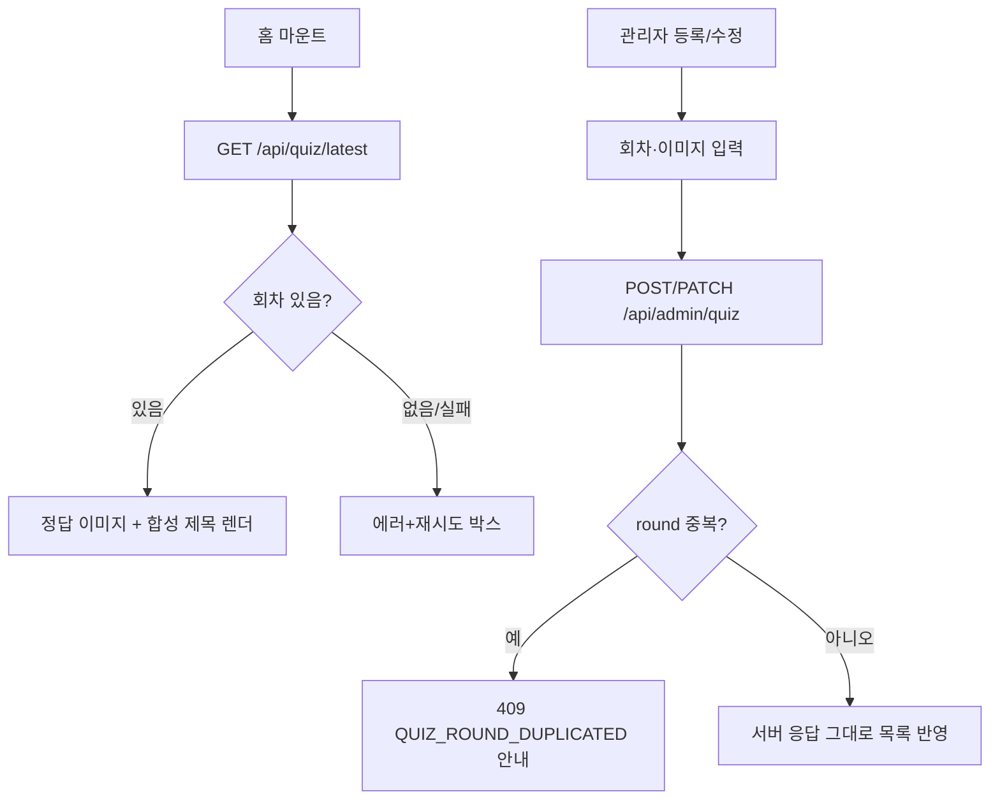

# quiz — 설계

## 1. 화면 구조

| 화면 ID | 화면 | 영역 배치 |
|---|---|---|
| SC-07-01 내부 | 홈 퀴즈 섹션 | `HomeScreen` 섹션 순서(Hero → Quick → Support → Quiz → …) 안 — 정답 이미지 1장 + 합성 제목 + 안내 문구("매주 금요일 12:00…") |
| SC-01-01 내부 | 관리자 퀴즈 관리(`/admin/quiz`) | 관리자 셸 탭 안 — 목록 표 + 등록/수정 폼(회차·이미지 URL 직접입력 또는 파일업로드) + 일괄 선택 툴바 |

퀴즈 섹션은 별도 헤딩 없이 `SectionBlock` 이 감싸는 형태다.

## 2. 상태

| 상태 | 조건 | 화면에 보이는 것 |
|---|---|---|
| 불러오는 중 | `GET /api/quiz/latest` 진행 중 | 홈 섹션 로딩 표시 |
| 정상 | 최신 회차 있음 | 정답 이미지 + 합성 제목("🎉컴프야 퀴즈 이벤트 {round}회 정답") |
| 데이터 없음 | 등록된 회차가 없음(404) | 에러+재시도 박스(비노출 처리 아님) |
| 오류 | 요청 실패 | 에러+재시도 박스 |
| 관리자 — 일괄 삭제 부분 실패 | 선택 항목 중 일부만 처리됨 | 성공분만 반영 + 실패 건수 배너 |

## 3. 흐름

이미지는 URL 직접입력 또는 파일 업로드(`POST /api/upload/events` → S3) 두 경로로 채울 수 있다.

## 4. 디자인 값

- 별도 뱃지·색 토큰 없음 — 이미지 게시형 섹션이라 상태 표현이 텍스트/에러 박스 위주.
- 섹션 레이아웃은 홈 도메인의 `SectionBlock` 공용 틀을 그대로 따른다.

## 5. 서버와 주고받는 것

| 요청 | 응답 | 실패하면 |
|---|---|---|
| `GET /api/quiz/latest` | 최신 회차(합성 제목 포함) | 데이터 없음/오류 모두 에러+재시도 박스 |
| `POST /api/admin/quiz` | 등록된 회차 | 회차 중복 시 409 |
| `PATCH /api/admin/quiz/{id}` | 수정된 회차(안 보낸 필드는 기존값 유지) | 존재하지 않는 id면 404 |
| `DELETE /api/admin/quiz/{id}`, `bulk` | 처리 결과 | 일부 실패 시 배너 |
| `POST /api/upload/events` | 업로드된 이미지 URL | 실패 시 업로드 영역에 안내 |

## 6. Figma

| 화면 | node-id |
|---|---|
| 홈 퀴즈 섹션 | 미확인 — Figma 정본 파일 없음 |
| 관리자 퀴즈 관리 | 미확인 — 동일 |
