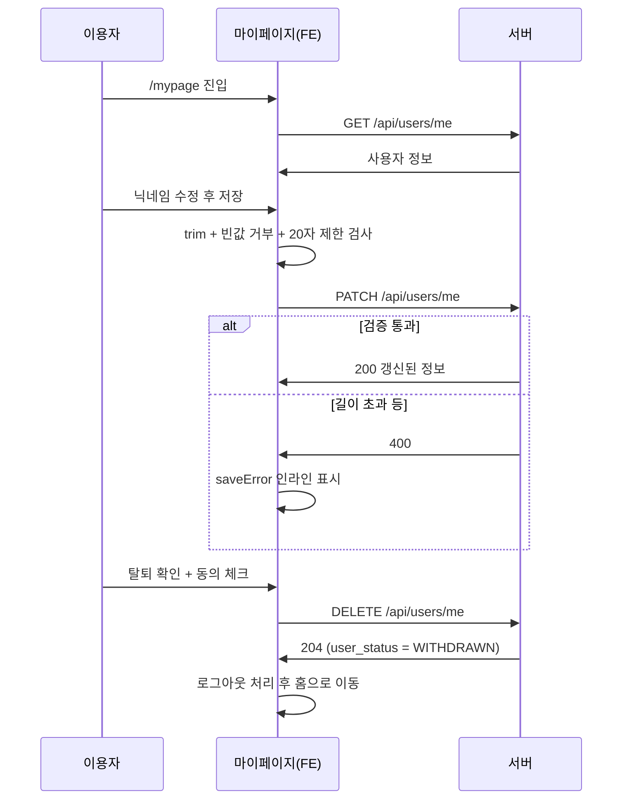

# users — 설계

## 1. 화면 구조

| 화면 ID | 화면 | 영역 배치 |
|---|---|---|
| SC-09-01 | 마이페이지 | `<MobileLayout>` 본문 — 프로필(닉네임·이미지) 편집 카드 + 탈퇴 버튼(하단, 확인 모달 경유) |
| SC-01-01 내부 탭 | 회원 관리(관리자) | 어드민 셸 안 — 검색창 + 정렬 가능한 표 + 행 클릭 시 권한/상태 변경 폼 + 하단 `AdminPagination` |

## 2. 상태

| 상태 | 조건 | 화면에 보이는 것 |
|---|---|---|
| 불러오는 중 | 내 정보/회원 목록 요청 중 | `StateBox status="loading"` |
| 오류 | 조회 실패 | `StateBox status="error"` + 재시도 |
| 빈 화면 | 회원 정보를 찾을 수 없음 / 검색 결과 0건 | `StateBox status="empty"` |
| 편집 중 (마이페이지) | 닉네임 입력창 활성화 | 저장/취소 버튼, 저장 실패 시 `saveError` 인라인 표시 |
| 탈퇴 확인 (마이페이지) | 탈퇴 버튼 클릭 | 확인 모달 + 약관 동의 체크(`agreeChecked`) 전까지 탈퇴 버튼 비활성 |
| 변경 중 (관리자) | 권한/상태 변경 저장 중 | 저장 버튼 비활성 + `saving`, 실패 시 `saveError` |

## 3. 흐름

## 4. 디자인 값

상태 표시는 `global/ui/mobile/stateBox/StateBox` 공용 토큰만 쓴다. 관리자 표는 `global/ui/admin/pagination/AdminPagination` 토큰을 그대로 따르고, 표 글자는 `$font-size-12` 토큰(`fe-design.md` § 1). 이 도메인 전용 색·간격 토큰 없음.

## 5. 서버와 주고받는 것

| 요청 | 응답 | 실패하면 |
|---|---|---|
| `GET /api/users/me` | 사용자 정보 | `StateBox status="error"` + 재시도 |
| `PATCH /api/users/me` | 갱신된 사용자 정보 | 400(길이·형식) → 인라인 오류 문구 |
| `DELETE /api/users/me` | 204 | 인라인 오류 문구, 탈퇴 처리는 취소됨 |
| `GET /api/admin/users` (전량) | 회원 배열(최대 1000명) | `StateBox status="error"` + 재시도 |
| `PATCH /api/admin/users/{publicId}/role` | 갱신된 회원 | 403(자기 자신) 또는 400 → 인라인 오류 |
| `PATCH /api/admin/users/{publicId}/status` | 갱신된 회원 | 동일 |

## 6. Figma

| 화면 | node-id |
|---|---|
| 마이페이지 · 회원 관리 | 미확인 — Figma 정본 파일 없음(`screen-id.md` § 4) |
