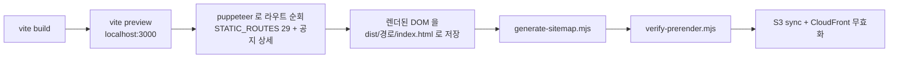

# prerender — 임시 해법이 준 것과 남긴 것

> 기준일: 2026-09-25
> 출처: `web/scripts/prerender.mjs`, `verify-prerender.mjs`, `generate-sitemap.mjs`, `notice-source.mjs`, `infra/cloudfront/rewrite-index.js`, `.github/workflows/deploy-fe.yml`
> 배경: 2026-08-31 도입, 09-04 기본 빌드 편입. 1인 · 3주 기한에서 SSR 전환 대신 고른 방식이다.

---

## 1. 동작 방식

| 단계 | 파일 | 요점 |
|---|---|---|
| 대상 목록 | `prerender.mjs:34-73` | 정적 29개 경로. 공지 상세는 빌드 때 운영 API 로 목록을 받아 추가(`notice-source.mjs`) |
| 완료 대기 | `prerender.mjs` `DATA_ROUTES` | 경로별 CSS 셀렉터가 DOM 에 나타날 때까지 최대 20초. 없으면 **경고만 찍고 계속** |
| 경로 보정 | `infra/cloudfront/rewrite-index.js` | 확장자 없는 경로에 `/index.html` 부착. 런타임이 ES5.1 이라 `charAt` 등으로 작성 |
| 검증 | `verify-prerender.mjs` | 스냅샷이 존재하고 홈과 크기가 다른지만 확인. 공지 상세는 검사하지 않음 |

---

## 2. 얻은 것

| 지표 | 전 | 후 |
|---|---|---|
| 주소별 HTML | 모든 주소 동일(6,400 bytes) | 정적 29 + 공지 상세 각각 본문 포함 |
| sitemap 주소 | 2 | 정적 27 + 공지 상세(빌드 시 병합) |
| 라우터 · 스토어 수정 | — | **0** (기존 SPA 그대로) |
| 인프라 변경 | — | CloudFront Function 1개 |

"코드를 거의 건드리지 않고 크롤러에게 본문을 보여준다" 는 목표는 달성했다.

---

## 3. 남긴 것 — 구조에서 오는 한계

| 한계 | 왜 생기나 | 결함 |
|---|---|---|
| 스냅샷을 버리고 다시 그린다 | `main.jsx:7` 이 `createRoot` 로 마운트 → 기존 DOM 을 지우고 새로 렌더. 게다가 `AuthProvider.jsx:32` 가 인증 확인 전까지 `null` 을 렌더해 **본문이 잠깐 사라진다** | [FE-01](../02-diagnosis/frontend/FE-01-snapshot-discarded-on-mount.md) |
| 스냅샷이 없는 주소는 홈 HTML 이 200 으로 나간다 | CloudFront 오류 응답이 404 → `/index.html`(홈 스냅샷, 200). 홈의 canonical · 메타가 딸려 간다 | [FE-02](../02-diagnosis/frontend/FE-02-soft-404.md) |
| 대기 로직이 취약하다 | "데이터가 왔다" 를 CSS 셀렉터로 추측. 셀렉터가 바뀌거나 API 가 느리면 빈 표가 조용히 찍힌다 | [FE-03](../02-diagnosis/frontend/FE-03-prerender-fragility.md) |
| 빌드가 로컬 포트와 CORS 에 묶인다 | 브라우저(퍼피티어)가 `localhost:3000` 에서 운영 API 를 부르므로 BE CORS 허용 목록에 그 주소가 있어야 한다 | [FE-03](../02-diagnosis/frontend/FE-03-prerender-fragility.md), [BE-05](../02-diagnosis/backend/BE-05-hardcoded-env.md) |
| 같은 정보를 여러 곳에 손으로 적는다 | 가이드 슬러그 12개가 콘텐츠 파일 · `STATIC_ROUTES` · `sitemap.xml` 세 곳에, 공지 슬러그 생성 함수가 FE 와 스크립트 두 곳에 있다 | [FE-03](../02-diagnosis/frontend/FE-03-prerender-fragility.md), [BE-06](../02-diagnosis/backend/BE-06-notice-contract.md) |
| 메타는 여전히 브라우저가 만든다 | `useDocumentMeta.js` 가 `document.head` 를 직접 수정. 스냅샷에는 퍼피티어가 실행한 결과가 담길 뿐이다 | [FE-04](../02-diagnosis/frontend/FE-04-client-side-meta.md) |

---

## 4. 결론

prerender 는 **"브라우저를 빌드 서버에서 한 번 돌리는"** 방식이라 SPA 의 가정(브라우저에서만 실행)을 지키면서 결과만 가져온다. 그래서 수정 비용이 작았지만, 한계를 고치려면 결국 **서버에서도 실행되는 코드**로 바꿔야 한다. 그 작업을 프레임워크 규칙 안에서 하려는 것이 Next.js 이관이다 → [`rendering-options.md`](./rendering-options.md).
