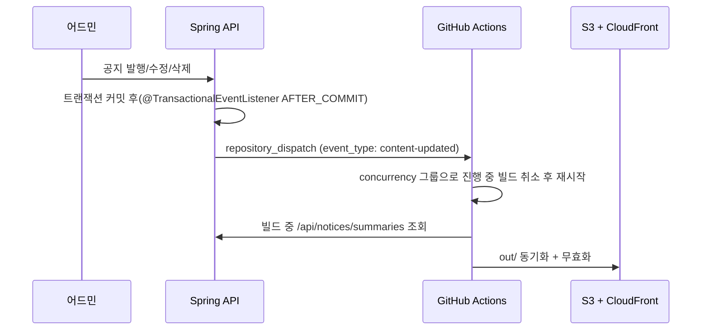

# 5단계 — SEO 동등성과 콘텐츠 갱신 경로

> 목표: 검색엔진이 받는 것이 **기준선 이상**이고, 공지를 올리면 정적 페이지가 자동으로 갱신된다
> 닫는 결함: [FE-02](../02-diagnosis/frontend/FE-02-soft-404.md), [FE-04](../02-diagnosis/frontend/FE-04-client-side-meta.md), [BE-06](../02-diagnosis/backend/BE-06-notice-contract.md)(재빌드 트리거), [BE-08](../02-diagnosis/backend/BE-08-cache-config-drift.md)
> 운영 영향: 없음 (CloudFront 변경은 6단계에서 적용)

---

## 1. 메타 · 색인 파일

| 항목 | 구현 | 기준선 대비 |
|---|---|---|
| 페이지 메타 | 각 `page.tsx` 의 `metadata` / `generateMetadata` | title · description · canonical 동일 |
| canonical | 루트 `metadataBase = NEXT_PUBLIC_SITE_URL`, 페이지별 `alternates.canonical` | 동일 |
| noindex | `/community` · `/probability/[sectionId]` · `/auth/callback` + **`/mypage` · `/admin/*` 추가** | 개선 |
| `robots.txt` | `app/robots.ts` — `/admin`, `/mypage`, `/auth` disallow + sitemap | 개선 |
| `sitemap.xml` | `app/sitemap.ts` — 정적 경로 + 가이드(콘텐츠 파일) + 공지(`/api/notices/summaries` 의 `slug` · `updatedAt`) | 주소 집합 동일, `lastmod` 추가 |
| 404 | `app/not-found.tsx` → `out/404.html` | 개선 (6단계에서 CloudFront 연결) |
| 구조화 데이터(선택) | 공지 · 가이드 상세 `Article`, 루트 `WebSite` JSON-LD | 신규 |

---

## 2. 공지 발행 → 정적 페이지 갱신

정적 export 에서는 새 공지의 상세 HTML 이 **재빌드해야** 생긴다. 지금도 prerender 가 같은 구조라 운영 방식은 같고, 사람이 배포를 눌러야 하는 부분만 자동화한다.

| 설계 포인트 | 결정 |
|---|---|
| 트리거 시점 | **커밋 후**. 커밋 전 호출하면 빌드가 옛 데이터를 읽을 수 있다 |
| 연속 발행 | 워크플로 `concurrency: { group: fe-deploy, cancel-in-progress: true }` — 마지막 것만 완료 |
| 토큰 | GitHub fine-grained token(해당 저장소 `contents: read`, `actions: write`)을 BE 환경변수로. 코드 · 설정 파일에 커밋 금지 |
| 실패 | BE 는 호출 실패를 로그만 남기고 공지 저장은 성공 처리. 어드민 화면에 "사이트 반영 대기" 표시(선택) |
| 그 사이 사용자 | 목록은 빌드 전까지 옛 HTML. 새 공지 링크는 재빌드 후 생김 — 수 분 지연 허용(정책 판단) |

쿠폰 · 이벤트도 같은 트리거를 쓴다(목록이 정적 HTML 이므로).

---

## 3. 빌드 효율

- 공지 요약 · 쿠폰 · 이벤트 API 에 ETag([BE-08](../02-diagnosis/backend/BE-08-cache-config-drift.md)) — 빌드가 자주 돌아도 BE 부하가 작다.
- 빌드 시간 목표: 현재 prerender 포함 빌드(약 58초, Notion 「기술 기록」 4-(a))보다 짧게.

---

## 4. 완료 기준

- [ ] 기준선 JSON 과 새 산출물(`out/`) 비교: 공개 경로 전부 title · description · canonical · h1 동일
- [ ] 기준선의 "잘못된 동작" 4경로가 기대대로 바뀜(없는 주소 404, 개인 · 관리 화면 noindex)
- [ ] 스테이징(별도 S3 prefix 또는 로컬 `npx serve out`)에서 공지 발행 → 수 분 내 상세 생성 확인
- [ ] `out/sitemap.xml` 주소 집합이 기준선과 같고 `lastmod` 포함
