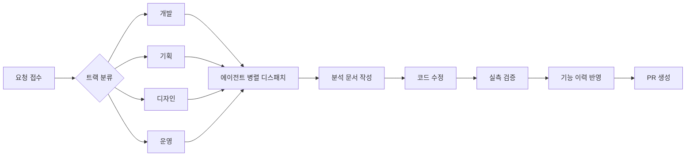

# AI 기반 개발 프로세스

## 한 줄 요약

규칙 문서로 AI 에이전트를 운용해 **분석 → 수정 → 실측 검증**을 반복한다. 사람이 매번 형식을 다시 정하지 않아도, 결과물이 항상 같은 모양으로 나온다.

---

## 왜 이렇게 하나

작업을 자유 형식으로 맡기면 결과물 형식이 매번 흔들리고, 같은 종류의 기록이 문서마다 다른 자리에 남는다. 그러면 작업 횟수만큼 문서가 늘어나고, 나중에 어떤 문서가 최신인지 찾는 비용이 커진다. 이 프로젝트는 "어떻게 분석하고, 어떻게 기록하고, 어떻게 검증하는가"를 규칙 문서로 미리 고정해서 이 판단 자체를 없앴다. 에이전트는 규칙을 읽고 그대로 실행하고, 사람은 결과만 검증한다.

---

## 전체 흐름

요청 하나가 들어오면 먼저 어떤 트랙(개발/기획/디자인/운영)인지 가르고, 트랙별로 에이전트를 동시에 띄운다. 같은 파일을 두 에이전트가 건드리지 않도록 범위를 미리 나눈다. 각 에이전트는 분석 문서를 먼저 쓰고, 그 문서만 보고 코드를 고친 뒤, 빌드·테스트로 실측 검증까지 마치고 보고한다.

---

## 규칙과 역할 구성

| 구성 | 무엇을 고정하나 |
|---|---|
| 규칙 (`.claude/rules/`) | 경로별 자동 로드 — BE·FE·공통 컨벤션. 파일을 읽는 순간 해당 규칙이 대화에 실린다 |
| 컨벤션 (`.claude/conventions/`) | 도구 선택 기준, 진행 로그 형식, 동시 작업 충돌 방지, 릴리스 절차처럼 메인이 직접 참조하는 운영 절차 |
| 템플릿 (`.claude/templates/`) | 문서 다섯 종류의 형식 — 기능 기획, 설계, 변경 이력 항목, 수정 전 분석, 수정 후 실측 |
| 에이전트 (`.claude/agents/`) | 역할별 실행 단위. 입력·출력·건드릴 수 있는 범위를 각각 고정 |
| 워크플로 (`.claude/workflows/`) | 여러 에이전트를 잇는 절차서 — 다중 도메인 병렬 처리 등, 메인이 읽고 그대로 dispatch |
| 훅 (`.claude/hooks/`) + 스크립트 (`.claude/scripts/`) | 위험한 명령을 사람이 매번 확인하지 않아도 자동 차단(DDL 실행, master 직접 커밋, 세션 밖 파일 커밋) + 도메인 이름 대조표 자동 생성 |

에이전트는 기획(planner-lite, planner-division) · 디자인(designer-render, designer-review) · 개발(developer-analyze, backend-developer, frontend-developer, developer-integrate) 로 나뉜다.

---

## 작업 1건이 남기는 것

작업 1건은 항상 같은 자국을 남긴다.

**브랜치 생성 → 분석 문서 → 에이전트별 커밋 → 실측 검증 보고서 → 기능 이력 1줄 → PR**

실측 검증 보고서에는 고친 전후 수치가 그대로 남는다 — "빌드 통과 여부", "테스트 통과 개수", "위반 항목 수" 같은 값이 문서에 박제되어, 나중에 그 작업이 실제로 뭘 바꿨는지 대화 기록을 뒤지지 않고도 확인할 수 있다.

---

## 문서 늘어남을 막는 규칙

문서 수는 **기능 수에 비례**하고, **작업 횟수에는 비례하지 않는다**. 같은 기능을 열 번 고쳐도 새 파일은 늘지 않는다 — 기존 분석 문서와 이력에 이어 쓴다. 새 파일이 생기는 경우는 둘뿐이다: 새 기능이 생겼을 때, 그리고 여러 기능을 가로지르는 결정(예: 컨벤션 개정)이 났을 때.

---

## 검증을 두 겹으로 둔 이유

작업하는 에이전트와 확인하는 에이전트를 나눴다. `backend-developer`·`frontend-developer`가 코드를 고치고, `developer-integrate`는 코드를 직접 고치지 않고 읽기 전용으로 양쪽 결과를 대조한다. 여기에 한 겹을 더 뒀다 — 코드를 읽는 것만으로는 "지금 실제로 터지는가"를 알 수 없어서, 브라우저 조작과 운영 데이터베이스 조회로 실측하는 단계를 따로 둔다.

실제로 이 두 번째 겹이 아니었으면 놓쳤을 사례가 여러 건 있다 — 코드만 봤을 때의 판정과 실측 결과가 갈린 대표 사례 5건은 [ai-workflow-verification.md](ai-workflow-verification.md)에 모았다. 공통점은 하나다 — 코드 읽기만으로는 전부 "결함"에서 멈췄을 것을, 화면을 직접 열어보고 나아가 운영 빌드로 다시 열어봐야 "지금 실제로 터지는가"까지 갈렸다.

---

## 도구 운용에서 배운 것

에이전트 운용 자체도 실측 없이는 문제를 놓쳤다. 비슷한 디자인 스킬 3종이 같은 요청에 동시 후보로 걸려 결과가 매번 달라졌던 것, `CLAUDE.md`가 선언한 참조 문서와 실제로 에이전트가 읽던 컨벤션 파일이 서로 달랐던 것(4개 에이전트가 어긋난 경로를 읽고 있었다), 폐기 표시만 하고 지우지 않은 파일이 4,900여 줄 남아 매 검색마다 같이 걸리던 것 — 셋 다 "설정해 뒀다"와 "실제로 그렇게 동작한다"가 다르다는 같은 함정이었다.

코드 리뷰에서도 같은 함정이 반복됐다. 입력 검증 애노테이션(`@Min`/`@Max`)이 붙어 있어도 검사 엔진(`hibernate-validator`) 자체가 의존성에 없으면 조용히 무시된다. 캐시 무효화(`@CacheEvict`)는 스프링 기본 동작이 트랜잭션 커밋 **전**이라, 안전판 애노테이션을 따로 만들어 둔 곳(쿠폰 6곳)과 안 만든 곳(공지·이벤트·퀴즈 44곳)이 갈려 있어도 코드만 보면 둘 다 "정상"으로 읽힌다. 선언이 있다는 사실과 그 선언이 실제로 발화한다는 사실은 별개다 — 둘 다 실행 경로를 따라가거나 실측해야 갈린다.

---

## 여러 세션을 동시에 돌리다 겪은 사고

같은 작업 폴더를 여러 세션(코드 수정·디자인 감사·문서 정리)이 동시에 쓰면서, 커밋할 때 `git status`에 다른 세션이 고친 파일까지 섞여 나와 남의 변경사항이 함께 커밋된 사고가 반복됐다. 한 세션이 관리자 화면을 편집하던 중간 상태를, 다른 세션의 검증 작업이 "화면이 깨졌다"로 오탐지한 일도 있었다 — 같은 파일을 10차례 다시 확인하고 나서야 오탐이라는 게 확정됐다.

해결은 세션마다 작업 폴더 자체를 분리하는 것이었다. 병렬 세션은 각자 별도 작업 디렉터리(worktree)를 쓰게 하고, 같은 디렉터리를 써야 하는 예외 상황에서는 이 세션이 실제로 고친 파일 목록만 커밋 대상으로 잡아 다른 세션 파일이 섞이지 않게 막는다. 어떤 도구를 어떤 작업에 쓸지 미리 정해 두는 규칙, 파일 잠금 규칙도 같은 사고에서 나왔다.

---

## 지운 것을 감사하는 절차

문서를 대규모로 재배치할 때는 "원본 → 목적지"를 파일 단위로 전부 표에 채운 뒤에만 원본을 지운다. 예를 들어 한 정리 작업에서는 지우기 전에 관련 커밋 해시 51개를 하나씩 `git merge-base`로 대조해 실제로 이관됐는지 확인했고, 그 과정에서 표에 빠져 있던 누락 7건을 먼저 채운 뒤에야 삭제를 진행했다. 지금 이 문서가 속한 재편 작업도 같은 절차를 따른다 — 130개 문서 파일을 먼저 목적지별로 전수 분류한 뒤, 이관이 끝난 것만 지운다.

---

## 처음 지시와 다르게 처리한 사례

사람이 내린 지시를 에이전트가 코드 사실과 맞춰 다르게 처리하고, 그 판단이 맞았던 사례가 있다.

| 지시 | 실제 처리 | 왜 |
|---|---|---|
| 허용되지 않은 방식(405)·형식(415) 오류를 잘못된 요청(400) 하나로 묶어라 | 405·415를 각각 분리해서 응답하게 했다 | 상태코드에는 각자 뜻이 있다. "전부 서버 오류(500)"가 원래 문제였는데 "전부 400"으로 바꾸면 같은 종류의 뭉뚱그리기를 반복하는 셈이다 |
| 쿠폰 화면도 같은 방식으로 고쳐라 | 쿠폰 화면은 손대지 않았다 | 원인을 다시 보니 화면이 아니라 저장 로직이 서버가 채워준 값을 버리고 있었다. 화면은 잘못이 없었다 |
| 운영 화면 배지 표시 방식 후보 세 가지 중 하나를 골라라 | 전체 건수 조회 기능이 아예 없다는 것을 먼저 확인하고, 페이지 단위 조회를 쓰는 도메인 2곳만 전량 조회로 바꿨다 | 나머지 도메인(퀴즈·쿠폰·공지 등)은 애초에 페이지 단위로 세지 않아 원래 값이 정확했다. 안 고쳐도 되는 곳을 고치지 않았다 |

---

## 규모

18개 도메인 코드 리뷰를 한 라운드로 통합한 결과, 발견 약 100건 중 약 79건을 고치고 약 41건을 미결로 남겼다(집계 방식이 도메인마다 달라 근사치). 이 라운드에서 실제로 반영된 커밋은 44개이며, 기능 버전은 `v2.0.0`에서 `v2.0.1` 후보로 전부 PATCH 등급이었다(새 언어·프레임워크·DB 세대 교체 없음). 같은 시기 FE 구조 정리 한 건에서는 지운 줄 224 / 추가한 줄 49로 순 175줄이 줄고 파일 2개가 없어졌다.

---

## 셋업 프롬프트 사례

새 작업을 시작할 때 실제로 쓰인 요청 문장 예시(요약·발췌).

> {도메인명} 도메인을 코드로 구현해줘. developer agent 가 작업 분배 plan 짜고,
> backend-developer / frontend-developer 병렬 dispatch.
> 양쪽 완료 후 developer integrate-review 로 cross-domain 정합 검증.

> 다음 작업들을 백그라운드 병렬로 진행해줘:
> - Track 1: <작업 A>
> - Track 2: <작업 B>
> - Track 3: <작업 C>
> 완료 알림 받으면 보고해.

---

## 에이전트 모델 배분

| 모델 | 배정 에이전트 | 이유 |
|---|---|---|
| Sonnet | backend-developer, frontend-developer, developer-analyze, planner-lite, designer-render, designer-review | 코드 작성·패턴 매칭 중심 작업 — 비용 대비 충분한 성능 |
| Opus | developer-integrate, planner-division | 여러 에이전트의 결과를 통합하고 불일치를 판단하는, reasoning 밀도가 높은 구간 |

반복 실행되는 코드 작성·분석 작업은 저렴한 모델로 돌리고, 여러 산출물을 통합·조정해야 하는 구간에서만 상위 모델을 쓰는 비용 대비 효율 판단이다.
