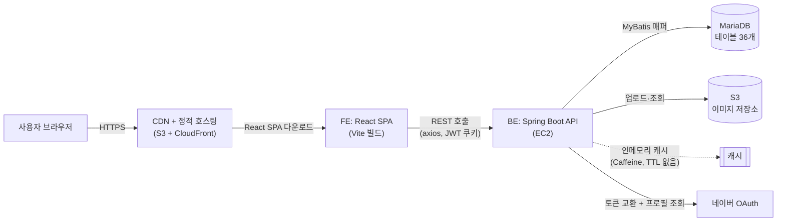
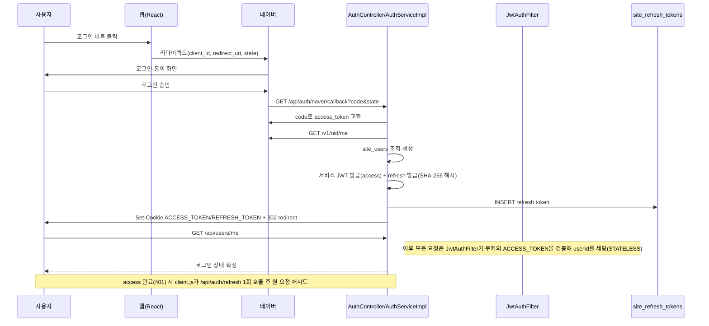
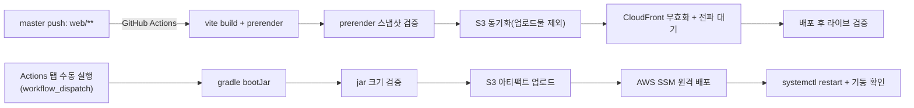

# 시스템 아키텍처

## 1. 시스템 구성도

⚠️ FE 정적 파일과 사용자 업로드 이미지가 같은 S3 버킷을 쓴다 — 배포 시 동기화가 업로드물을 지우지 않도록 예외 처리한다(§5).

## 2. 기술 스택

| 영역 | 기술 | 버전 | 근거 |
|---|---|---|---|
| FE 프레임워크 | React | ^19.2.0 | `web/package.json` |
| FE 상태관리 | Redux Toolkit | ^2.11.0 | 〃 |
| FE 라우팅 | React Router DOM | ^7.10.1 | 〃 |
| FE 빌드 | Vite | ^7.2.4 | 〃 |
| FE 스타일 | Sass (SCSS modules) | ^1.97.1 | 〃 |
| BE 언어 | Java | 21 | `build.gradle` toolchain |
| BE 프레임워크 | Spring Boot | 3.3.2 | `build.gradle` |
| BE DB 접근 | MyBatis Spring Boot Starter | 3.0.3 | 〃 |
| BE 인증 | Spring Security + JJWT | 0.11.5 | 〃 |
| BE 변환 | MapStruct | 1.5.5.Final | 〃 |
| BE 캐시 | Caffeine (Spring Cache, `type=simple`) | — | `build.gradle` · `application.properties` |
| BE 문서화 | springdoc-openapi | 2.6.0 | `build.gradle` |
| DB | MariaDB | 10.5.29(운영 실측) | `mariadb-java-client:3.3.3` |
| 배포 | GitHub Actions | — | `.github/workflows/*.yml` |

## 3. 요청 흐름

FE 화면 → API 호출 → BE 계층 순서로 한 겹씩 내려간다.

1. **FE**: `web/src/domains/{도메인}/mobile/{도메인}Screen.jsx` → `hooks/use{도메인}List.js` → Redux thunk → `infra/http/client.js`(axios)
2. **API 경로**: `/api/{도메인 복수형}`(공개) · `/api/admin/{도메인 복수형}`(관리자) — kebab-case
3. **BE**: `{도메인}Controller` → `{도메인}ServiceImpl`(업무 흐름·트랜잭션) → `{도메인}Repository`(얇은 래퍼) → `{도메인}Mapper.xml`(SQL) → DB
4. 응답은 항상 `{ success, code, data }` 봉투로 포장한다(`GlobalResponseAdvice`)

상세 규칙: `.claude/rules/be/be-structure-map.md`(BE 패키지·주소 지도) · `.claude/rules/fe/fe-convention.md`(FE 폴더·라우트 등록).

## 4. 인증·보안

네이버 OAuth 단일 로그인 수단. Access·Refresh 토큰 모두 HttpOnly 쿠키(`ACCESS_TOKEN`/`REFRESH_TOKEN`) — `Authorization` 헤더 방식은 쓰지 않는다.

| 항목 | 로컬 | 운영 |
|---|---|---|
| access 토큰 수명 | 30분 | 60분 |
| refresh 토큰 수명 | 30일 | 30일 |
| 세션 정책 | STATELESS(서버 세션 없음) | 〃 |

권한 방어선: `/api/admin/**`만 `SecurityConfig`가 `hasRole("ADMIN")`으로 강제 차단하는 **유일한 자동 가드**다. 그 외 로그인 필요 API는 컨트롤러가 직접 `userId == null`을 확인한다. FE `AuthGuard`는 화면 진입을 먼저 걷어내는 UX 보조 장치일 뿐 최종 방어선이 아니다 — API를 직접 호출해도 서버가 막는다.

## 5. 배포 파이프라인

| 환경 | FE | BE | DB |
|---|---|---|---|
| dev(로컬) | `npm start`(Vite dev, 3000) | `bootRun`(8080), `application.properties` | `.env.properties`로 접속, JWT access 30분 |
| prod | master push 시 자동 배포 | **수동**(workflow_dispatch만 — push 트리거는 비활성) | `application-prod.properties`, JWT access 60분 |

CloudFront 쪽에는 뷰어 요청 함수(`infra/cloudfront/rewrite-index.js`)가 하나 붙어 있다 — `/legend-stats` 같은 디렉터리 경로를 `index.html` 로 바꿔 prerender 스냅샷이 실제로 서빙되게 하고, `www` 를 apex 로 301 한다. 이 함수만은 Actions 가 아니라 콘솔에서 수동 게시한다.

⚠️ **테스트 DB와 운영 DB가 같은 인스턴스다.** `sql/V3/`에 DDL을 작성하는 순간 운영에도 즉시 반영된다 — 스키마 변경 전에는 항상 사용자 확인이 먼저다.

## 6. 로컬 실행

BE `./gradlew bootRun`(8080) + FE `cd web && npm start`(3000). 상세 절차·환경변수 목록은 루트 [`SETTING.md`](../../SETTING.md) 참고.

## 7. 공통 장치

| 무엇 | 어디에 | 하는 일 |
|---|---|---|
| 인증 필터 | `security/filter/JwtAuthFilter.java` | 매 요청 쿠키의 액세스 토큰 검증 → 사용자 식별, 세션 없음 |
| 전역 예외 처리 | `common/support/advice/GlobalExceptionHandler.java` | 예외 → 상태코드 매핑([ADR 0008](../decisions/0008-exception-status-mapping.md)), 내부 메시지는 로그에만 |
| 응답 봉투 | `common/support/dto/GlobalResponse.java` | 모든 API 를 `{success, code, data}` 로 통일 |
| 커밋 후 캐시 무효화 | `common/support/cache/CacheEvictAfterCommit*.java` | 트랜잭션 커밋 뒤에 캐시를 비우는 자체 애노테이션. coupons 만 적용, 나머지는 커밋 전 evict |
| 캐시 수동 재적용 | `CacheSyncServiceImpl` + 관리자 "동기화" 탭 | 스케줄러가 없어 조회 전용 도메인 캐시는 운영자가 버튼으로 비운다 |
| FE HTTP 클라이언트 | `web/src/infra/http/client.js` | axios 인스턴스, 401 이면 refresh 1회 재시도(동시 401 합침) |
| FE 라우트 가드 | `app/router/guards/AuthGuard.jsx` | 로그인·권한 미충족 화면 차단. 실제 방어는 BE(§ 4) |
| FE 비동기 상태 | `app/store/utils/applyAsyncHandlers.js` | 슬라이스마다 반복되는 loading/error 리듀서 공용화 |

## 8. 외부 의존

| 대상 | 용도 | 끊기면 |
|---|---|---|
| 네이버 OAuth | 유일한 로그인 수단 | 로그인·마이페이지·관리자 전부 불가 |
| S3 호환 스토리지 | 프로필·퀴즈·공지 이미지 | 업로드·기존 이미지 서빙 중단 |
| 광고 네트워크 | 홈·가이드 광고 슬롯(현재 꺼짐, [ADR 0003](../decisions/0003-adsense-manual-slots.md)) | 영향 없음 |
| GA4 | 페이지뷰·이탈 클릭 추적(`.claude/rules/fe/fe-analytics.md`) | 지표만 끊김 |

## 9. 알려진 구조적 제약

- 캐시에 만료 시간이 없다 — 커밋 전 evict 도메인은 옛 값이 재적재되면 다음 쓰기까지 고착. [roadmap § 6 D-22](../roadmap.md)
- 타임존이 DB·서버 어디에도 명시돼 있지 않다 — [ADR 0007](../decisions/0007-kst-timezone.md)
- 배치 실행 기반(`@Scheduled`)이 없다 — 정리 작업은 전부 수동. [roadmap § 4](../roadmap.md)
- FE 자동 테스트 0건 — 회귀는 수동 확인에 의존
- test DB = prod DB 동일 인스턴스 — DDL·시드 실행이 곧 운영 반영(§ 5)
- V1 레거시 테이블 4개가 아직 실재 — community 동결로 정리 보류. [roadmap § 6 D-18](../roadmap.md)
