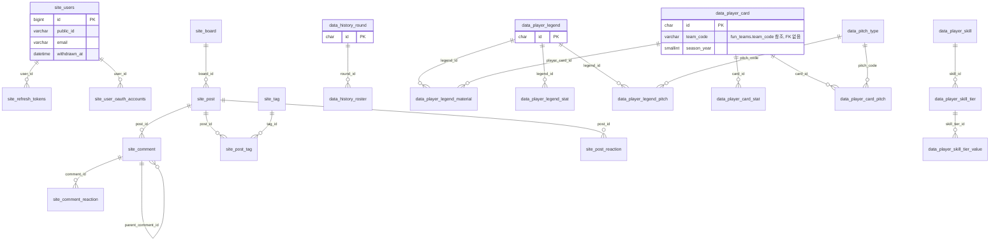

# 도메인 모델 — ERD·테이블 대응

> [`domain.md`](./domain.md) 에서 분리(150줄 상한). 관계는 `sql/V2`·`sql/V3` DDL의 `FOREIGN KEY` 제약만 그렸다 — 코드 주석상 참조(예: `team_code`)나 애플리케이션 레벨로만 지키는 관계(`site_user_event.user_id` 등, FK 미설정)는 점선 대신 문장으로 별도 표기했다.

## 1. ERD

- `data_player_card.team_code`는 `fun_teams.team_code`를 코드 주석으로만 참조한다 — FK 제약 없음
- `data_history_roster`는 `(player_name, season_year)` 인덱스로 `data_player_legend_material`과 화면에서 논리적으로 매칭된다 — FK 없음, 조회 시점 조인
- `site_user_event.user_id` · `statistic_support_click.user_id`는 의도적으로 FK를 걸지 않는다(쓰기 비용 절감, 정합성은 앱 레벨) — `sql/V3/CREATE_07`·`CREATE_08` 주석

## 2. 테이블 ↔ 기능 대응표

| 도메인 | 주요 테이블 | 매퍼 위치 |
|---|---|---|
| authentication / users | `site_users`, `site_user_oauth_accounts`, `site_refresh_tokens` | `mapper/site/oauth/*.xml` |
| coupons | `site_coupons` | `mapper/site/coupon/CouponMapper.xml` |
| events | `site_events` | `mapper/site/event/EventMapper.xml` |
| notices | `site_notices` | `mapper/site/notice/NoticeMapper.xml` |
| quiz | `fun_quiz`(⚠️ 접두는 `fun_`이나 관리자가 등록하는 사이트 콘텐츠) | `mapper/site/quiz/QuizMapper.xml` |
| community(동결) | `site_board/post/comment/tag/post_tag/post_reaction/comment_reaction/report` + 레거시 `boards/posts/tags/posts_tags` | `mapper/site/community/*.xml` |
| players | `data_player_card`, `data_player_card_stat`, `data_player_card_pitch`, `fun_teams` | `mapper/fun/playerCard/*.xml`, `mapper/fun/team/FunTeamMapper.xml` |
| legendStats | `data_player_legend`, `data_player_legend_material`, `data_player_legend_stat`, `data_player_legend_pitch`, `data_pitch_type` | `mapper/fun/legendCard/*.xml`, `mapper/fun/legendStat/FunLegendStatMapper.xml` |
| historyLegend(BE 패키지명 `historyMode`) | `data_history_round`, `data_history_roster` | `mapper/fun/historyMode/FunHistoryModeMapper.xml` |
| playerSkills | `data_player_skill`, `data_player_skill_tier`, `data_player_skill_tier_value` | `mapper/fun/playerSkill/PlayerSkillMapper.xml` |
| mileage | 전용 테이블 없음 — `data_player_card`/`data_player_legend_material` 조회 | `mapper/fun/mileage/MileageMapper.xml` |
| admin / 내부 로깅 | `site_user_event`, `site_user_event_daily`(집계 배치 미구현) | `mapper/site/analytics/AnalyticsEventMapper.xml` |
| home (후원 클릭 집계, REQ-HM-08) | `statistic_support_click` | `mapper/site/statistics/StatisticSupportClickMapper.xml` |
| guides / policy / error | 없음 — FE 정적 콘텐츠 | - |

테이블 상세 정의(컬럼·인덱스·행수)는 별도 DB 색인 문서에 있다 — 여기서는 링크하지 않는다(재편 대상 경로).
