# 도메인 모델

## 1. 도메인 목록

FE 폴더(정본) ↔ BE 패키지 ↔ API 경로 대조표 — `bash .claude/scripts/domain-map.sh` 출력 그대로.

| FE(정본) | BE 패키지 | API | 상태 |
|---|---|---|---|
| admin | admin | - | (예외) OK, API 없음 — 관리 기능은 각 도메인의 `/api/admin/**`에 흩어져 있다 |
| authentication | - | - | ❌ BE 없음·API 없음 — 실제 로그인 로직은 `domain/oauth` 패키지에 있다(아래 참고) |
| community | community | - | (예외) OK, API 없음 — 동결, `/api/{boards,posts,comments,...}` 복수 경로 |
| coupons | coupon | coupons | OK |
| error | - | - | (예외) BE 없음·API 없음 — FE 전용 에러 화면 |
| events | event | events | OK |
| guides | - | - | (예외) BE 없음·API 없음 — FE 정적 콘텐츠 |
| historyLegend | historyLegend | - | OK, API 없음 — 실제 라우트는 `/api/history-rounds`(BE 코드상 명칭 `historyMode`) |
| home | home | home | OK |
| legendStats | legendStat | legend-stats | OK |
| mileage | mileage | mileage | OK |
| notices | notice | notices | OK |
| odds | - | - | (예외) BE 없음·API 없음 — FE 정적 JSON |
| playerSkills | playerSkill | player-skills | OK |
| players | - | - | ❌ BE 없음·API 없음(스크립트 기준) — 실제 BE는 `domain/fun/playerCard`, API는 `/api/player-cards`다. 단수형이 `player`가 아니라 `playerCard`로 이름 자체가 달라 자동 매칭에서 빠진다 |
| policy | - | - | (예외) BE 없음·API 없음 — FE 정적 콘텐츠 |
| quiz | quiz | quiz | OK |
| users | - | users | ❌ BE 없음(스크립트 기준) — 실제 BE는 `UserController` + `domain/oauth`(계정 원본 공유), API `/api/users/me` 등 |

FE에 없는 BE 패키지: `analytics`(예외, 이벤트 수집 인프라) · `oauth`(예외, authentication·users 가 공유) · `statistics`(예외, home 후원 클릭 집계) · `legendCard`·`playerCard`·`team`(❌ — `fun/` 하위 게임 데이터 패키지, FE 도메인과 이름이 달라 자동 매칭 대상이 아님. 각각 legendStats·players·players 화면이 사용).

## 2. 화면 계층 (IA)

```mermaid
flowchart TB
  Root[전체 화면] --> Pub[공개 - 가드 없음]
  Root --> User[로그인 필요 - AuthGuard USER/ADMIN]
  Root --> Admin[관리자 전용 - AuthGuard ADMIN]

  Pub --> P1["SC-07-01 홈"]
  Pub --> P2["SC-02-01 쿠폰"]
  Pub --> P3["SC-03-01 이벤트"]
  Pub --> P4["SC-04-01 공지 목록"]
  Pub --> P5["SC-04-02 공지 상세"]
  Pub --> P6["SC-05-01 커뮤니티(읽기전용)"]
  Pub --> P7["SC-08-01 로그인 콜백"]
  Pub --> P8["SC-10-01/02 확률 공시"]
  Pub --> P9["SC-11-01 선수 백과사전"]
  Pub --> P10["SC-12-01 공용 에러"]
  Pub --> P11["SC-13-01~04 정책 4화면"]
  Pub --> P12["SC-14-01 히스토리 재료 탐색기"]
  Pub --> P13["SC-15-01 레전드 평점표"]
  Pub --> P14["SC-16-01 마일리지"]
  Pub --> P15["SC-17-01 스킬 백과사전"]
  Pub --> P16["SC-18-01/02 가이드"]

  User --> U1["SC-09-01 마이페이지"]

  Admin --> A1["SC-01-01 어드민 셸(7탭)"]
  Admin --> A2["SC-04-03 공지 글쓰기"]
```

### 주요 이용 여정

이용자 4상황 + 운영자 1상황, 총 5개 여정. 화면 순서는 실제 라우트 기준.

| 여정 | 거치는 화면(SC) | 관련 REQ |
|---|---|---|
| 게임 중 쿠폰만 빠르게 받기 | SC-07-01 → SC-02-01 | `features/coupons/spec.md` REQ-CP-04(바로가기 클릭)·REQ-CP-05(1계정 1회, 저장소 경계 밖) |
| 패치·이벤트 직후 새 소식 확인 | SC-07-01 → SC-03-01/SC-04-01 → SC-04-02 | `features/home/spec.md` REQ-HM-02·03(섹션 실패 격리·오류 표시). 이벤트 상세 화면 없음·퀴즈 응시 없음은 각각 `roadmap.md` § 3(events)·`features/quiz/spec.md` § 5 확정 사양 |
| 공략 파고들기(스킬·구종·선수·레전드 재료) | SC-07-01 → SC-15-01 → SC-14-01/SC-16-01 → SC-17-01·SC-11-01 | 백과사전 "게임정보" 두 칸 내용 0건은 `README.md` § 1 확인된 빈 부분 |
| 습관적으로 둘러보기 | SC-07-01 → SC-18-01 → SC-18-02 → SC-05-01 | 미등록 slug 안내는 `features/guides/design.md` § 2. 커뮤니티 쓰기 동결은 `roadmap.md` § 3(community) |
| 운영자 등록 작업 | SC-08-01 → SC-01-01 → SC-04-03 | `features/admin/spec.md` REQ-ADM-01(셸 접근 가드) |

## 3. 화면 목록

라우트 등록 24개 전부.

| 화면번호 | 이름 | 경로 | 권한 |
|---|---|---|---|
| SC-01-01 | 어드민 셸(홈·퀴즈·이벤트·쿠폰·공지·유저·동기화 7탭) | `/admin`, `/admin/:tab` | 관리자(ADMIN) |
| SC-02-01 | 쿠폰 목록 | `/coupons` | 공개 |
| SC-03-01 | 이벤트 목록 | `/events` | 공개 |
| SC-04-01 | 공지 목록 | `/notices` | 공개 |
| SC-04-02 | 공지 상세 | `/notice/:slug` | 공개 |
| SC-04-03 | 공지 글쓰기(신규/수정 공용) | `/admin/notice/write`, `/admin/notice/write/:id` | 관리자(ADMIN) |
| SC-05-01 | 커뮤니티(읽기 전용) | `/community` | 공개(쓰기 동결) |
| SC-07-01 | 홈 | `/` | 공개 |
| SC-08-01 | 로그인 콜백 처리 | `/auth/callback` | 공개(비로그인 전용) |
| SC-09-01 | 마이페이지 | `/mypage` | 로그인 필요(USER/ADMIN) |
| SC-10-01 | 확률 공시 목차 | `/probability` | 공개 |
| SC-10-02 | 확률 공시 상세 | `/probability/:sectionId` | 공개 |
| SC-11-01 | 선수 백과사전 | `/players` | 공개 |
| SC-12-01 | 404/공용 에러 화면 | `*`(catch-all) + `errorElement` | 공개 |
| SC-13-01 | 개인정보처리방침 | `/privacy` | 공개 |
| SC-13-02 | 이용약관 | `/terms` | 공개 |
| SC-13-03 | 문의하기 | `/contact` | 공개 |
| SC-13-04 | 사이트 소개 | `/about` | 공개 |
| SC-14-01 | 히스토리 재료 탐색기 | `/history-mode/legend` | 공개 |
| SC-15-01 | 레전드 재료 평점표 | `/legend-stats` | 공개 |
| SC-16-01 | 마일리지 저격 경로 | `/mileage` | 공개 |
| SC-17-01 | 스킬 백과사전 | `/skills` | 공개 |
| SC-18-01 | 가이드 목록 | `/guides` | 공개 |
| SC-18-02 | 가이드 상세 | `/guides/:slug` | 공개 |

번호를 받지 않은 것(라우트가 없어서): 어드민 셸 내부 7탭(URL 하나에 내부 상태 전환), 퀴즈(독립 라우트 없이 홈 섹션 + 어드민 탭으로만 존재), 레이아웃·모달 공용 컴포넌트.

## 4. 데이터 계층 (ERD)

테이블 정의·관계는 [`domain-erd.md`](./domain-erd.md) 로 분리했다(150줄 상한). 요약: 36개 테이블이 `site_`(15, 운영 콘텐츠)·`data_`(13, 게임 데이터)·`fun_`(2, 사이트 운영 게임 콘텐츠)·접두없음(6, v1 잔존 4 + 신규 1)로 나뉜다.
